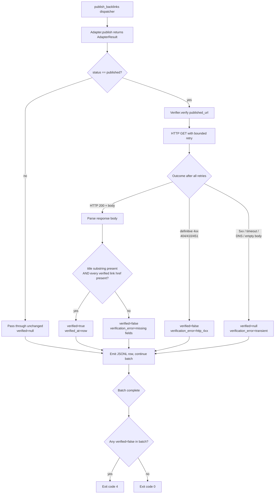

# Real-Publish Verification

## Problem Frame

A prior opencli-based adapter fake-published for an extended period — it returned fabricated `https://medium.com/p/{sha256}` URLs while the pipeline reported `status: published` and exit code 0. From the user's perspective the run was green; in reality zero articles existed on Medium. The current adapter rewrite (Blogger API v3, Medium API + Playwright) is structurally less prone to this, but nothing in the pipeline asserts that the returned `published_url` is real. A future regression — selector drift, partial API success, mis-mapped response field, agentic adapter retry — could silently reintroduce the same failure class.

Real-Publish Verification closes the loop: after each adapter returns a `published_url`, the pipeline performs an independent HTTP fetch of that URL and asserts the published article actually contains the article's title and the expected target-link hrefs. Verification status surfaces in the JSONL output and the final exit code so cron jobs, the web UI, and human operators all detect "published but not actually live" without manual auditing.

## User Flow

The diagram below illustrates the **HTML channel** (Medium adapter). The Blogger adapter uses the API channel: after publish, the verifier calls `posts.get(blog_id, post_id)` once, runs R6 checks against the structured JSON fields, and skips R5/R5a/R8a/R8b entirely.

## Requirements

**Verification trigger and surface**
- R1. After each adapter returns `AdapterResult.status == "published"` with a non-empty `published_url`, the dispatcher invokes a verifier before emitting the JSONL row.
- R2. Verification is synchronous and inline — the dispatcher blocks on the verifier before processing the next payload. No async worker, no separate phase.
- R3. Adapter results with `status` in `{"drafted", "failed"}` skip verification and emit `verified: null` (verification is undefined for non-published rows).
- R4. Dry-run mode (`_dry_run == True`) skips verification entirely; emit `verified: null` with `verification_error: "dry_run"`.

**Verification heuristic**
- R4a. **Per-adapter verification channel.** Each adapter declares its preferred verification channel:
  - **Blogger** → platform API (`posts.get(blog_id, post_id)`). Reuses the existing Blogger API client + OAuth credentials. Returns structured JSON with authoritative `title`, `content`, `url`, and `published` fields — no HTML parsing, no CDN edge cache, no paywall. Title and link checks (R6) run against the structured fields rather than HTML.
  - **Medium** → HTTP GET on `published_url`, per R5–R6. Medium's public read API surface for non-owner read is limited, so HTML remains the only available channel. All R5–R6 mitigations (host allowlist, parsed text, hrefs in `<a>`) apply.
  - Other adapters added later must declare which channel they use.
- R5. The HTML channel (used by Medium and any future non-API adapter) performs an HTTP GET on `published_url` and accepts HTTP 200 only. 3xx redirects are followed up to **5 hops**, all of which must stay within the same eTLD+1 as the adapter's allowlist (R5a) — so Medium's `medium.com/p/{id}` → `medium.com/@user/slug` canonicalization and a custom-domain author.medium.com → custom-domain chain are both tolerated, while an off-domain redirect to an unrelated host is rejected. Final hop must be 200.
- R5a. **Host allowlist (pre-flight).** Before any body parsing, the verifier asserts that the host of `published_url` matches an adapter-declared allowlist of platform-canonical hostnames (e.g., Blogger adapter allows `*.blogspot.com` and `blogger.com` paths; Medium adapter allows `medium.com` and `*.medium.com`). A `published_url` whose host falls outside the allowlist sets `verified: false` with `verification_error: "host_not_allowed: <host>"` and skips body parsing. This is the cheapest defense against a regressed adapter returning a fabricated or attacker-controlled URL whose response happens to echo input.
- R6. The verifier parses the response body via an HTML parser (`html.parser` from stdlib if sufficient, else `beautifulsoup4`) and asserts both:
  - (a) the article's `title` appears as a case-insensitive substring of the **visible rendered text** (extracted via the parser) OR within the page's `og:title` / `<title>` / `<h1>` element. Raw-byte substring against the whole response body is **not** acceptable — it false-positives against `__APOLLO_STATE__`, JSON-LD blobs, and sidebar/recommendation headlines. AND
  - (b) every `href` URL from the **verified link subset** of the input payload's `links[*].url` appears at least once as the value of an `<a href="…">` attribute in the parsed DOM. Raw substring match anywhere in the body is **not** acceptable — Medium routinely embeds arbitrary outbound URLs in sidebar/state-blob content. The verified link subset is the set of `links` entries whose `kind` selects them for verification — defaults to `{"target", "main_domain"}`, with the exact set treated as a deferred-to-planning decision.
  - If the verified link subset is empty for a given payload, only the title check (R6a) applies.
- R7. If R6 holds, the row's `verified` is `true`. If R6 fails on a 200 response, `verified` is `false` and `verification_error` records which check failed (e.g., `"title_missing"`, `"target_link_missing: https://…"`).
- R8. If the HTTP fetch terminates with a **definitive client/permanent failure** after all retries — HTTP `404`, `410`, `451`, or other 4xx indicating the URL is wrong, gone, or blocked — `verified` is `false` and `verification_error` records the status (e.g., `"http_404"`). The reasoning: a freshly-published URL still 404'ing after the lag window has elapsed is evidence the URL is fabricated or the publish silently failed, not indexing lag. This is the exact case the project's original fake-publish incident produced, so it must be a hard signal, not a soft one.
- R8a. If the HTTP fetch terminates with a **transient/indeterminate** condition after all retries — HTTP 5xx, timeout, DNS failure, connection refused, TLS error, or "HTTP 200 but empty/incomplete body" — `verified` is `null` and `verification_error` records the final reason (e.g., `"timeout: 3/3 attempts"`, `"http_503"`). These conditions cannot distinguish lag from real failure and warrant human re-check rather than a hard fail.
- R8b. **Medium paywall detection.** Before running R6 content checks on a 200 response, the verifier checks for Medium paywall markers (e.g., a "Member-only story" interstitial, a truncating "Continue reading…" gate, or a meta tag indicating gated content). If detected, the row is `verified: null` with `verification_error: "paywall_gated"`. This avoids R6b false-negatives on legitimately-published gated stories whose body the anonymous fetch cannot see. Paywall-gated rows do not contribute to the `lag_count` in R17 — they are a distinct null cause.

**Medium indexing-lag policy**
- R9. The HTML-channel verifier retries up to 3 attempts with progressive waits of 5s, 10s, 15s (total wall-clock ≤ 30s) when the first attempts return non-200 or empty body. Per-platform retry budgets are hard-coded inline in the verifier; do not build a configurable per-adapter retry-profile abstraction until a third adapter with distinct behavior actually lands.
- R10. Blogger uses the API channel with a single-attempt profile (synchronous publish + read-after-write consistency on the same API surface, no lag expected). Medium uses the HTML channel with the 3-attempt profile from R9.
- R11. Adapter-level retry (the separate `@retry_transient` work, scoped in `docs/brainstorms/2026-05-12-adapter-retry-backoff-requirements.md`, which handles retries on the publish API call itself) and verifier retry are independent: verifier retry only triggers on the verification-side HTTP fetch outcome, not on the publish call.

**JSONL output contract**
- R12. Each emitted row gains three new fields, additive to the existing schema:
  - `verified`: `true` | `false` | `null`
  - `verified_at`: ISO-8601 timestamp string when `verified` is `true` or `false`; `null` otherwise
  - `verification_error`: short reason string when `verified` is `false` or `null` for a reason other than skip; `null` otherwise
- R13. `AdapterResult.status` enum is unchanged. Downstream consumers that filter on `status == "published"` continue to work without modification, provided they tolerate unknown additive fields.

**Exit code semantics**
- R14. `publish-backlinks` final exit code is `4` (ExternalServiceError class) when any row in the run has `verified == false`. `verified == null` does NOT trigger exit 4 on its own.
- R15. When multiple failure classes occur in the same run (e.g., adapter `DependencyError` exit 3 plus `verified == false` rows triggering exit 4), the final exit code is the **maximum** of all observed failure-class exit codes. Verification exit 4 therefore overrides adapter exit 3 and equals (does not lose to) any other ExternalServiceError exit 4. The intent: a verification failure is never silently masked by a noisier-but-lower-priority error. The stderr summary in R17 always reports verification counts so cron-side routing can act on the verification signal independently of exit code.

**Diagnostics**
- R16. The verifier emits one structured stderr line per article: `verifying <published_url> (attempt N/M)` on each attempt, and a terminal line `verified=<true|false|null> <published_url> [verification_error]` on completion. No bodies, no headers, no tokens in logs.
- R17. A run-end summary line on stderr reports counts and the Medium lag-ratio: `verification: N verified, M unverified (verified=false), K lag (verified=null), lag_ratio: P% (Medium HTML channel)`. "Lag" here is shorthand for any `verified: null` row whose `verification_error` indicates a fetch-side transient failure (timeout, 5xx, DNS, empty body) on the HTML channel; it is not a separate JSONL field. Lag-ratio is `lag_count / medium_published_count` for the run; absent if no Medium publishes occurred.
- R18. **Lag-ratio escalation trigger (telemetry-driven).** If lag-ratio exceeds 20% across 3 consecutive non-trivial Medium runs (≥5 published rows each), planning revisits the 30s budget — options include extending the verifier retry window, lowering Medium throttle to give CDN more warm-up time, or shipping the deferred `verify-published` subcommand for async re-verification. This is a follow-up trigger, not a V1 blocker.

## Success Criteria

- **Founding-incident defense.** A handcrafted fake adapter that returns `published_url` pointing at a nonexistent URL produces exit code 4 and a JSONL row with `verified: false`, `verification_error: "http_404"` (or analogous 4xx). The user sees the failure without inspecting the platform — this is the project's founding fake-publish failure mode, now caught.
- **Host-spoofing defense.** A regressed adapter that returns `published_url` on a host outside the adapter's allowlist (attacker echo server, paste site, draft preview host) produces `verified: false` with `verification_error: "host_not_allowed: <host>"` and exit 4 — even if the response body would otherwise contain the title and target links.
- **Heuristic precision.** A real Medium publish whose response body contains the article's title in its `<h1>` and the target hrefs inside `<a>` tags in the article body yields `verified: true`. A near-miss page where the title appears only in a sidebar recommendation block and the hrefs appear only in `__APOLLO_STATE__` JSON does NOT yield `verified: true` — the parsed-text + hrefs-in-`<a>` checks reject it.
- **Lag tolerance.** A real Medium publish with realistic 5–15s indexing lag completes with `verified: true` after the verifier's retry window in the common case. Lag exceeding 30s leaves the row at `verified: null` with `verification_error` naming the transient reason; the batch still exits 0 unless a `verified: false` row also exists.
- **Link-stripping detection.** An adapter that publishes the article but strips the target links (selector drift, HTML sanitiser regression, Medium dropping outbound anchors) produces `verified: false` with `verification_error` naming the first missing link. Final exit code is 4.
- **Paywall handling.** A real Medium member-only publish that returns a paywall interstitial to anonymous fetches produces `verified: null` with `verification_error: "paywall_gated"`, not a false `verified: false`. Operator is not paged for legitimate gated stories.
- **Blogger API correctness.** A real Blogger publish is verified via `posts.get` against the API's structured fields, completes synchronously with no lag retry, and shows `verified: true` for correctly-published articles. A Blogger adapter regression that returns a `published_url` whose `post_id` does not exist in the API yields `verified: false`, not `null`.
- **Clean-run shape.** A clean run with all articles correctly published and verified shows `verification: N verified, 0 unverified, 0 lag, lag_ratio: 0% (Medium HTML channel)` on stderr and exits 0.

## Scope Boundaries

**Row types**
- Out of V1: Verification of `drafted`-status rows (no public URL to fetch; drafts on Medium aren't reachable without auth). An adapter that returns `drafted` with a fabricated draft URL bypasses verification entirely — tracked as a known residual risk to revisit after V1 lands.

**Verification heuristic scope**
- Out of V1: Content fingerprinting beyond title + target hrefs (e.g., full body hash, paragraph count, image presence). Platforms wrap HTML; full-content hashing has high false-positive rate.
- Out of V1: Verification of structural SEO attributes (canonical tags, noindex, link `rel`). Different problem class. **Note:** whether `rel="nofollow"` detection on target hrefs is in or out of V1 is a deferred-to-planning decision — see Outstanding Questions.

**Tooling and remediation**
- Out of V1: A separate `verify-published` CLI subcommand for re-verifying earlier runs. May land later if `verified: null` rates prove high.
- Out of V1: Quarantining or unpublishing `verified: false` articles. Verification reports; remediation is human.

**Downstream consumer migration**
- Downstream consumers of the publish-backlinks JSONL output (web UI, log aggregators, any cron-side parsers) must tolerate the three additive fields. A consumer that asserts a fixed key set would break — planning must enumerate the current consumers and confirm they ignore unknown fields. If any are strict, a `schema_version` field becomes load-bearing; otherwise R12's additive-only contract is sufficient.

## Key Decisions

- **Synchronous, inline verification.** Adding 5–10s per article is rounding error inside Medium's existing 60–300s throttle. An async worker adds operational surface (queue, retries, race with checkpointing) for negligible time savings. Worst-case note: verifier runs *before* the inter-article throttle starts, so a Medium article exhausting all 3 verifier attempts adds up to 30s before the throttle begins — batch wall-clock impact is bounded by `articles × (30s + throttle)`.
- **Independent `verified` field, not a `published_unverified` status.** Keeps the `status` enum stable so downstream consumers continue working. `verified` is a clean orthogonal signal: a row can be `status: published, verified: false`.
- **Title + target-link heuristic, not HTTP-200-only.** This project's core value is target-link insertion. A "200 OK with stripped links" article is functionally a fake publish — it goes live but delivers zero SEO value. The heuristic must catch that.
- **API verification channel where the platform exposes one.** Blogger's `posts.get` returns authoritative JSON; verifying against it eliminates entire failure classes (CDN stale edge, paywall HTML, sidebar false-positives, redirect ambiguity, indexing lag). It does reduce request-level independence — the publisher and verifier share auth — but the response is the platform's own record of what was stored, which beats HTML-scraping the same platform's cache. For Medium, no usable public read API exists, so HTML is unavoidable; the R5/R6 mitigations carry that load.
- **Definitive 4xx → `verified: false`, transient → `verified: null`.** A 404 after the lag window is evidence of fabrication/silent-publish-failure, not lag. Conflating them with 5xx/timeout/DNS would let the project's founding failure (fabricated `https://medium.com/p/{sha256}` URLs returning 404) ship green again. The split makes the safer default the loud one.
- **Soft-fail with deferred exit code.** Hard-failing on first `verified: false` would cause the dispatcher to exit before emitting remaining articles' JSONL rows, even though those articles have already been published. Soft-fail preserves the audit trail; final exit 4 ensures cron/CI still alerts at run end.
- **`verified: null` distinct from `verified: false`.** Transient-failure unverified is a "not enough information" signal that warrants human re-check, not a publish failure. Conflating them would make Medium lag inflate the alert rate.

## Dependencies / Assumptions

- Reuses `linkcheck.py` patterns (SSL context, urllib-based fetch, simple retry) — but the verifier is a new code path, not an extension of `check_urls`. `linkcheck.py` discards response bodies and treats 3xx as success; the verifier reads bodies, caps redirect hops, and inspects content. Plan should expect a new module that copies the SSL context helper, not a refactor of `linkcheck.py`.
- Input payload preserves `links` (with each entry's `kind`) through to the publish-backlinks stage so the verifier can read them. (The current pipeline already does — `validate-backlinks` doesn't strip them — but planning should confirm.)
- The dispatcher must hand both the source row's `links` and the `AdapterResult` to the verifier. `AdapterResult.to_publish_output()` does not currently carry `links`; the exact binding (extend `AdapterResult`, pass `row` alongside, or thread through a new arg) is a planning decision.
- Adapter-side retry (separate work item, brainstorm 2026-05-12) is independent and can land before or after this. No coupling.
- Verifier shares network egress, DNS resolver, TLS stack, and (likely) CDN edge with the adapter's publish path. Independence is therefore at the request-level, not the infrastructure-level: CDN edge-cached stale 200s would fool both adapter and verifier identically.

## Outstanding Questions

### Resolve Before Planning

_None. All P0/P1/P2 review findings resolved 2026-05-12._

### Deferred to Planning

- [Affects R6][Technical] HTML parser choice: stdlib `html.parser` vs adding `beautifulsoup4` (+ `lxml` or stdlib backend). Both can extract visible text and `<a href>` attribute values. Planning picks based on parsing-correctness on real Medium/Blogger pages observed in test fixtures.
- [Affects R5a][Technical] Per-adapter host allowlist representation: class attribute on each adapter, declarative `__allowed_hosts__` tuple, or central dispatcher dict. Planning chooses.
- [Affects R5a/R6][Technical] Should `<a href>` matches be restricted to anchors inside the article's main content container (e.g., `<article>`, `<main>`, or platform-specific selectors), or anywhere in the parsed DOM? "Anywhere in DOM" still false-positives on Medium's related-stories sidebar. Tighter scoping likely needed for V1.
- [Affects R6][Technical] Concrete `links` subset selection: which `kind` values count as "verifiable" (likely `{"target", "main_domain"}`, possibly add `"supporting"`). Plus: should hrefs be required to appear inside `<a href>` tags, not anywhere in the document?
- [Affects R5][Technical] Maximum response body size to fetch and scan (e.g., cap at 2 MB; treat over-cap as `verified: null` with `verification_error="body_too_large"`).
- [Affects R5][Technical] Redirect handling: `urllib.request.urlopen` follows redirects transparently with no per-hop cap. Implementing "one hop max" requires a custom `HTTPRedirectHandler`. Planning must also reconcile this with Medium's normal canonicalization redirects (`/p/{id}` → `/@user/slug`) and Blogger geo-redirects — one hop may be too narrow in practice.
- [Affects R10][Technical] Per-platform retry budgets are hard-coded inline (decision in R9); planning chooses the exact call-site representation (literal dict, constants, etc.).
- [Affects R12][Technical] JSONL backward-compat: confirm by audit that all current downstream consumers (web UI overlay, any logs/analytics) ignore unknown fields. Default decision: no `schema_version` field, additive-only contract per R13. Bump only if a strict consumer is found.
- [Affects R14][Technical] Exit-code partition with the existing `publish_backlinks.py` flow: today only `error is None` rows go to stdout. A `status=published, verified=false` row has `error=None` but represents a failure. Planning must specify where `verified=false` rows go (stdout with the new flag, stderr like errors, or both) and how the final exit code 4 interacts with adapter-failure exit 4 already raised by the dispatcher.
- [Affects R16][Technical] Exact stderr format must align with the structured-logging style used by `@retry_transient` (separate brainstorm) so the web UI overlay can parse both consistently.

## Next Steps

→ `/ce:plan` for structured implementation planning (once Resolve Before Planning is cleared)
