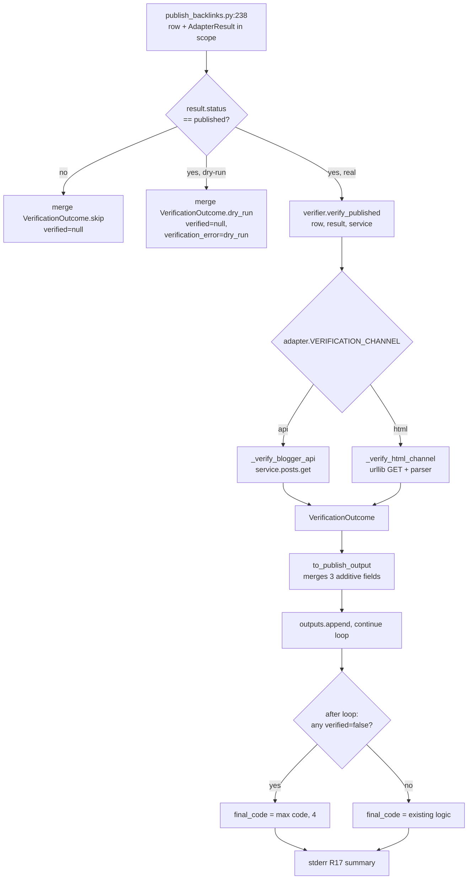

# Real-Publish Verification

## Overview

After each adapter publish, the dispatcher will call a new verifier module that independently asserts the article is actually live and contains the article's title plus the verified-link subset. Verification status surfaces as three additive JSONL fields (`verified`, `verified_at`, `verification_error`) and feeds the final exit code via a `max()` rule. Blogger goes through Blogger's `posts.get` API; Medium goes through an HTML GET with host-allowlist pre-flight, parsed-text + `<a href>` matching, paywall detection, and bounded retry for indexing lag.

## Problem Frame

A prior opencli-based adapter fake-published for an extended period — fabricated `https://medium.com/p/{sha256}` URLs while the pipeline reported `status: published` and exit code 0. The current adapter rewrite is structurally less prone to this, but nothing today asserts that the returned `published_url` is real. This plan installs the defense-in-depth check that catches both the original incident (fabricated URLs) and the realistic 2026 failure mode (host spoofing, sidebar/state-blob false-positives, paywall masking, indexing lag, link stripping). See origin: `backlink-publisher/docs/brainstorms/2026-05-12-real-publish-verification-requirements.md`.

## Requirements Trace

- **R1–R4** (verification trigger and surface): handled in Unit 6 (dispatcher integration); honors `status` enum and `_dry_run` skip.
- **R4a** (per-adapter channel declaration): handled in Unit 4.
- **R5 / R5a / R6** (HTML channel, host allowlist, parsed text + `<a href>`): Unit 2.
- **R7 / R8 / R8a** (verified states + definitive 4xx → false / transient → null): Units 2 and 3. **R8b** (paywall classification): dropped from V1 — see scope decisions below.
- **R9 / R10 / R11** (retry budgets, per-channel profile, independence from `@retry_transient`): Unit 2 (HTML) and Unit 3 (Blogger).
- **R12 / R13** (JSONL additive fields, `status` enum unchanged): Unit 5 (`AdapterResult.to_publish_output`).
- **R14 / R15** (exit 4 on any `verified=false`; `max()` precedence — including DependencyError refactor and verifier_internal_error rollup): Unit 6.
- **R16 / R17** (stderr per-row + run-end counts: `N verified, M unverified, K null` — **no `lag_ratio` in V1**, no Medium-channel tagging; scoped down per scope-guardian review): Unit 6.
- **R18** (telemetry-driven escalation): **dropped from V1**. No automated escalation infrastructure; `lag_ratio` and segmentation removed. Re-add when a downstream consumer exists. Counts on stderr suffice for human triage.
- **R8b** (Medium paywall detection): **dropped from V1**. Member-only stories with anonymous fetch fail R6 link-check naturally, surfacing as `verified=false, verification_error="target_link_missing: …"` — louder and simpler than the previously-proposed null/paywall_gated path. Add paywall classification only if operators report frequent false-positives on legitimately-gated content.
- Success Criteria (founding-incident, host-spoofing, heuristic precision, lag tolerance, link-stripping, paywall, Blogger API correctness, clean-run shape): test scenarios in Units 2, 3, 6 cover these directly.

## Scope Boundaries

- Out: verification of `drafted`-status rows.
- Out: `verify-published` subcommand for re-running verification on prior JSONL.
- Out: quarantine / unpublish of `verified=false` rows.
- Out: full body hash / paragraph-count / image-presence fingerprinting.
- Out: `rel="nofollow"` / canonical-tag / structural SEO checks.
- Out: per-adapter configurable retry-profile abstraction (origin decision: hard-code two profiles).
- Out: bumping `schema_version` in JSONL output (default: additive-only; revisit only if a strict downstream consumer is found).

## Context & Research

### Relevant Code and Patterns

- **Dispatcher loop**: `src/backlink_publisher/cli/publish_backlinks.py:127-248`. Per-row body calls `adapter_publish(...)` (L192-197) returning `AdapterResult`. Line **238** merges row + result via `result.to_publish_output(row, ts)`; both `row` (carries `links`) and `result` (carries `published_url`, `status`, adapter identity) are in scope. **This is the verifier insertion point.**
- **Collective exit-code gate**: `publish_backlinks.py:250-263`. Today: `successful = [r for r in outputs if r.get("error") is None]`; `failed` rows print to stderr; `raise SystemExit(4)` on any failed row. Unit 6 extends this with a `verified=false` accounting branch and a `max(...)` rule.
- **`AdapterResult`**: `src/backlink_publisher/adapters/base.py:9-34`. Frozen-ish dataclass. `to_publish_output(row, ts)` (L22-34) is the additive point for the three new fields with safe `null` defaults.
- **Blogger API client**: `src/backlink_publisher/adapters/blogger_api.py:18-64` (`_build_credentials`) and L112 (`service = build("blogger", "v3", credentials=creds)`). OAuth scope `https://www.googleapis.com/auth/blogger` (L15) covers `posts.get`. Today only `posts.insert` is called (L126) — verifier adds `service.posts().get(blogId, postId).execute()`.
- **`linkcheck.py` primitives**: `src/backlink_publisher/linkcheck.py:21-25` (`_ssl_context`), L28-55 (HEAD-then-GET via `urllib.request`), L58-73 (retry loop). All private — copy the shape into `verifier.py`, do not import private names.
- **Test patterns**: `tests/` flat layout, one file per surface. Mocking is **stdlib `unittest.mock`** (`patch` / `MagicMock`), not `pytest-mock` — see `tests/test_adapter_blogger_api.py:1-35`, `tests/test_adapter_dispatcher.py:1-55`. End-to-end CLI test pattern is `_run_publish()` helper in `tests/test_publish_backlinks.py:17-48` (swaps stdin/stdout/stderr, catches `SystemExit`, returns `(stdout, stderr, code)`). Blogger mock surface uses `service.posts.return_value.insert.return_value.execute.return_value` (extend with `.get...` for verifier tests).
- **JSONL output shape**: canonical dict literal lives in `AdapterResult.to_publish_output` (`base.py:24-33`). No central output validator — additive fields are non-breaking.

### Institutional Learnings

From the brainstorm phase (origin doc):
- The prior opencli adapter fake-published with fabricated URLs while pipeline reported green. Verification must defend specifically against URLs that look plausible but don't exist (404) and against URLs whose response happens to echo the input (host spoofing).
- API path beats browser-automation path wherever the platform exposes one. The Blogger adapter already uses Blogger API — verification via `posts.get` is a one-call reuse, no new auth surface.
- Web-UI consumers swallow JSONL produced by `publish-backlinks` via `subprocess.run`. They tolerate additive fields today (no key-set assertions), per the brainstorm's downstream consumer note.
- The adapter-retry-backoff work (`docs/brainstorms/2026-05-12-adapter-retry-backoff-requirements.md`) is independent. Both ship into the same dispatcher loop — Unit 6 must avoid colliding with that work's stderr format.

### External References

None used — Python stdlib (`urllib`, `html.parser`), existing Google API client, and existing project patterns cover the implementation surface.

## Key Technical Decisions

- **Single verifier module, two channel functions, centralized adapter metadata.** `src/backlink_publisher/verifier.py` exposes `verify_published(row, result, service=None) -> VerificationOutcome` that dispatches to `_verify_html_channel` or `_verify_blogger_api`. **Adapter metadata (channel + allowed hosts + path patterns + arg extractor) lives inside `verifier.py` as a `_ADAPTER_METADATA` dict keyed by adapter name** — not on the adapter modules. With only two adapters, scattering declarations across `blogger_api.py` / `medium_api.py` / `medium_browser.py` / `medium_brave.py` is premature abstraction. Centralizing keeps the verifier-policy surface in one file; when a third adapter lands the cost of moving to per-adapter declarations is mechanical. Keeps the surface flat and matches the project's flat-module convention (see `linkcheck.py`, `language_check.py`).
- **Sibling module, not extension of `linkcheck.py`.** `linkcheck.py` discards bodies, treats 3xx as success, **and disables TLS verification** (`linkcheck.py:21-25` builds an SSL context with `check_hostname=False`, `verify_mode=CERT_NONE`). The verifier's whole purpose is to assert reality, so it MUST use `ssl.create_default_context()` with hostname + certificate verification enabled. Do not copy `_ssl_context()` from `linkcheck.py`; build a fresh strict context in `verifier.py`.
- **Hard-coded per-channel retry budgets.** Inline constants in `verifier.py`: `_HTML_RETRY_WAITS_S = (0, 5, 10, 15)` — this is `len()=4` total attempts (initial at 0s + 3 retries waiting 5s/10s/15s; total wall-clock ≤ 30s, matching origin R9). `_API_RETRY_WAITS_S = (0,)` — single attempt. The error-string template for an exhausted retry budget is also a module constant: `_ERR_TRANSIENT_EXHAUSTED = "transient_exhausted: {n}/{n} attempts"`, with `n = len(_HTML_RETRY_WAITS_S)`. Unit 6's lag-counting predicate imports this constant rather than matching on a literal — prevents cross-unit string drift.
- **`html.parser` first, `beautifulsoup4` as escape hatch.** Stdlib `html.parser` should be sufficient for extracting visible text and `<a href>` attribute values from Blogger + Medium HTML. If real Medium fixtures break it during implementation, add `beautifulsoup4` to `pyproject.toml` as a single bounded dependency change. (Deferred-to-implementation gate.)
- **Verifier inputs bound at the dispatcher, not via `AdapterResult` extension.** The verifier signature takes `row` (for `links`) and `result` (for `published_url`, `status`, `adapter`) directly. `AdapterResult` stays unchanged; `to_publish_output` gains only the three additive verification fields. Avoids coupling adapter result shape to verifier internals.
- **Verification failure stays at exit 4 (`ExternalServiceError` class).** Reuses the existing exit-code semantics — verification failure is, by domain, an external-service-failure signal. R15's `max()` rule means it ties with other exit-4 classes and overrides exit 1/2/3.
- **stdout/stderr partition**: `verified=false` rows go to **stdout** with the new fields populated (they were successfully published, just unverifiable). This preserves the audit trail and lets web-UI / cron consumers inspect them. The collective exit code 4 + stderr summary (R17) is the alerting signal, not the stdout/stderr split. (Resolves the deferred-to-planning question on R14.)
- **Blogger `posts.get` post-id extraction**: Blogger published URLs follow the shape `https://<blog>.blogspot.com/<YYYY>/<MM>/<slug>.html` and **do not contain the numeric `postId`** — only the slug. The `postId` is returned exclusively in the `posts.insert` API response payload (`response["id"]` and `response["blog"]["id"]`). Therefore: `AdapterResult` gains a new optional `_provider_meta: dict[str, str]` field; `BloggerAPIAdapter.publish()` captures `id` and `blog.id` from the insert response and stashes them in `_provider_meta` before returning. The verifier reads `_provider_meta["blog_id"]` / `_provider_meta["post_id"]` directly. URL parsing is NOT a fallback path — it would silently fail for the common Blogger URL shape. (Resolves a P0 finding from plan review: prior framing of URL parsing as default was based on an incorrect URL-shape assumption.)
- **Blogger `service` reuse pattern.** Decision deferred to the open-question pass below — the Blogger adapter today does NOT expose its `service` object outside `BloggerAPIAdapter.publish()`. See Open Questions / Resolve Before Implementation.

## Open Questions

### Resolved During Planning

- **Where does the verifier slot in?** Between `publish_backlinks.py:238` (`result.to_publish_output(...)`) and the `outputs.append(...)` accounting on the next lines. Both `row` and `result` are in scope.
- **How does the verifier choose channel?** `verify_published(row, result, *, service=None)` reads `result.adapter` and looks up the adapter module's `VERIFICATION_CHANNEL` constant + `get_verifier_args(result)` helper. Dispatcher does not need to know about channels directly.
- **How does exit code 4 interact with existing adapter-failure exit 4?** Tie. R15 = `max()`. Both encode `ExternalServiceError`. (Subject to the DependencyError refactor — see Resolve Before Implementation.)
- **Does Blogger need a separate auth flow for `posts.get`?** No. Existing OAuth scope `auth/blogger` covers it. (Service-reuse mechanism still being decided — see Resolve Before Implementation.)
- **Where do `verified*` fields appear in the JSONL?** As three additive fields in `AdapterResult.to_publish_output`'s dict literal, with `null` defaults; the dispatcher overrides them per row.
- **stdout vs stderr partition for `verified=false`?** stdout (audit trail). Stderr summary line + exit 4 is the alerting signal.
- **TLS verification**: enabled. `ssl.create_default_context()` with full hostname + cert verification. Do NOT inherit `linkcheck.py`'s lax context.
- **Wildcard host allowlist matching**: explicit semantics — `*.medium.com` matches if `host == "medium.com"` OR (`host.endswith(".medium.com")` AND `host.count(".") >= 2`). Host is normalized (lowercased, trailing dot stripped, IDNA-encoded) before comparison. Reject any host containing characters that fail IDNA encoding. Unit 2 tests must include negative cases: `attacker.medium.com.evil.com`, `evilmedium.com`, `medium.com.evil.com` — all rejected.
- **Blogger `post_id` source**: structured passthrough via new `_provider_meta` field on `AdapterResult`. URL parsing not used. Real Blogger URLs don't carry `postId` in the path.
- **`002` adapter-retry-backoff status**: `completed` (not concurrent as the original plan wording suggested). Verifier stderr format must mirror `adapters/retry.py`'s landed structured-line format.

### Resolve Before Implementation

The plan review (2026-05-12 document-review pass) surfaced these blocking decisions. They must be answered before Unit 1 begins; placeholders below; final resolutions tracked in the brainstorm refinement section above.

- **DependencyError vs `max()` exit-code rule** — **RESOLVED**: refactor `DependencyError` to log-and-continue, mirroring what `2026-05-12-002` already did for `ExternalServiceError`. Specifically, Unit 6 also modifies `publish_backlinks.py:198-200` to: catch `DependencyError`, append a synthetic error row to `outputs` (status `failed`, error string carrying the dependency message), record the highest-seen non-verification exit code (3 in this case) in a `max_failure_code` local, and continue the loop. Post-loop computes `final_code = max(max_failure_code, 4 if verified_false_count > 0 else 0, 0)`. **Add to Unit 6 Files**: explicit mention of the L198-200 hunk modification. **Add to Unit 6 test scenarios**: regression test that a `DependencyError` mid-loop is recorded as a `failed` row and the loop continues to verify subsequent rows. **Risk**: `DependencyError` historically meant "irrecoverable per-process condition" (e.g., OpenCLI not installed). Continuing the loop on such errors may surface duplicates of the same dependency failure for every subsequent row. Acceptable — the dispatcher emits each as a row-level failure on stderr, and the operator sees a clear pattern.
- **Blogger `service` exposure** — **RESOLVED**: refactor `blogger_api.py` to provide a module-level `_get_service(config) -> Resource` helper with lazy init + a thread-safety lock around credential building. Both `BloggerAPIAdapter.publish()` and the new `_verify_blogger_api` call this single entry point. `_build_credentials` becomes module-private (already is) but `_get_service` is module-public for the verifier to import. The lazy singleton is keyed by config path (so different config files don't share state). **Add to Unit 3 Files**: modify `src/backlink_publisher/adapters/blogger_api.py` to introduce `_get_service`. **Add to Unit 3 Approach**: explicit note that the singleton is process-local — fork/multiprocessing would re-init naturally. **Risk**: token refresh races between adapter and verifier are now centrally handled (same `Credentials` instance is mutated by both), which is the correct behavior; document in a brief code comment.
- **SSRF defense against private-IP `published_url`** — **RESOLVED (V1)**: after the host allowlist check, resolve the host's A/AAAA records via `socket.getaddrinfo` and reject any address that `ipaddress.ip_address(addr).is_private` or `.is_loopback` or `.is_link_local` or `.is_reserved` flags True. Also explicitly reject `169.254.169.254`, `fd00:ec2::254`, and known cloud-metadata addresses (gate beyond `is_link_local` to cover `is_private` aliases). Apply on every redirect hop (DNS rebinding defense). Rejection → `verified=false, verification_error="host_resolved_to_private_ip: <ip>"`. **Add to Unit 2 Approach**: explicit `_check_resolved_ip_safe(host)` helper, called immediately after `_check_host_allowed`. **Add to Unit 2 test scenarios**: `published_url=https://medium.com/foo` where `medium.com` is mocked to resolve to `127.0.0.1` → rejection; same for `169.254.169.254`, `10.0.0.5`, `fe80::1`, `fc00::1`.
- **eTLD+1 redirect enforcement strategy** — **RESOLVED**: drop the custom redirect handler entirely. Let `urllib.request.urlopen` follow redirects with the default stdlib handler. Cap total hops at 5 by passing `urlopen(..., timeout=...)` and inspecting the final response's URL — if more than 5 hops were followed (compare the final URL's response chain), reject. **After the chain completes**, re-run `_check_host_allowed(final_url)` and `_check_resolved_ip_safe(final_host)` on the final URL — if either fails, treat as `verified=false, verification_error="redirect_to_disallowed_host"` (or `redirect_to_private_ip`). This subsumes the founding-incident defense: a redirect that lands off-platform fails host allowlist on the final URL. Same-eTLD+1 logic deleted. **Remove from Unit 2**: custom `HTTPRedirectHandler` and the same-eTLD+1 comparison code. **Update Unit 2 test scenarios**: replace "5-hop within eTLD+1 allowed / 6-hop rejected" cases with "redirect chain landing on `medium.com/@user/slug` → host allowlist still passes, accepted" and "redirect chain landing on `attacker.example.com/echo` → final host fails allowlist, rejected".
- **Verifier-internal-error saturation guard** — **RESOLVED**: any row whose `verification_error` starts with `verifier_internal_error:` is counted as `verified=false` for exit-code purposes, even though the `verified` JSONL field remains `null` (preserving the schema's "null = unknown" semantics). Specifically: Unit 6's `verified_false_count` accounting uses an expanded predicate — `r.get("verified") is False OR (r.get("verification_error") or "").startswith("verifier_internal_error:")`. **Add to Unit 6 test scenarios**: a row where the verifier raises an exception → JSONL emits `verified=null, verification_error="verifier_internal_error: …"`, final exit 4. **Side effect**: stderr summary distinguishes these — "K lag (verified=null)" excludes the internal-error rows; a new optional counter shows them separately if any exist (e.g., `J internal-error`). The trade is louder alerts in exchange for never letting a verifier regression mute the entire defense.
- **Final-URL path-shape check (homepage-redirect counter-example)** — **RESOLVED**: ship both defenses in V1.
  - **(a) `<a href>` and text scoping**: Unit 2's `_parse_and_match` restricts both visible-text title extraction and `<a href>` collection to inside the article container — `<article>`, `<main>`, or platform-specific selectors. For Medium: prefer `<article>` element; fall back to `section[data-field="body"]` if absent (Medium markup observed pattern). For Blogger HTML channel (if ever used): `<div class="post-body"`. Tag-name and class selectors are module-level constants for future tuning. Title and href matching outside these containers (in nav, sidebar, header, footer) is treated as no-match.
  - **(b) Path-shape allowlist on final URL**: per-adapter `ALLOWED_PATH_PATTERNS` regex tuple. Medium: `r"^/@[^/]+/[\w\-]+"` (e.g., `/@user/slug`), `r"^/p/[\w]+"` (Medium internal id). Blogger: `r"^/\d{4}/\d{2}/.+\.html$"`. Reject if final URL path doesn't match any pattern → `verified=false, verification_error="non_article_url: <path>"`. Rejects `medium.com/`, `medium.com/tag/foo`, `medium.com/topic/bar`, plain blog root `*.blogspot.com/`.
  - **Add to Unit 2 Approach**: both helpers (`_scoped_parse_and_match` and `_check_path_shape`) and their constants.
  - **Add to Unit 2 test scenarios**: title appearing in `<aside>` recommendation block but absent from `<article>` → `verified=false`; URL 301-chains to `https://medium.com/` (path = `/`) → `verified=false, verification_error="non_article_url: /"`; URL 301-chains to `https://medium.com/tag/python` → same rejection; legitimate Medium URL `https://medium.com/@user/my-post-abc123` → accepted.
- **Verifier internal exception handler exception-leak**: `verifier_internal_error: <repr>` may leak credential strings if the exception transitively references the OAuth credentials object. Sanitize: log `type(e).__name__` + filtered `str(e)` (strip `Bearer`, `Authorization`, `access_token`, `refresh_token` substrings and CR/LF). Treat as auto-apply.

### Deferred to Implementation

- **`html.parser` sufficiency**: validate against real Medium fixtures during Unit 2. Add `beautifulsoup4` only if the stdlib parser misses anchors or visible-text extraction.
- **Exact Medium paywall markers**: which strings/attributes most reliably indicate a gated story. Capture from live Medium fixtures during Unit 2 and pin the marker set as inline constants. **Note:** scope-guardian flagged paywall detection itself as candidate for V1 deferral; a `verified=false, target_link_missing` outcome is louder than `verified=null, paywall_gated`. See scope decisions in the brainstorm refinement section.
- **stderr format alignment with `2026-05-12-002` (now completed) `@retry_transient`**: read the landed format in `adapters/retry.py` and mirror.
- **Wall-clock budget per fetch attempt**: in addition to `_MAX_BODY_BYTES = 2_000_000`, set `_MAX_FETCH_WALL_CLOCK_S = 15` per attempt to prevent slow-drip DoS where a malicious server returns bytes slower than `urllib`'s per-socket timeout. Enforce by tracking elapsed time inside the chunked-read loop. (Security finding; auto-applied.)
- **Stderr log injection sanitization**: every stderr line that includes adapter-supplied or response-derived strings (`published_url`, `verification_error`) goes through a `_safe_for_log(s)` helper that strips control characters and caps length at 256 chars. (Security finding; auto-applied.)

## High-Level Technical Design

> *This illustrates the intended approach and is directional guidance for review, not implementation specification. The implementing agent should treat it as context, not code to reproduce.*



Verifier module shape (directional, not implementation):

```text
verifier.py
├── @dataclass VerificationOutcome:
│       verified: bool | None
│       verified_at: str | None       # ISO-8601 when bool, else null
│       verification_error: str | None
├── constants: _HTML_RETRY_WAITS_S, _API_RETRY_WAITS_S,
│              _MAX_BODY_BYTES, _MAX_REDIRECT_HOPS,
│              _PAYWALL_MARKERS
├── verify_published(row, result, *, service=None) -> VerificationOutcome
│       — dispatches by adapter channel; handles status/dry-run skip
├── _verify_blogger_api(service, blog_id, post_id, title, expected_hrefs)
│       — single posts.get call; matches title/links against JSON
├── _verify_html_channel(url, title, expected_hrefs, host_allowlist)
│       — host check → retry loop → paywall check → parse → R6 match
├── _check_host_allowed(url, allowlist) -> bool
├── _fetch_with_retry(url, waits_s, max_bytes, max_hops) -> FetchResult
├── _detect_paywall(html_body) -> bool
└── _parse_and_match(html_body, title, expected_hrefs) -> MatchOutcome
```

## Implementation Units

- [ ] **Unit 1: Verifier module skeleton — outcome model, constants, dispatch entry**

**Goal:** Land the public surface of `verifier.py` — `VerificationOutcome` dataclass, per-channel retry constants, and the `verify_published` dispatch entry that handles status/dry-run skip paths without doing any I/O yet. Channel-specific verifiers are stubs returning `null` outcomes.

**Requirements:** R1, R3, R4, R12 (defaults and shape only).

**Dependencies:** None.

**Files:**
- Create: `src/backlink_publisher/verifier.py`
- Test: `tests/test_verifier_core.py`

**Approach:**
- `VerificationOutcome` is a `@dataclass(frozen=True)` with three optional fields. **No factory helpers** — call sites construct `VerificationOutcome(verified=True, verified_at=now_iso(), verification_error=None)` directly. Only ~6 construction sites in the verifier; factories would add indirection without payoff (scope-guardian trim).
- `verify_published(row, result, *, service=None)` checks `result._dry_run` → `skipped("dry_run")`; checks `result.status not in ("published",)` → `skipped(None)`; otherwise dispatches to channel stubs that return `verified_null("not_implemented")` for now.
- Constants live as module-level uppercase names; do not introduce a config surface.

**Patterns to follow:**
- Module shape mirrors `linkcheck.py` and `language_check.py` (flat module, module-level constants, no class).
- Use `unittest.mock`-friendly signatures: avoid singleton state.

**Test scenarios:**
- Happy path: `verify_published` with `result.status="drafted"` returns the skip outcome — `VerificationOutcome(verified=None, verified_at=None, verification_error=None)` per R3 (verification undefined for non-published rows).
- Edge case: `result._dry_run=True` returns `VerificationOutcome(verified=None, verification_error="dry_run")`.
- Edge case: `result.status="failed"` returns the skip outcome.
- Happy path: `result.status="published"` with a known channel dispatches to the (stubbed) channel function and returns its outcome.
- Edge case: factory helpers produce the expected field combinations and `verified_at` is set only when `verified` is non-null.

**Verification:**
- `pytest tests/test_verifier_core.py` passes.
- `python -c "from backlink_publisher.verifier import verify_published, VerificationOutcome"` succeeds without side effects.

---

- [ ] **Unit 2: HTML channel verifier — host allowlist, retry, paywall, parsed-text + hrefs**

**Goal:** Implement `_verify_html_channel` end-to-end against the Medium adapter's needs. Covers R5/R5a/R6/R7/R8/R8a/R9/R10 for the HTML path plus SSRF defense, scoped `<a href>` matching, and final-URL path-shape check (per resolved Resolve Before Implementation items).

**Requirements:** R5, R5a, R6, R7, R8, R8a, R9, R10 (Medium half). R8b paywall classification dropped from V1.

**Dependencies:** Unit 1.

**Files:**
- Modify: `src/backlink_publisher/verifier.py` (add `_verify_html_channel`, `_check_host_allowed`, `_fetch_with_retry`, `_detect_paywall`, `_parse_and_match`)
- Test: `tests/test_verifier_html_channel.py`
- Test fixture: `tests/fixtures/medium/` — handcrafted HTML samples covering happy/paywall/sidebar-false-positive/empty-body/stripped-links cases

**Approach:**
- Copy `_ssl_context()` shape from `linkcheck.py:21-25` (do not import).
- Custom `urllib.request.HTTPRedirectHandler` enforces 5-hop cap and same-eTLD+1 (compare last two labels of `urlparse(...).netloc` between source and target).
- Host allowlist check runs **before** the first GET — fail-fast with `verification_error="host_not_allowed: <host>"`, set `verified=false`.
- Body fetch uses GET with `User-Agent: backlink-publisher/X verifier`, body capped at `_MAX_BODY_BYTES = 2_000_000`; over-cap → `verified=null, verification_error="body_too_large"`.
- Retry budget for the HTML channel: first attempt at 0s; on non-200 or empty body, retry at 5s/10s/15s (three retries). Definitive 4xx (404/410/451) at any attempt short-circuits the loop to `verified=false, verification_error="http_<code>"` — origin R8.
- Paywall detection: **not in V1** (scope-guardian trim). Member-only Medium stories will naturally fail R6 because target hrefs live in the gated body — surface as `verified=false, verification_error="target_link_missing: …"`. Operators see this as a loud signal; add paywall classification only if real-fixture testing shows high false-positive rates on legit member-only publishes.
- Parsing via `html.parser.HTMLParser` subclass: extract visible text (skip `<script>` and `<style>` content) and accumulate every `<a href>` attribute value. Title check: case-insensitive substring against extracted visible text OR explicit `<h1>` / `<title>` / `og:title` content. Link check: every href in the verified link subset must appear in the collected `<a href>` set.
- Verified link subset selection: filter `row["links"]` by `kind in {"target", "main_domain"}` (default). Empty subset → R6a-only.

**Technical design:** *(directional, not implementation)*

```text
_verify_html_channel(url, title, expected_hrefs, host_allowlist):
    if not _check_host_allowed(url, host_allowlist):
        return verified_false(f"host_not_allowed: {host_of(url)}")
    fetch = _fetch_with_retry(url, _HTML_RETRY_WAITS_S, _MAX_BODY_BYTES, _MAX_REDIRECT_HOPS)
    match fetch.outcome:
      case Definitive4xx(code):   return verified_false(f"http_{code}")
      case Transient(reason):     return verified_null(reason)
      case BodyTooLarge():        return verified_null("body_too_large")
      case Ok(body):
        if _detect_paywall(body):  return verified_null("paywall_gated")
        match = _parse_and_match(body, title, expected_hrefs)
        if match.title_ok and match.all_links_ok:
            return verified_true(now_iso())
        return verified_false(match.first_missing_reason)
```

**Patterns to follow:**
- urllib usage matches `linkcheck.py` shape: `Request`, `urlopen`, explicit timeout, `User-Agent` header.
- Time stamping via `datetime.now(timezone.utc).isoformat()` to match the dispatcher's `created_at` convention.

**Test scenarios:**
- Happy path: 200, `<h1>` contains title, `<a href>` set covers all expected hrefs → `verified=true`, `verified_at` set.
- Happy path: title in `og:title` meta only (not in `<h1>`), all links present → `verified=true`.
- Edge case: empty `expected_hrefs` (R6 fallthrough) — title-only check decides.
- Error path: host not in allowlist (`attacker.example.com`) → `verified=false, verification_error=host_not_allowed: …` — and no HTTP call is made.
- Error path: definitive 404 after all retries → `verified=false, verification_error=http_404`.
- Error path: 410 → `verified=false, verification_error=http_410`.
- Edge case: 503 across all retries → `verified=null, verification_error=http_503` (transient class).
- Edge case: connection timeout across all retries → `verified=null, verification_error=timeout: 3/3 attempts`.
- Edge case: 200 with empty body across all retries → `verified=null, verification_error=empty_body`.
- Edge case: 200 with paywall markers present → `verified=null, verification_error=paywall_gated`, parsing/matching skipped.
- Error path: title present only in sidebar `<aside>` recommendation block, not in `<h1>` / `<title>` / `og:title` / visible article text → `verified=false, verification_error=title_missing` (false-positive guard).
- Error path: target href present only inside `__APOLLO_STATE__` JSON blob, not in any `<a href>` → `verified=false, verification_error=target_link_missing: <url>` (false-positive guard).
- Error path: one of three target hrefs missing from `<a href>` set → `verified=false`, error names the first missing.
- Edge case: response body exceeds 2 MB cap → `verified=null, verification_error=body_too_large`.
- Edge case: redirect chain `medium.com/p/{id}` → `medium.com/@user/slug` (one hop, same eTLD+1) → followed, final 200 verified.
- Edge case: redirect chain `medium.com/p/{id}` → `attacker.example.com/echo` (off-domain) → rejected; treated as host violation `host_not_allowed` on final hop.
- Edge case: 5-hop redirect chain all within `medium.com` → followed; 6th hop → `verified=null, verification_error=redirect_cap_exceeded`.

**Verification:**
- `pytest tests/test_verifier_html_channel.py` passes against fixtures.
- Manual smoke: feed a captured real Medium HTML fixture through `_verify_html_channel` and confirm `verified=true` for a known-good capture.

---

- [ ] **Unit 3: Blogger API channel verifier — `posts.get` + structured match**

**Goal:** Implement `_verify_blogger_api` that uses the existing Blogger API client to fetch the published post by `blogId`/`postId` and matches against `title` and the verified link subset. Covers the Blogger half of R4a/R6/R7/R8.

**Requirements:** R4a, R6 (API variant), R7, R8 (API variant), R10.

**Dependencies:** Unit 1. Adapter declarations (Unit 4) are NOT a prerequisite — Unit 3 accepts inputs directly; Unit 4 wires the call site.

**Files:**
- Modify: `src/backlink_publisher/verifier.py` (add `_verify_blogger_api`)
- Test: `tests/test_verifier_blogger_api.py`

**Approach:**
- Signature: `_verify_blogger_api(service, *, blog_id, post_id, title, expected_hrefs) -> VerificationOutcome`. The Blogger `service` object is built by the existing adapter; the verifier reuses it rather than re-authing.
- Call `service.posts().get(blogId=blog_id, postId=post_id).execute()` once — no retry budget (synchronous read-after-write consistency on the same API surface).
- Response JSON contains `title` and `content` (HTML). Title check: case-insensitive substring against the JSON `title` field (no parsing needed). Link check: parse `content` with the same `_parse_and_match` helper from Unit 2 (anchors-only path) and assert every verified href present.
- Error mapping: `googleapiclient.errors.HttpError` with `resp.status == 404` → `verified=false, verification_error=http_404`; other client errors (400/403) → `verified=false, verification_error=http_<code>`; 5xx or transport errors → `verified=null, verification_error=http_<code>` (or `transient`).

**Patterns to follow:**
- Mock surface mirrors `tests/test_adapter_blogger_api.py:28-34` (`make_mock_service()`) — extend with `service.posts.return_value.get.return_value.execute.return_value`.
- Error class handling mirrors how `blogger_api.py` already catches `HttpError`.

**Test scenarios:**
- Happy path: `posts.get` returns JSON with matching `title` and a `content` HTML containing all expected hrefs in `<a>` tags → `verified=true`.
- Error path: `posts.get` raises `HttpError(status=404)` → `verified=false, verification_error=http_404` (this is the Blogger analog of fake-URL detection).
- Error path: `posts.get` raises `HttpError(status=403)` → `verified=false, verification_error=http_403`.
- Edge case: `posts.get` raises `HttpError(status=500)` → `verified=null, verification_error=http_500`.
- Edge case: `posts.get` raises `TimeoutError` / `ConnectionError` → `verified=null, verification_error=transient: …`.
- Error path: JSON returned with `title` not matching → `verified=false, verification_error=title_missing`.
- Error path: JSON returned with one of three expected hrefs missing from `content` → `verified=false, verification_error=target_link_missing: <url>`.
- Edge case: empty `expected_hrefs` → title-only check decides.

**Verification:**
- `pytest tests/test_verifier_blogger_api.py` passes against mocked `service` objects.

---

- [ ] **Unit 4: Centralized adapter metadata in verifier + Blogger `_provider_meta` capture**

**Goal:** Replace the proposed per-adapter declaration surface with a single `_ADAPTER_METADATA` dict inside `verifier.py`. Add a `_provider_meta` field to `AdapterResult` and have `BloggerAPIAdapter.publish()` populate it with `blog_id` / `post_id` from the insert response. Two adapters don't justify spreading metadata across four adapter modules.

**Requirements:** R4a (channel routing — now via dict), R5a (allowlist source — now centralized), final-URL path-shape check (per Resolve Before Implementation).

**Dependencies:** None for the dict; Unit 5 for the `_provider_meta` `AdapterResult` field.

**Files:**
- Modify: `src/backlink_publisher/verifier.py` — add `_ADAPTER_METADATA` dict + `_resolve_adapter_metadata(adapter_name)` helper.
- Modify: `src/backlink_publisher/adapters/base.py` — add optional `_provider_meta: dict[str, str] = field(default_factory=dict)` to `AdapterResult`.
- Modify: `src/backlink_publisher/adapters/blogger_api.py` — after `posts.insert` returns, capture `response["id"]` and `response["blog"]["id"]` into `_provider_meta` before constructing the returned `AdapterResult`.
- Test: `tests/test_verifier_adapter_metadata.py`
- Test update: `tests/test_adapter_blogger_api.py` — assert `_provider_meta` populated.

**Approach:**
- `_ADAPTER_METADATA` shape (in `verifier.py`):
  ```text
  _ADAPTER_METADATA = {
      "blogger-api": {
          "channel": "api",
          "allowed_hosts": ("*.blogspot.com", "blogger.com"),
          "allowed_path_patterns": (r"^/\d{4}/\d{2}/.+\.html$",),
          "args": lambda row, result: {
              "blog_id": result._provider_meta["blog_id"],
              "post_id": result._provider_meta["post_id"],
          },
      },
      "medium-api": {
          "channel": "html",
          "allowed_hosts": ("medium.com", "*.medium.com"),
          "allowed_path_patterns": (r"^/@[^/]+/[\w\-]+", r"^/p/[\w]+"),
          "args": lambda row, result: {"url": result.published_url},
      },
      "medium-browser": { ... same as medium-api ... },
      "medium-brave":   { ... same as medium-api ... },
  }
  ```
  Lambdas keep arg extraction inline. Future-third-adapter cost is one dict entry.
- `_provider_meta`: optional dict, default empty. Serializable in `to_publish_output` only if non-empty (or omit entirely from JSONL — kept internal; Unit 5 decides).
- Blogger insert response: per Google API client docs, `service.posts().insert(...).execute()` returns a dict with `id` (postId) and `blog: {id}` (blogId). Capture both.

**Patterns to follow:**
- Centralized config dict matches existing project shape (e.g., `errors.py` exit-code constants on classes).

**Test scenarios:**
- Happy path: `_resolve_adapter_metadata("blogger-api")` returns dict with `channel == "api"`, allowlist includes `*.blogspot.com`, path patterns include the `/YYYY/MM/...html` shape.
- Happy path: all three Medium adapter names resolve to `channel == "html"` with the same allowlist.
- Error path: unknown adapter name → clear `KeyError` with a message listing supported names.
- Happy path: Blogger `args` lambda invoked on an `AdapterResult` with `_provider_meta={"blog_id": "X", "post_id": "Y"}` returns `{"blog_id": "X", "post_id": "Y"}`.
- Error path: Blogger `args` lambda on a result with empty `_provider_meta` → `KeyError`, dispatcher (Unit 6) handles by mapping to `verified=false, verification_error="missing_provider_meta"`.
- Happy path: `BloggerAPIAdapter.publish()` populates `_provider_meta["blog_id"]` and `_provider_meta["post_id"]` from a mocked `posts.insert` response.

**Verification:**
- `pytest tests/test_verifier_adapter_metadata.py` and updated `test_adapter_blogger_api.py` pass.
- Static check (informational, not test): `_ADAPTER_METADATA` keys cover every adapter name dispatched from `adapters/__init__.py`.

---

- [ ] **Unit 5: `AdapterResult.to_publish_output` schema additive update**

**Goal:** Add three additive verification fields to the canonical JSONL output shape with safe `null` defaults. Dispatcher (Unit 6) overrides these per row.

**Requirements:** R12, R13.

**Dependencies:** Unit 1 (uses `VerificationOutcome` type for typing, though the dict literal itself is plain).

**Files:**
- Modify: `src/backlink_publisher/adapters/base.py:22-34` — add three fields to the dict literal
- Modify: `tests/test_adapter_base.py` — extend existing dict-shape assertions

**Approach:**
- Extend the literal returned by `to_publish_output(row, created_at)` with `"verified": None`, `"verified_at": None`, `"verification_error": None`.
- Optional convenience: add a `to_publish_output_with_verification(self, row, ts, outcome)` helper that returns the dict with the three fields overridden, OR keep the override in the dispatcher (Unit 6) for simplicity. Default plan: dispatcher overrides; do not add the helper unless Unit 6 review shows a clear gain.
- Do not change the `status` enum. Do not change any other field.

**Patterns to follow:**
- Additive dict-literal extension matches the existing `_dry_run`/`_command` convention (`publish_backlinks.py:176-177` adds them post-hoc).

**Test scenarios:**
- Happy path: `to_publish_output` on a `published` result returns the dict with `verified=None`, `verified_at=None`, `verification_error=None` (defaults).
- Happy path: `to_publish_output` on a `drafted` result returns the same defaults — verification status is null for non-published rows by default; dispatcher leaves them untouched.
- Edge case: confirm `status` enum still contains only `drafted`/`published`/`failed` — no new variant.

**Verification:**
- `pytest tests/test_adapter_base.py` passes.
- JSON-serializable: `json.dumps(result.to_publish_output(row, ts))` succeeds (`None` serializes to `null`).

---

- [ ] **Unit 6: Dispatcher integration — verifier call, exit-code `max`, diagnostics**

**Goal:** Wire the verifier into `publish_backlinks.py`, implement R14/R15 (`max()` exit-code logic), emit R16 per-row stderr lines and R17 run-end summary including `lag_ratio`. This is the unit that turns Units 1-5 into observable behavior.

**Requirements:** R1, R2, R4, R14, R15, R16, R17, R18.

**Dependencies:** Units 1, 2, 3, 4, 5 — this is the integration point.

**Files:**
- Modify: `src/backlink_publisher/cli/publish_backlinks.py:127-263` — verifier call between L238 and L240; new exit-code accounting in the L250-263 block; stderr emission at L238 and at run end
- Test: `tests/test_publish_backlinks_verification.py` (new file; uses `_run_publish()` helper pattern)

**Approach:**
- Between `result.to_publish_output(row, ts)` (L238) and `outputs.append(...)`: call `verifier.verify_published(row, result, service=blogger_service_or_none)` (the `service` is whatever the Blogger adapter already constructed and exposed; for HTML adapters `service` is `None`). Merge `outcome.verified`, `outcome.verified_at`, `outcome.verification_error` into the output dict.
- Adapter selection of channel uses `get_verifier_args` (Unit 4) and `VERIFICATION_CHANNEL`. Plumbed via `verify_published`'s internal dispatch — the dispatcher does not need to know about channels directly.
- Stderr per-row line (R16): emit `verifying <published_url> (attempt N/M)` from inside the verifier; emit terminal `verified=<true|false|null> <published_url> [<error>]` line either from verifier or from dispatcher after the call — default plan: from dispatcher to keep the verifier I/O-free except for the actual HTTP/API calls.
- Exit-code accounting (replaces today's L250-263 block):
  - Compute `successful = [r for r in outputs if r.get("error") is None]` (unchanged).
  - Compute `verified_false_count = sum(1 for r in outputs if r.get("verified") is False)`.
  - Compute `medium_lag_count` via an explicit predicate (avoids Python `and`/`or` precedence pitfalls and the literal-error-string coupling):
    ```text
    def _is_medium_lag(r):
        if r.get("verified") is not None: return False
        if r.get("platform") != "medium": return False
        err = r.get("verification_error") or ""
        return (err.startswith("http_5")
                or err.startswith("transient_exhausted:")  # imported from verifier._ERR_TRANSIENT_EXHAUSTED
                or err == "empty_body")
    medium_lag_count = sum(1 for r in outputs if _is_medium_lag(r))
    ```
    Paywall (`paywall_gated`) and `verifier_internal_error:` are **excluded** from lag — they are not transient-network conditions. Cross-platform lag (Blogger 5xx) is also excluded by the `platform == "medium"` gate.
  - Compute `medium_published_count = sum(1 for r in outputs if r.get("platform") == "medium" and r.get("status") == "published")`.
  - Compute `verified_false_count = sum(1 for r in outputs if r.get("verified") is False or (r.get("verification_error") or "").startswith("verifier_internal_error:"))` — verifier-internal-errors roll up into false for exit-code purposes (P0 resolution: prevents silent-failure regression).
  - Refactor the `DependencyError` mid-loop early-exit at `publish_backlinks.py:198-200` to log-and-continue (mirroring `ExternalServiceError`). Accumulate a `max_failure_code` local that tracks the highest exit code observed from non-verification failure classes.
  - `final_code = max(max_failure_code, 4 if verified_false_count > 0 else 0, 0)`. Empty-output case (today's exit 5) unchanged.
  - Stdout: all rows in `outputs` (including `verified=false`) go to stdout — preserves audit trail. Stderr text-block for failures unchanged.
- R17 summary line on stderr at end (V1 simplified — `lag_ratio` and Medium-tagging removed per scope-guardian trim): `verification: N verified, M unverified (verified=false), K null (verified=null)`. If any verifier_internal_error rows occurred, append ` (J internal-error)` so operators see verifier-health drift distinctly from network lag.

**Technical design:** *(directional)*

```text
# in the per-row loop, after L238 result.to_publish_output(...)
output_dict = result.to_publish_output(row, ts)
outcome = verifier.verify_published(row, result, service=blogger_service)
output_dict["verified"] = outcome.verified
output_dict["verified_at"] = outcome.verified_at
output_dict["verification_error"] = outcome.verification_error
print(f"verified={outcome.verified} {result.published_url} "
      f"[{outcome.verification_error or '-'}]", file=sys.stderr)
outputs.append(output_dict)

# after the loop, replacing today's L250-263
successful = [r for r in outputs if r.get("error") is None]
verified_false = sum(1 for r in outputs if r.get("verified") is False)
# ... lag_ratio computation ...
print(f"verification: {verified_true_count} verified, "
      f"{verified_false} unverified (verified=false), "
      f"{lag_count} lag (verified=null)"
      + (f", lag_ratio: {lag_ratio:.0%} (Medium HTML channel)" if lag_ratio is not None else ""),
      file=sys.stderr)
existing_code = ... # current logic
final_code = max(existing_code, 4 if verified_false > 0 else 0)
sys.exit(final_code)
```

**Patterns to follow:**
- `_run_publish()` helper in `tests/test_publish_backlinks.py:17-48` — clone for new test file.
- `unittest.mock.patch` against `backlink_publisher.verifier.verify_published` (preferred over patching internal channels) for dispatcher tests.

**Test scenarios:**
- Happy path: 2 published rows, both `verified=true` → stdout has 2 rows with `verified=true`, stderr summary `2 verified, 0 unverified, 0 lag`, exit 0.
- Error path (founding-incident defense): 1 published row from fake adapter returning a 404 URL → output row has `verified=false, verification_error=http_404`, exit 4.
- Error path (host-spoofing defense): published_url is on an attacker domain → `verified=false, verification_error=host_not_allowed: …`, exit 4, no HTTP attempted (verified via assertion on mock).
- Edge case (lag tolerance): Medium row that returns 503 on all retries → `verified=null, verification_error=http_503`, stderr summary includes `1 lag` and `lag_ratio: 100%`, exit 0.
- Edge case (paywall): Medium row returning a paywall page → `verified=null, verification_error=paywall_gated`, stderr counts paywall under null but **not** under "lag" (lag class is transient-network only), exit 0.
- Error path (link-stripping): published Medium row with title present but one expected href absent from `<a href>` set → `verified=false, verification_error=target_link_missing: <url>`, exit 4.
- Happy path (Blogger API correctness): published Blogger row where mocked `posts.get` returns matching title and links → `verified=true`, exit 0.
- Error path (Blogger fake): mocked `posts.get` raises `HttpError(status=404)` → `verified=false, verification_error=http_404`, exit 4.
- Integration (exit-code max): batch with one `DependencyError` row (would today be `SystemExit(3)` via `emit_error`) plus one `verified=false` row → final exit code is `max(3, 4) = 4`; verification not masked.
- Integration (dry-run): `--dry-run` flag set → no verification HTTP calls happen; every output row carries `verified=null, verification_error=dry_run`; exit 0.
- Integration (mixed adapters): one Blogger + one Medium published, both verified `true` → stderr summary contains `lag_ratio: 0% (Medium HTML channel)` (Medium denominator only).
- Edge case (empty batch from stdin): exit 5 path unchanged.
- Edge case (one published, one failed adapter error): adapter-failed row written to stderr as today, published row verified normally, final exit code = max of adapter-class exit and verification-class exit.

**Verification:**
- `pytest tests/test_publish_backlinks_verification.py` passes (all scenarios above).
- `pytest tests/` regression: no existing test starts failing.
- Manual smoke against a captured Blogger + Medium fixture: feed JSONL through `publish-backlinks --dry-run=false` with mocked adapter+service in a scratch test, confirm `verified=true` rows on stdout and a final summary line on stderr.

## System-Wide Impact

- **Interaction graph:** `publish_backlinks.py` dispatcher ↔ `verifier.py` ↔ adapter modules (channel declarations). No callbacks, no middleware. Web UI (`webui.py`) and any cron consumers read the JSONL on stdout — they receive three additional fields and must tolerate them.
- **Error propagation:** A verifier-side exception is treated as `verified=null, verification_error="verifier_internal_error: <repr>"` and **does not** abort the batch — defensive: a verifier bug should never block a publish from being recorded. Logged loudly to stderr. Aligns with the dispatcher's existing "catch and continue" treatment of `ExternalServiceError`.
- **State lifecycle risks:** None new — no persistent state introduced. Run-id / checkpoint state is owned by the separate `2026-05-12-001-feat-draft-queue-scheduled-publish-plan.md` work and is independent.
- **API surface parity:** Every adapter that exposes `publish` must also expose `VERIFICATION_CHANNEL`, `ALLOWED_HOSTS`, `get_verifier_args` (Unit 4). Future adapters (Substack, Dev.to) inherit this contract or fail to dispatch cleanly.
- **Integration coverage:** `tests/test_publish_backlinks_verification.py` (Unit 6) exercises the end-to-end dispatcher + verifier + exit-code flow; per-module tests (`test_verifier_*`, `test_adapter_verification_declarations`) cover unit behavior.
- **Unchanged invariants:**
  - `AdapterResult.status` enum (`drafted` / `published` / `failed`) — unchanged.
  - Existing JSONL field names — all preserved; new fields are additive.
  - Exit code 0/1/2/3/5 semantics for non-verification failures — unchanged.
  - Adapter-level retry (in-flight `@retry_transient` work) — independent; verifier retry is a separate loop.
  - `linkcheck.py` external API — untouched.

## Risks & Dependencies

| Risk | Mitigation |
|------|------------|
| `html.parser` may fail to extract anchors from real Medium HTML reliably. | Add `beautifulsoup4` as a one-line `pyproject.toml` addition during Unit 2 if real-fixture testing reveals gaps. Decision gate captured in Deferred-to-Implementation. |
| Paywall markers drift as Medium changes its UI. | Markers as module-level constants; gate-keep with fixture-based regression tests; document as known fragility in module docstring. |
| Blogger `posts.get` response shape varies for custom-domain Blogger users. | Custom-domain Blogger explicitly out-of-V1-scope per Unit 4 allowlist (`*.blogspot.com` only). If reported, expand allowlist + add an integration fixture in v1.1. |
| `2026-05-12-002` adapter-retry-backoff plan has **already landed** (status: completed; `adapters/retry.py` exists). | No coordination remaining. The dispatcher already has `ExternalServiceError` log-and-continue (`publish_backlinks.py:201-218`). Unit 6 stderr format reads `adapters/retry.py`'s landed format and mirrors it — no negotiation. |
| Verifier internal exception silently masks a real failure (defensive wrap converts to `verified=null`, which by R14 doesn't trigger exit 4). | **Open — see Resolve Before Implementation.** Must decide between (a) counting `verifier_internal_error:` rows as `verified=false` for exit-code purposes, or (b) adding a saturation threshold (>50% null over ≥5 rows → exit 4). Without one of these, the plan re-introduces silent fake-publish at the verifier layer. |
| SSRF: a buggy/compromised adapter returns a `published_url` whose DNS resolves into the local network or cloud metadata; verifier issues an internal GET. | **Open — see Resolve Before Implementation.** Recommend post-resolution IP allowlist rejecting RFC1918/loopback/link-local/CGNAT/IPv6 equivalents on every redirect hop. |
| Sloppy wildcard host matching: `*.medium.com` matches `attacker.medium.com.evil.com`. | Auto-applied: matching rule pinned in Key Technical Decisions and Unit 4 with explicit IDNA normalization + label-count check + negative test scenarios in Unit 2. |
| TLS verification was being inherited from `linkcheck.py`'s lax context, which would silently let an on-path attacker satisfy verification. | Auto-applied: verifier uses `ssl.create_default_context()` with full hostname + cert verification. Pinned in Key Technical Decisions. |
| Slow-drip DoS: a malicious server returns one byte every `socket_timeout - epsilon`, stalling the verifier indefinitely under the size cap. | Auto-applied: `_MAX_FETCH_WALL_CLOCK_S = 15` per attempt, enforced inside the chunked-read loop. |
| Log injection: `published_url` or `verification_error` strings containing CR/LF or terminal control sequences corrupt downstream log parsing. | Auto-applied: every stderr line passes through `_safe_for_log(s)` which strips control characters and caps length at 256 chars. |
| Blogger API channel is read-after-write on the same surface — not as independent as plain HTTP GET would be. | **Open — see Open Questions / Outstanding.** Optional V1.1 enhancement: follow `posts.get` success with an unauthenticated HTTP HEAD on `published_url` to confirm public reachability. |
| Verifier internal bug masks a real publish failure as `verified=null`. | Defensive wrap (see Error propagation above) plus a regression test in Unit 6 that injects an internal exception and asserts the stderr message + dispatcher continues. |
| Web UI / cron consumers don't tolerate additive JSONL fields. | Origin doc's downstream-consumer migration note. Audit at implementation time (`webui.py` is the only known consumer in-repo) — confirms additive tolerance before merge. |
| Same-eTLD+1 helper is non-trivial to implement correctly with stdlib alone for arbitrary TLDs. | Constrained domain — only two public suffixes matter (`.com`, `.blogspot.com`). Implement a minimal "last two labels" comparison; add the `tldextract` dependency only if a third platform with a more exotic TLD lands. |

## Documentation / Operational Notes

- Update `backlink-publisher/README.md` "Project Structure" and "Failure modes" sections to mention the verifier and the three new JSONL fields. (Lightweight doc update — single section diff.)
- Update `config.example.toml` if any new config knob lands; current plan introduces no config knobs, so no change.
- No new env vars; no rollout flag (verification is on by default and tied to `--dry-run`).
- Monitoring: cron consumers should treat exit code 4 from `publish-backlinks` as actionable; the run-end `verification:` stderr summary is the primary triage signal. No dashboard work in V1.

## Sources & References

- **Origin document:** [`backlink-publisher/docs/brainstorms/2026-05-12-real-publish-verification-requirements.md`](../brainstorms/2026-05-12-real-publish-verification-requirements.md)
- Related code:
  - `src/backlink_publisher/cli/publish_backlinks.py:127-263` (dispatcher loop + exit code)
  - `src/backlink_publisher/adapters/base.py:9-34` (`AdapterResult` + `to_publish_output`)
  - `src/backlink_publisher/adapters/blogger_api.py:18-126` (Blogger client + OAuth scope)
  - `src/backlink_publisher/linkcheck.py:21-73` (SSL + urllib + retry shape to mirror)
  - `src/backlink_publisher/errors.py` (exit-code class hierarchy)
  - `src/backlink_publisher/schema.py:31-46` (input schema with `links` + `kind`)
  - `tests/test_publish_backlinks.py:17-48` (`_run_publish()` helper to clone)
  - `tests/test_adapter_blogger_api.py:28-34` (`make_mock_service()` to extend)
- Related plans:
  - `backlink-publisher/docs/plans/2026-05-12-002-feat-adapter-retry-exponential-backoff-plan.md` (concurrent, shares the dispatcher loop; coordinate stderr format)
- External docs: none used.
