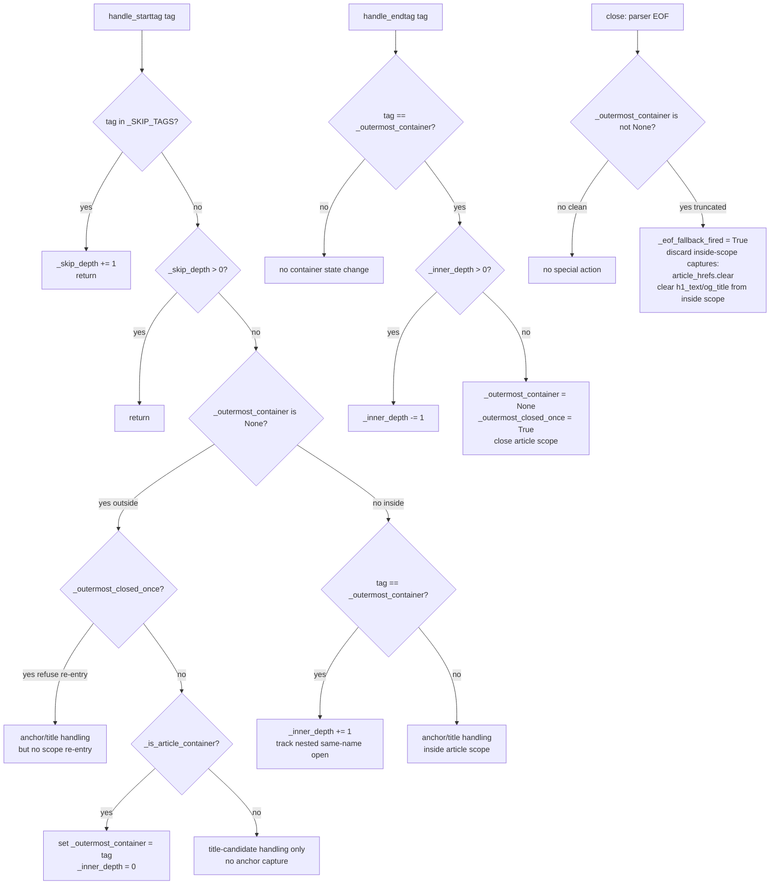

# _ArticleScopedCollector Stack Desync Fix (M1)

## Overview

`_ArticleScopedCollector` (in `verifier.py:542-637`) tracks article containers with `_article_tag_stack` (a list of tag names) that only pops when the closing tag's name matches the stack top. On real-world Medium / Blogger HTML — which can contain a nested `<article>` block (e.g., a "related stories" preview) or a sub-layout `<main>` whose closing tag is silently absent — the stack stays open for the rest of the document. Sidebar `<aside>` content then leaks into the "inside article" partition and weakens the key V1 defense: the title-in-sidebar false-positive guard.

This plan replaces the stack with **outermost-only tracking**: the collector remembers the first article-container tag it entered and ignores nested containers entirely; closure happens only when a `</tag>` matching that outermost name arrives, or at EOF. The semantics shrink to "everything between the first article-container open and its matching close (or EOF) is the article body" — which mirrors how Medium / Blogger actually render and is invariant to inner-tag imbalance.

## Problem Frame

The post-merge code-review run on `feat/real-publish-verification` ([review summary](../../.context/compound-engineering/ce-review/2026-05-12-feat-real-publish-verification/summary.md)) flagged this defect as **M1**, the highest-impact P1 residual. Three reviewers independently identified the failure (correctness 0.78, adversarial 0.82, maintainability 0.74). They agreed the bug is a design-level issue — a deterministic auto-fix cannot resolve it because the right semantics need a choice — and recommended either a depth-counter or "outermost only" tracking, paired with a fuzz test.

The exploit/regression surface:

1. **Sidebar title leak (primary).** A "recommended for you" `<aside>` or `<section>` containing the article's title appears *outside* the article container in well-formed HTML — currently correctly excluded. But if a nested *container* tag (e.g., `<main>` inside `<article>` for a sub-layout block, or `<article>` inside `<main>` for a related-stories preview card) opens and its closing tag is silently absent before the outer container closes, `_article_tag_stack` ends up `["article", "main"]` and the outer `</article>` does not match the stack top `"main"` — **nothing pops**. The article scope stays open, every later `<aside>` is now "inside", and `title_missing` is no longer detectable. *(Plain inner `<div>` / `<span>` tags do NOT trigger this — `_article_tag_stack` only pushes container tags. The failure shape is nested-container imbalance specifically.)*
2. **Operational cost.** The current behavior is silent. There is no log line or counter that says "collector exited in a degenerate state." A real Medium publish that should be `verified=false` would be `verified=true`. This re-introduces the founding-incident class of failure (fake/unverifiable publish reported as green).

> **Note on the original M1 finding's "state-blob href leak" framing.** The review summary cited a state-JSON-embedded-anchor leak as a second exploit vector. On closer inspection during planning: `<a href>` strings embedded inside attribute values (e.g., `data-state="..."`) are NOT tokenized by stdlib `html.parser` as real `<a>` start tags, and `<script>` blocks containing JSON are already skipped via `_SKIP_TAGS`. The realistic exploit vector reduces to the sidebar-leak shape above. R2 is preserved as a regression target but its representative test in Unit 1 exercises a generic out-of-scope `<section>` containing real `<a href>` tags — see Open Questions for the unresolved framing.

The branch `feat/real-publish-verification` is otherwise ready to ship; this fix is the precondition flagged by the review verdict ("M1 should be the first follow-up").

## Requirements Trace

- **R1.** Restore the title-in-sidebar false-positive defense for the *visible-text channel* (origin V1 success criterion: "heuristic precision") under malformed inner HTML. *Verified against synthetic test cases constructed during planning (Unit 1 regression test "sidebar title leak"); no real Medium/Blogger page exhibiting this shape was captured at planning time — see Production Evidence.* **Scope clarification:** the `<title>`, `<h1>`, and `og:title` capture channels remain global (not article-scoped) per Key Tech Decisions; an attacker who controls the response body can still place a matching title in any of those channels. R1 specifically covers the visible-text-inside-article channel. The plan's adversarial framing acknowledges this asymmetry — see the Adversarial-defense framing note in Key Technical Decisions.
- **R2.** Restore the out-of-scope anchor false-positive defense (originally framed as "state-blob href leak" in M1; the realistic exploit reduces to any `<a href>` outside the article container leaking into `article_hrefs` under stack desync). *Verified against synthetic test cases constructed during planning (Unit 1 regression test "out-of-scope anchor leak").*
- **R3.** Behavior on well-formed HTML must be unchanged — all 301 existing tests stay green. *(Verification step, mandatory before merge: run `pytest tests/ -q | tail -3` BEFORE editing source to capture baseline pass count, then run again AFTER all edits — the pass count must be identical. Project has no pytest-plugin gymnastics; plain `pytest -q | tail -3` is sufficient.)*
- **R4.** Add fuzz/property coverage that feeds random tag streams to the collector and asserts no degenerate scope-stays-open state escapes. *(Implemented in Unit 2; depends on Unit 1.)*
- **R5.** Document the invariant in the class docstring so a future contributor understands why nested containers are intentionally ignored.

## Scope Boundaries

- Out: M2 (URL canonicalization in target_link comparison). Separate fix; different review thread.
- Out: M3 (cross-module underscore-prefixed imports rename). Public-surface promotion, separate commit.
- Out: M4 (README exit-code table). Doc-only follow-up.
- Out: M5 (`InstalledAppFlow.run_local_server` non-interactive flag). Pre-existing risk, separate.
- Out: Switching the parser from stdlib `html.parser` to `beautifulsoup4`. The stdlib parser is enough; this fix is a state-machine redesign, not a parser swap.
- Out: Adding a separate telemetry counter for "collector exited in degenerate state". Subsumed by the EOF hard-reject Key Technical Decision: a truncated outermost scope produces `verification_error="article_container_unclosed"` on stderr per-row plus the run-end summary, which IS the operator-facing signal. No new JSONL field, no new metrics surface.
- Out: Generalizing to arbitrary container selectors (e.g., per-platform CSS-selector configurability). The two existing rules — `_ARTICLE_CONTAINER_TAGS = {"article", "main"}` plus `<section data-field="body">` plus `<div class="post-body">` — remain hard-coded.

## Context & Research

### Relevant Code and Patterns

- **`_ArticleScopedCollector`**: `src/backlink_publisher/verifier.py:542-637`. The buggy state machine.
- **Container detection**: `verifier.py:100` (`_ARTICLE_CONTAINER_TAGS = frozenset({"article", "main"})`) and `_is_article_container()` at `verifier.py:573-582` (adds `section[data-field="body"]` and `div.post-body`).
- **Skip-tag handling**: `verifier.py:103` (`_SKIP_TAGS = frozenset({"script", "style", "noscript", "template"})`) — unchanged by this plan; depth-counter pattern for `_skip_depth` is the right model and what the new outermost tracker should *not* re-invent for containers (containers are not nested-counted).
- **`_parse_and_match_html`**: `verifier.py:640-679`. The single caller of the collector. Treats parser exceptions as title/link-missing (best-effort). No change needed.
- **Existing collector tests**: `tests/test_verifier_html_channel.py:257-348` (`_ArticleScopedCollector` direct tests) and `tests/test_verifier_html_channel.py:355-438` (`_parse_and_match_html` tests). Both consume the same fixture-light style (handcrafted HTML strings inline in test functions). Pattern to follow for the new fuzz/regression suite.
- **End-to-end HTML-channel test pattern**: `tests/test_verifier_html_channel.py:691` (`test_html_title_in_sidebar_rejected`) shows the integration shape with `_public_dns` fixture. The new regression scenarios slot in alongside.

### Institutional Learnings

- **From the verification plan (`2026-05-12-005`)**: the article-scope partition is one of two structural defenses against the founding-incident failure mode. It is not the *only* defense (host allowlist, path-shape allowlist, SSRF check all run first). But it is the **last line of defense against legitimate-host content that does not actually contain the article body** — e.g., a Medium home redirect, a tag page, a profile page with the article title in a sidebar promo card. The other defenses do not catch those.
- **From `feedback/api-idempotency-lesson`**: defensive parsing of platform HTML is brittle because the platforms own the markup and change it freely. The right shape is "narrow and confidence-bounded": when in doubt, reject (return `verified=false`), do not over-accept. The outermost-only redesign is consistent with this — it cannot accidentally include sidebar content; the worst case is "we collect more than expected" only when the outermost `</article>` is missing, which already triggers EOF-driven termination.
- **`html.parser` behavior**: stdlib `html.parser.HTMLParser` does not synthesize close tags or balance them. `handle_endtag` fires once per `</...>` seen in the byte stream; if `</article>` is absent the parser hits EOF without ever firing the close handler. The collector must handle EOF gracefully (it already does — `close()` is called at `verifier.py:657`).

### External References

None. Pure stdlib redesign of an internal class.

### Production Evidence

**Honest framing:** at planning time, no real Medium or Blogger page has been captured exhibiting the nested-container-imbalance shape (`<article><main>…</article>` with `<main>` close missing) that the original M1 reviewers cited. The reviewer counterexamples were theoretical, and the plan author had to construct refined shapes during planning when the originally-cited examples did not actually reproduce against the current `_article_tag_stack` behavior (see Problem Frame note).

**Why ship the fix anyway:**
1. The reviewer agreement (3 of 8 reviewers, correctness 0.78 / adversarial 0.82 / maintainability 0.74) is on a *design-level* defect: the stack-based matching is *constructionally* vulnerable to nested-container imbalance regardless of whether such input has been observed. The fix removes the construction, not just the observed instance.
2. The threat model is adversarial: an attacker who controls the response body served at a legitimate-shaped URL can craft any HTML they like. Production-evidence is not the gating criterion for adversarial defense; constructive resistance is.
3. The fix's downside (the new `_outermost_closed_once` + EOF-hard-reject rules) is reviewed via the Choice Validation table — strictly safer than today and strictly safer than depth-counter on every malformed input considered.
4. The "ship without observation" risk is bounded by R3 (existing 301 tests stay green = no well-formed-HTML regression).

**Followup, deferred:** capture a corpus of real Medium / Blogger / Hashnode HTML samples (~50 real publish URLs across the three platforms) and re-run the verifier offline against them. This goes in a separate observability ticket; it is NOT a prerequisite for this fix. If the corpus shows the wild-frequency of nested-container imbalance is zero, the value of this fix is purely adversarial (still worth shipping); if non-zero, this fix shifts those publishes from silent-false-positive to deterministic-`verified=false`.

## Key Technical Decisions

- **Outermost-only tracking, not depth-counter.** The reviewer's recommendation listed both. Depth-counter is rejected because:
  1. Inner article containers are vanishingly rare on real Medium/Blogger pages and are semantically *not* part of the article body (the most common case is a "Related Posts" widget that opens its own `<article>` tags for each card). Counting them as "still inside" actively re-introduces the false-positive surface the partition exists to prevent.
  2. Depth-counter is equally vulnerable to mismatched-close-tag drift — the close still has to match a known tag name to decrement; if the outer container's close is missing, an unrelated later close (e.g., `</main>` after `<article>` is the outermost) decrements the count incorrectly.
  3. Outermost-only collapses the state to a single optional string (the tag name we are watching for) plus the inner-depth counter for same-name nesting. Simpler, easier to reason about under adversarial input.

  **Choice validation against four structured inputs.** *All three columns are evaluated assuming the design also includes `_outermost_closed_once` + EOF hard-reject; the "Today (tag-name stack)" column shows what today's actual code does (which has NEITHER of those additions) so the column is not a "today vs. designs" comparison — it is "today's actual behavior" alongside "today + outermost-only refactor" and "today + depth-counter refactor". The depth-counter column further assumes name-aware matching (close must match a known tag name); a naive any-close-decrements depth-counter is strictly worse and is rejected without being shown.*

  | Input shape | Today (tag-name stack) | Depth-counter | Outermost-only (this plan) |
  |---|---|---|---|
  | `<article>body<main>x</main></article><aside>side</aside>` (well-formed nested foreign container) | OK — `</main>` pops, `</article>` pops, side excluded | OK — counter goes 1→2→1→0, side excluded | OK — first-enter wins on `<article>`; `<main>` ignored as different-name; `</main>` no-op; `</article>` exits |
  | `<article>body<main>x</article><aside>title</aside>` (nested foreign container with missing close) | **BUG** — stack `[article, main]`, `</article>` doesn't match top `"main"`, no pop, side leaks | **BUG** — counter goes 1→2; `</article>` only matches if logic checks tag name AND name == any-stack-entry; under naive depth-counter (any close decrements) the `</article>` would decrement to 1, side leaks. Under name-aware depth-counter this fails identically to today. | OK — first-enter is `"article"`; `<main>` is different tag name, ignored; `</article>` matches outermost, exits; side excluded |
  | `<article>A</article><article>B</article>` (two top-level articles) | Both captured (B's anchors leak into `article_hrefs`) | Both captured (counter resets to 0 between, second enter re-arms it) | **OK** — `_outermost_closed_once` set after first close; second `<article>` is no-op; B excluded |
  | `<article>body<aside>side</aside>` (missing outermost close, EOF arrives mid-scope) | Side leaks (scope never exits) | Side leaks (counter still 1 at EOF) | **OK** — `close()` finds `_outermost_container is not None`, sets `_eof_fallback_fired`, discards `article_hrefs` and inside-scope title-candidates; `_parse_and_match_html` returns `"article_container_unclosed"`, `verified=false` |

  The first row shows all three designs are equivalent on well-formed input. The remaining rows show outermost-only is strictly safer on the malformed shapes that motivated the fix.
- **Track tag name, not opaque token.** The outermost state holds the literal tag name (`"article"`, `"main"`, `"section"`, or `"div"`) as recorded at the moment of first enter. This is needed because the close must match by name, and because the entry could be any of four shapes (`<article>`, `<main>`, `<section data-field="body">`, `<div class="post-body">`).
- **First-enter wins, no fallback to a later container.** Once `_outermost_container` is set, any later `_is_article_container(...)` open is ignored. This means a page whose `<main>` opens before its `<article>` will collect from inside `<main>` (including the `<article>` inside it). That is correct: `<main>` is by W3C definition the page's primary content; the inner `<article>` is part of that content.
- **Single-article semantics enforced via `_outermost_closed_once: bool`.** Once the outermost container's matching close fires, the flag is set; subsequent container opens become no-ops (`_outermost_container` stays `None` for the rest of the document). Without this, a page with two top-level `<article>` blocks would collect their union — letting an attacker emit `<article>real</article><article>sidebar-with-title-and-target</article>` at a legitimate `/@user/slug` URL and have BOTH captured. Single-article semantics is what the upstream path-shape allowlist promises for legitimate pages; the parser enforces it independently as a defense-in-depth measure that does not require the upstream allowlist to be perfectly tuned.
- **Adversarial-defense framing — what this fix does and does not defend.** Under an adversary who controls the full HTML body served at a legitimate-shaped URL, the verifier checks four channels: visible-text-inside-article, `<a href>` set inside article (`article_hrefs`), and three global title candidates (`<title>`, `<h1>`, `og:title`). **This fix scopes the first two to the article container correctly**; the three title candidates **remain globally captured** (always-on, first-wins). An attacker controlling the body can pass the title substring check by placing the expected title in any of those three globals; the primary remaining defense is the *link* check (R6 in the parent plan): every expected href must appear in `article_hrefs`, which IS article-scoped. Adversarial scope-expansion to article-scope the three title channels too is **explicitly out of scope** here — see Adversarial Scope Decision in Open Questions. This decision is a judgement call: the additional state and rule complexity to scope title candidates would not by itself defend against an attacker who can also inject the expected href inside the article, so the marginal adversarial value is uncertain.
- **EOF-bounded termination is a hard rejection, not a fallback.** If parser EOF arrives with `_outermost_container is not None` (outermost close never fired), the collector treats the captured state as **untrusted**: in `close()` it sets `_eof_fallback_fired = True` and clears `article_hrefs`, `h1_text`, and `og_title` *if* those candidates were captured inside the unclosed scope. (`<title>` text captured before any container opened is preserved — it was not inside the unclosed scope.) `_parse_and_match_html` reads `_eof_fallback_fired` and returns a new additive failure reason `"article_container_unclosed"`; `_verify_html_channel` maps it to `verified=false, verification_error="article_container_unclosed"`. Rationale: under an adversarial threat model where the adversary controls the response body served at a legitimate-shaped URL, omitting `</article>` is a trivial attack against any "best-effort" fallback. Converting truncation into a deterministic `verified=false` signal makes the failure both correct and operator-visible — and subsumes any separate "EOF fallback fired" telemetry counter (the new `verification_error` reason IS the operator signal).
- **No skip-tag stack interaction change.** `_skip_depth` for `<script>` / `<style>` / `<noscript>` / `<template>` stays as-is. Container tracking and skip tracking are independent state machines.
- **Two `<a href>` capture rule changes are intentionally NOT scoped here.**
  1. We do not start capturing `<a href>` *outside* the article container even when no outermost container is ever opened. Today, if a page has no `<article>` / `<main>` / `<section data-field="body">` / `<div class="post-body">` at all, `article_hrefs` ends up empty and link matching fails with `target_link_missing`. That behavior is preserved — it is the correct "could not verify" signal for, e.g., Medium home redirects with no article body.
  2. We do not change title-candidate capture (`<title>`, `<h1>`, `og:title`) — those are always-on regardless of container state.

## Open Questions

### Resolved During Planning

- **What if a page has two top-level `<article>` elements (e.g., archive pages or attacker-crafted bodies)?** `_outermost_closed_once` enforces single-article semantics: the first `<article>` enters and its matching close clears `_outermost_container` AND sets `_outermost_closed_once = True`. Subsequent container opens (article or otherwise) are refused. The second `<article>`'s content is treated as outside-scope — anchors not captured, `h1_done` already set so h1 not overwritten. This is the dispatcher-independent defense against the union-collection attack vector.
- **What about `<section data-field="body">` nested inside `<article>` (Medium pattern)?** First-enter wins on `<article>`; the inner `<section data-field="body">` is a different tag name (`"section"`), treated as normal content (anchors/visible-text captured normally); closing `</section>` is a no-op; closing `</article>` matches outermost, exits.
- **What if the first matching tag is `<div class="post-body">` (Blogger pattern) with generic inner `<div>`s?** Outermost is `"div"`; the inner-depth counter increments on EVERY `<div>` open (attribute-independent), decrements on every `</div>`. The matching outer `</div>` is the one that brings depth back to 0. Verified by Unit 1 happy-path test "Blogger pattern, `<div class="post-body">` containing generic inner `<div>`s".
- **What happens if the outermost close never arrives (parser EOF mid-scope)?** Hard reject: `close()` sets `_eof_fallback_fired = True`, clears `article_hrefs` and `h1_text`. `_parse_and_match_html` returns `"article_container_unclosed"`; `_verify_html_channel` propagates as `verified=false, verification_error="article_container_unclosed"`. This is NOT a "best-effort fallback" — under adversarial input, omitting `</article>` is a trivial attack and must produce a deterministic failure signal.
- **Does this change affect the title-candidate capture order?** No. `_in_title`, `_in_h1`, and `og_title` capture is independent of container state. (However, if `_eof_fallback_fired`, `h1_text` is cleared — see EOF hard-reject Key Tech Decision — because the in-scope h1 cannot be trusted; `<title>` and `og:title` captured strictly before any container open in `<head>` are preserved.)
- **What's the post-`close()` invariant on `_skip_depth`?** `>= 0`, NOT `== 0`. stdlib `html.parser.HTMLParser.close()` does NOT synthesize close events for unclosed `<script>` / `<style>` / `<noscript>` / `<template>` tags; on truncated input within a skip block, `_skip_depth` may remain > 0. The fuzz assertion is `>= 0`, committed.
- **Does the fuzz test need network or fixtures?** No. Pure in-memory tag streams piped to the collector. Use `random.Random(seed=2026_05_12)` for deterministic reproducibility — no pytest fixture or external data files needed.

### Deferred to Implementation

- **Decision on h1_text / og_title preservation under EOF hard-reject — RESOLVED:** Option A. On `_eof_fallback_fired`, the `close()` override clears `article_hrefs` and `h1_text` unconditionally; `<title>` and `og:title` captured strictly in `<head>` before any container open are preserved IN THE COLLECTOR but `_parse_and_match_html` short-circuits on `_eof_fallback_fired` and returns `"article_container_unclosed"` without consulting any title candidate. Operator-observable outcome: truncated input always surfaces as `verified=false, verification_error="article_container_unclosed"` regardless of whether `<title>` would otherwise have matched. Rationale: the safer default is to never let a truncated body pass verification, period. Option B (conditional clearing) is only worth implementing if a future regression test shows a use case for letting truncated-but-`<head>`-complete pages pass via `<title>` match, which has no current motivation.

### Adversarial Scope Decision

- **Should title-candidate channels (`<title>` / `<h1>` / `og:title`) also be article-scoped, gated on `not _outermost_closed_once`, or otherwise hardened?** **Deferred to a follow-up plan, not this one.** The marginal adversarial value of scoping the title channels is uncertain: an attacker who controls the body to inject `<h1>` outside the article container ALSO controls the body inside the article container, and can simply emit the expected `<h1>` inside `<article>` for the same effect. The link check (every expected href must appear in `article_hrefs`, which IS article-scoped post-fix) is the primary defense — title-substring is heuristic. Hardening the title channels is **independently valuable** if combined with link-channel hardening that goes beyond what this fix does (e.g., requiring the title `<h1>` to physically appear inside the article container), but that is a separate design conversation. Adding it here would expand the diff beyond what M1 asked for. **Action:** file a follow-up ticket titled "Adversarial: article-scope title-candidate channels". The follow-up should justify itself with either real adversarial-payload evidence or a clearer extension to a stricter title-must-be-inside-article rule.
- **Whether to expose a deterministic seed via a pytest fixture.** Default: hard-code the seed; if a flaky-CI signal appears, add a `--fuzz-seed` knob.

## High-Level Technical Design

> *This illustrates the intended approach and is directional guidance for review, not implementation specification. The implementing agent should treat it as context, not code to reproduce.*

State-machine shape after the fix (compared to today):

```text
_ArticleScopedCollector state
─────────────────────────────
  today:                            after fix:
  _article_tag_stack: list[str]     _outermost_container: str | None
  (push on every container open)    (set once on first enter; cleared on close;
                                     stays None forever after _outermost_closed_once)
                                    _inner_depth: int
                                    (counts nested opens of the outermost tag NAME
                                     regardless of attributes; decremented on matching
                                     close; brings scope to 0 → terminate)
                                    _outermost_closed_once: bool
                                    (set when first outermost close fires;
                                     refuses re-entry on later container opens)
                                    _eof_fallback_fired: bool
                                    (set in close() if _outermost_container is not None
                                     at parser EOF; signals hard-reject to the caller)

  _skip_depth: int                  _skip_depth: int     (unchanged)
  _in_title: bool                   _in_title: bool      (unchanged)
  _in_h1 / _h1_done: bool           _in_h1 / _h1_done    (unchanged)
```

Container open/close flow:



**Key correctness notes:**
1. *Inner-depth counter:* increments on **every** `<tag>` open whose tag name equals `_outermost_container` when already inside — independent of whether `_is_article_container` returns True for that specific attribute set. This is critical for the `<div class="post-body">` case: every inner generic `<div>` must increment so the matching inner `</div>` doesn't prematurely close the scope.
2. *Closed-once flag:* once the outermost container closes, subsequent container opens are refused. Prevents two-top-level-articles union-collection.
3. *EOF hard reject:* a truncated outermost scope is a hard verification failure, not a best-effort fallback. The collector discards anchors and title-candidates captured inside the unclosed scope; the caller surfaces this as `verification_error="article_container_unclosed"`.

Reduced collector skeleton (directional, not implementation):

```text
class _ArticleScopedCollector(HTMLParser):
    _outermost_container: str | None
    _inner_depth: int
    _outermost_closed_once: bool
    _eof_fallback_fired: bool
    _skip_depth: int

    @property
    def _in_article(self) -> bool:
        return self._outermost_container is not None

    def handle_starttag(self, tag, attrs):
        # skip-tag handling unchanged
        if self._outermost_container is None:
            # outside scope
            if self._outermost_closed_once:
                # refuse re-entry — first article already closed
                pass  # anchors/titles handled per always-on rules
            elif self._is_article_container(tag, attrs_dict):
                self._outermost_container = tag
                self._inner_depth = 0
        elif tag == self._outermost_container:
            # inside scope — increment depth on every open whose tag NAME
            # matches `_outermost_container`. The check is plain tag-name
            # equality (compared directly here, NOT via _is_article_container
            # which only runs on the entry path above). This is critical so
            # generic <div> inside an outermost <div class="post-body">
            # correctly increments and the inner </div> doesn't prematurely
            # pop the outer scope.
            self._inner_depth += 1
        # title/h1/og:title/anchor handling reads self._in_article

    def handle_endtag(self, tag):
        # skip-tag handling unchanged
        # title/h1 unwind in handle_endtag unchanged from verifier.py:620-624
        if self._outermost_container is not None and tag == self._outermost_container:
            if self._inner_depth > 0:
                self._inner_depth -= 1
            else:
                self._outermost_container = None
                self._outermost_closed_once = True

    def close(self):
        super().close()
        if self._outermost_container is not None:
            # Truncated outermost scope — hard reject.
            self._eof_fallback_fired = True
            self.article_hrefs.clear()
            # Title candidates captured BEFORE the outermost open (<title>
            # before <article>, or og:title in <head>) are preserved by
            # not clearing them here; only h1_text and visible-text chunks
            # collected inside the unclosed scope are unreliable. Detail
            # finalized in Unit 1 — the safe default is to clear h1_text
            # only when _in_h1 was set inside the scope, but tracking that
            # adds complexity; the simpler invariant is to clear both
            # h1_text and any in-scope og_title (og:title in body) and
            # let _parse_and_match_html return article_container_unclosed
            # regardless.
            self.h1_text = ""
            # _eof_fallback_fired is read by _parse_and_match_html.
```

## Implementation Units

- [ ] **Unit 1: Redesign `_ArticleScopedCollector` to outermost-only tracking + deterministic regression tests**

**Goal:** Replace the `_article_tag_stack: list[str]` state with `_outermost_container: str | None` + `_inner_depth: int` + `_outermost_closed_once: bool` + `_eof_fallback_fired: bool`. Update `handle_starttag`, `handle_endtag`, and `close()` accordingly. Add a new additive `verification_error` reason `"article_container_unclosed"` returned by `_parse_and_match_html` when `_eof_fallback_fired` is True. Update the class docstring to document the invariants. Add deterministic regression tests covering: sidebar title leak (nested-foreign-container variant), out-of-scope anchor leak, mismatched-inner-tag desync, two-top-level-articles refusal, and EOF-truncation hard-reject.

**Requirements:** R1, R2, R3, R5.

**Dependencies:** None.

**Files:**
- Modify: `src/backlink_publisher/verifier.py:542-637` (`_ArticleScopedCollector`)
- Modify: `src/backlink_publisher/verifier.py:546-552` (class docstring — document outermost-only invariant, closed-once flag, and EOF hard-reject)
- Modify: `src/backlink_publisher/verifier.py:640-679` (`_parse_and_match_html`) — read `collector._eof_fallback_fired` after `close()` and return `"article_container_unclosed"` as the failure reason when True
- Test: `tests/test_verifier_html_channel.py:257-348` (existing collector tests — adapt any that assert against the internal stack, if present; behavior assertions stay green)
- Test: `tests/test_verifier_html_channel.py` (append new regression-test functions in the `_ArticleScopedCollector` section, lines ~348 onward)

**Approach:**
- Drop `_article_tag_stack`; replace with `_outermost_container: str | None`, `_inner_depth: int`, `_outermost_closed_once: bool`, `_eof_fallback_fired: bool`. Initialize all in `__init__`. `_in_article` property reads `self._outermost_container is not None` (unchanged contract).
- `handle_starttag` has three gates, checked in order:
  - **Outside scope, already closed once** (`_outermost_container is None and _outermost_closed_once`): do not re-enter. Skip container handling; anchors/titles fall through to always-on rules (which under `_in_article == False` don't capture anchors).
  - **Outside scope, never opened yet** (`_outermost_container is None and not _outermost_closed_once`): only enter if `_is_article_container(tag, attrs_dict)` returns True. Set `_outermost_container = tag` (lower-cased; already normalized at top of method) and `_inner_depth = 0`.
  - **Inside scope** (`_outermost_container is not None`): if the current tag's name equals `_outermost_container`, increment `_inner_depth` — **regardless of attributes**. This is critical: a generic `<div>` inside an outermost `<div class="post-body">` must increment so the inner `</div>` doesn't prematurely pop the scope. Tags with names different from `_outermost_container` are treated as normal content (anchors and visible text get captured by the always-on rules below).
- `handle_endtag` for any tag: only react if `tag == _outermost_container`. If `_inner_depth > 0`, decrement; else clear `_outermost_container` to `None` AND set `_outermost_closed_once = True`.
- `close()` override: after `super().close()`, if `_outermost_container is not None`, set `_eof_fallback_fired = True`, clear `article_hrefs`, clear `h1_text` (it was either captured inside the unclosed scope or never captured). Title-candidates captured strictly before any container open (`<title>` text, `og:title` from `<meta>` in `<head>`) are preserved because they were not inside the unclosed scope — but in practice `_parse_and_match_html` will short-circuit on `_eof_fallback_fired` and return `"article_container_unclosed"` without consulting them.
- `_parse_and_match_html` update — **this is the FIRST modification an implementer should make**, before touching the collector class. After `collector.feed()` and `collector.close()`, insert as the FIRST check before any title or href validation: `if collector._eof_fallback_fired: return "article_container_unclosed"`. Only if this flag is False, proceed with the existing title/href checks (unchanged shape, unchanged order). Locking this order in writing prevents an implementer from accidentally letting truncated input's stale h1_text or visible-text propagate through the title check.
- Title / h1 / og:title capture unchanged for non-truncation paths.
- Anchor capture: `if self._in_article and tag == "a":` block is unchanged.
- Docstring update: rewrite the "Inside the article container" paragraph to state (a) the outermost-only invariant with attribute-independent inner-depth, (b) `_outermost_closed_once` single-article semantics, (c) the EOF hard-reject as a deterministic failure path (not a "best-effort" fallback).

**Patterns to follow:**
- `_skip_depth` integer counter (already in the same class) — same idiom for `_inner_depth`.
- Lower-case tag normalization on entry (`tag = tag.lower()` at the top of `handle_starttag` / `handle_endtag` — unchanged).
- Inline test-fixture HTML strings in `tests/test_verifier_html_channel.py:266-348` — same style for the new regression tests.

**Test scenarios:**

*Happy paths (well-formed input — behavior preserved):*
- *Well-formed `<article>`:* HTML `<article><h1>Title</h1><p>Body with <a href="https://t/">link</a></p></article><aside><a href="https://side/">side</a></aside>`. Expected: `article_hrefs == {"https://t/"}`, `"side"` excluded, `h1_text` contains `"Title"`, `_eof_fallback_fired == False`. Identical to today's behavior.
- *`<main>` containing nested `<article>`:* HTML `<main><article><h1>Title</h1><a href="https://a/">A</a></article><a href="https://b/">B</a></main>`. Expected: `_outermost_container == "main"` throughout; `_inner_depth` stays 0 (the inner `<article>` is a different tag name, treated as normal content); `article_hrefs == {"https://a/", "https://b/"}`; `h1_text` contains `"Title"`. Inner `</article>` is a no-op; outer `</main>` exits scope; `_outermost_closed_once == True` afterwards.
- *Medium pattern, `<article>` containing `<section data-field="body">`:* outermost is `<article>`; inner section is ignored; close of `</section>` does not exit; close of `</article>` does. All anchors inside captured.
- *Blogger pattern, `<div class="post-body">` with attribute-bearing AND generic inner `<div>`s:* HTML `<div class="post-body"><div class="nested">attr-div</div><div>plain-div</div>body<a href="https://t/">link</a></div><aside><a href="https://side/">side</a></aside>`. Expected: outermost is `"div"` (post-body, entered via `_is_article_container` attribute match); first inner `<div class="nested">` increments `_inner_depth` to 1 **because the tag NAME matches `_outermost_container`, independent of attributes** (this is the critical attribute-independent rule — the check is `tag == self._outermost_container`, not `_is_article_container(tag, attrs)`); `</div>` decrements to 0; second inner `<div>` (no class) increments to 1; `</div>` decrements to 0; outer `</div>` exits scope; `article_hrefs == {"https://t/"}`. Sidebar excluded.
- *`<div class="post-body">` two-deep nested generic divs:* HTML `<div class="post-body">a<div>b<div>c</div></div>body<a href="https://t/">link</a></div>`. Verifies depth correctly goes 1→2→1→0 without prematurely exiting.
- *Attribute-conditional `<section data-field="body">` entry:* HTML `<section data-field="body"><a href="https://t/">link</a></section><aside><a href="https://side/">side</a></aside>`. Expected: outermost is `"section"` (entered via attribute match in `_is_article_container`); inner depth stays 0 (no inner `<section>` opens); `</section>` exits scope; `article_hrefs == {"https://t/"}`; sidebar excluded. **Locks in attribute-conditional entry path coverage that the fuzz alphabet probabilities aim to exercise.**

*Boundary conditions (intentionally-unchanged behaviors locked in):*
- *No article container at any depth:* HTML `<body><h1>Title</h1><a href="https://x/">link</a></body>`. Expected: `_outermost_container is None` throughout; `article_hrefs == set()` (anchors outside any container are not captured); `h1_text` contains `"Title"` (h1 is always-on); `_eof_fallback_fired == False`.
- *Title-candidate capture timing:* HTML `<head><title>Head Title</title><meta property="og:title" content="OG Title"></head><body><h1>H1 Title</h1><article><a href="https://t/">link</a></article></body>`. Expected: all three title candidates captured regardless of container state — `title_text == "Head Title"`, `og_title == "OG Title"`, `h1_text == "H1 Title"`; `article_hrefs == {"https://t/"}`.

*Regression scenarios (M1 failure shapes — pass under the new design):*
- *Regression — sidebar title leak (R1 primary):* HTML `<article>body<main>inner-main-no-close</article><aside><h1>Sidebar Title</h1></aside>` (a nested `<main>` container inside `<article>` with its close missing). Today's bug: stack `["article", "main"]`; `</article>` doesn't match top `"main"`, no pop; sidebar `<h1>` becomes "in scope" via `_h1_done` race or visible-text leak. **After fix**: outermost is `"article"`; nested `<main>` is a different tag name, treated as normal content (not a scope push); `</article>` matches outermost and exits cleanly; `_outermost_closed_once = True`; sidebar `<h1>` is NOT captured as h1_text (h1_done already true from first `<h1>` inside `<article>`); sidebar anchor (if any) excluded.
- *Regression — out-of-scope anchor leak (R2):* HTML `<main>body<article>related-card-no-close</main><section><a href="https://leak/">bad</a></section>` (Medium-style related-stories card inside `<main>` with its close missing, followed by an out-of-scope section with anchors). Today's bug: stack `["main", "article"]`; `</main>` doesn't match top, no pop; trailing `<section>` is "inside"; `"https://leak/"` captured. **After fix**: outermost is `"main"`; nested `<article>` is a different tag name, ignored; `</main>` matches outermost, exits; trailing `<section>` is outside; `"https://leak/"` NOT in `article_hrefs`.
- *Regression — same-name nested-container imbalance:* HTML `<article>outer<article>inner-no-close</article><aside><a href="https://side/">side</a></aside>` (the inner `</article>` closes the OUTER's scope under today's buggy code AND under outermost-only-without-inner-depth — but with inner-depth counter, the inner-no-close case is exactly what the second `</article>` is for). Wait — this shape actually HAS a close-tag. Reframe: HTML `<article>outer<article>inner-deliberately-no-close<aside><a href="https://side/">side</a></aside>` (only one `</article>` close arrives at EOF). After fix: outermost is `"article"`; inner `<article>` increments `_inner_depth` to 1; no closes arrive; EOF triggers hard-reject: `_eof_fallback_fired = True`, `article_hrefs` cleared, `verification_error="article_container_unclosed"`. (This is a stronger guarantee than the original "sidebar excluded" — truncation IS the failure signal.)
- *Regression — two top-level articles attack (R1/R2 combined):* HTML `<article>real-body<a href="https://t/">link</a></article><article>sidebar-imitator<a href="https://t/">link</a><h1>Title</h1></article>`. After fix: first `<article>` enters; first `</article>` exits and sets `_outermost_closed_once = True`; second `<article>` is refused (no re-enter); second article's content is treated as outside-scope; `article_hrefs == {"https://t/"}` (only from the first); second `<h1>` does not overwrite first (`_h1_done` guard). **Verifies `_outermost_closed_once` defense against union-collection attack.**

*Edge cases (state-machine correctness):*
- *Repeated outermost-tag-name inner opens (well-formed):* HTML `<article>outer<article>inner</article></article><aside><a href="https://side/">side</a></aside>`. Expected: `_inner_depth` increments on the second `<article>` (depth=1); decrements on the first `</article>` (depth=0); exits on the second `</article>` (clears `_outermost_container`, sets `_outermost_closed_once`). Sidebar excluded.
- *Unmatched outermost close (EOF hard-reject):* HTML `<article>...content...<a href="https://t/">link</a><aside><a href="https://side/">side</a></aside>` (no `</article>`). On `close()`: `_outermost_container == "article"`, sets `_eof_fallback_fired = True`, clears `article_hrefs`, clears `h1_text`. Subsequent `_parse_and_match_html` returns `"article_container_unclosed"`. **No anchor leak under truncation.**
- *Close tags with no opens:* HTML `</article></main></section></div>`. Expected: every close tag is a no-op because `_outermost_container is None`; `_eof_fallback_fired == False`; `_outermost_closed_once == False`.
- *`_skip_depth` interaction:* `<article><script><a href="should-skip"></script><a href="should-keep"></a></article>`. Script content skipped; outer anchor captured. Unchanged.

**Verification:**
- All existing 301 tests pass after the refactor. Capture the baseline first: `pytest tests/ -q 2>&1 | tail -3` and pin the count BEFORE editing source; rerun AFTER and require identical pass count.
- All new regression and boundary tests pass.
- `grep -n "_article_tag_stack" src/backlink_publisher/verifier.py` returns no matches (state field renamed).

---

- [ ] **Unit 2: Property-based fuzz test for malformed-HTML resilience**

**Goal:** Add three layers of property/fuzz coverage to `_ArticleScopedCollector`:
1. **Invariant fuzz** — 2000 pseudo-random tag streams asserting no exception escapes and type/state invariants hold.
2. **Adversarial property** — for every stream where the seed-controlled generator marks specific anchors as "should-be-excluded" (anchors emitted outside any container scope, or inside `<aside>` blocks at top level), assert those anchors are NOT in `article_hrefs` after `close()`.
3. **Structure-aware mutation** — take each deterministic regression seed from Unit 1 and mutate it (insert/delete/reorder tokens within ±5 positions of structural boundaries) producing ~200 variants per seed; each variant must still satisfy: anchors-tagged-as-leak excluded OR `_eof_fallback_fired == True`.

The seed is pinned for reproducibility. The combined coverage addresses the reviewer concern that pure random fuzzing measures invariants but not security properties.

**Requirements:** R4.

**Dependencies:** Unit 1 (tests assert post-fix invariants AND the new hard-reject contract).

**Files:**
- Test: `tests/test_verifier_html_channel.py` — append new test functions in the existing `_ArticleScopedCollector` section:
  - `test_collector_fuzz_invariants_random_tag_streams` (layer 1)
  - `test_collector_fuzz_security_excludes_marked_anchors` (layer 2)
  - `test_collector_fuzz_mutation_around_regression_seeds` (layer 3)
- Helper (in same file): `_generate_random_stream(rng) -> tuple[str, set[str]]` returning `(html, set_of_anchor_urls_that_must_not_leak)`.

**Approach:**
- No new dependencies. Use `random.Random(seed=2026_05_12)` for reproducibility (constant module-local seed).
- **Tag alphabet** for fuzz: `["article", "main", "section", "div", "aside", "h1", "h2", "p", "span", "a", "script", "style", "noscript", "template", "title", "body", "html"]`. **Attribute combinations** are emitted with explicit probability so the attribute-conditional containers (`<section data-field="body">`, `<div class="post-body">`) are exercised — without this, the article-container entry path through attributes is barely visited:
  - 25% of `<section>` opens carry `data-field="body"`.
  - 35% of `<div>` opens carry `class="post-body"`.
  - 50% of `<a>` opens carry `href="https://genN/"` where N is a per-stream counter; the generator tracks whether the anchor was opened inside the current scope (a tag-stack-aware tracker, not the collector's state) and tags it `leak` or `keep` accordingly.
- **Stream generator** per iteration: build a list of 50-500 tokens with these mix proportions:
  - 50% open tags, 30% close tags (correctly matched), 20% drop-close (deliberate imbalance).
  - Tags can carry text content between them (30% of tokens are text fragments).
- For each generated stream:
  - Instantiate a fresh `_ArticleScopedCollector`.
  - Call `feed(stream)` then `close()`.
  - **Layer 1 assertions** (always):
    - No exception raised.
    - `isinstance(c.article_hrefs, set)` and every member is `str`.
    - `isinstance(c.title_text, str)`, `isinstance(c.h1_text, str)`, `isinstance(c.og_title, str)`.
    - `c._skip_depth >= 0` (committed invariant; html.parser does NOT synthesize close events for unclosed `<script>`/`<style>`, so `_skip_depth` may remain > 0 on truncated input — `>= 0` is the right post-`close()` invariant).
    - `c._outermost_container is None or isinstance(c._outermost_container, str)`.
    - `c._inner_depth >= 0`.
  - **Layer 2 assertions** (security property):
    - For every anchor URL tagged `leak` by the generator: `url NOT in c.article_hrefs` OR `c._eof_fallback_fired == True` (the hard-reject branch clears the set, so either path satisfies the security property).
- 2000 iterations: trivial to run (each stream is in-memory, html.parser is fast). Wall-clock target is informational, not a verification gate.
- **Layer 3 — structure-aware mutation seeds**: enumerate the deterministic regression shapes from Unit 1 (sidebar title leak, out-of-scope anchor leak, same-name nested imbalance, two-top-level-articles attack, unmatched outermost close). For each seed, run ~200 mutations: pick a random position in the token sequence; with equal probability, (a) insert a random extra tag, (b) delete the token, (c) swap with a neighbor within ±5 positions. Each mutation goes through the collector; layer-2 security property must still hold.

**Patterns to follow:**
- Inline test fixtures, no new `tests/fixtures/` files.
- `random.Random(seed=...)` not the module-level `random` — keeps fuzz hermetic, no test-order dependency.
- Naming: `test_collector_fuzz_*` to make the property class greppable.

**Test scenarios:**
- *Property — no exceptions (layer 1):* 2000 random streams, none raise.
- *Property — type invariants (layer 1):* every collector instance after `close()` has `article_hrefs: set[str]`, three `str` title-candidate fields.
- *Property — state-machine invariants (layer 1):* `_outermost_container` is `None` or a known container tag name; `_inner_depth >= 0`; `_skip_depth >= 0`; if `_eof_fallback_fired == True` then `article_hrefs == set()`.
- *Property — sidebar exclusion (layer 2):* anchors tagged `leak` by the generator never appear in `article_hrefs` (or `_eof_fallback_fired` cleared the set).
- *Property — single-article enforcement (layer 2):* if the generator emitted more than one balanced top-level article-container, anchors inside the second-and-beyond are tagged `leak`; assertion holds.
- *Deterministic worst case — 100 unclosed article opens:* `"<article>" * 100 + "<aside><a href='leak'></aside>"`. After fix: outermost locks on first open; `_inner_depth` reaches 99; `close()` finds `_outermost_container is not None`, triggers hard-reject; **`article_hrefs == set()`**, `_eof_fallback_fired == True`. (The reviewer-noted contract change: this used to be documented as "leak IS captured by design"; now it is "leak is rejected.")
- *Deterministic worst case — alternating article/main with missing closes:* `"<article><main></article><main>"`. After fix: outermost is `"article"`; inner `<main>` is a different tag name (ignored); first `</article>` matches outermost, exits, sets `_outermost_closed_once = True`; second `<main>` is refused (closed-once). At `close()`: `_outermost_container is None`, no hard-reject; `_outermost_closed_once == True`; `_inner_depth == 0`.
- *Deterministic worst case — close tags with no opens:* `"</article></main></section></div>"`. After fix: every close tag is a no-op; `_outermost_container is None`, `_inner_depth == 0`, `_outermost_closed_once == False`, `_eof_fallback_fired == False`.
- *Mutation seeds — sidebar leak base:* 200 mutations of `<article><main></article><aside><h1>Title</h1></aside>` — layer-2 security property holds across all variants.
- *Mutation seeds — out-of-scope anchor base:* 200 mutations of `<main><article></main><section><a href="https://leak/">x</a></section>` — `"https://leak/"` never in `article_hrefs` unless `_eof_fallback_fired == True`.

**Verification:**
- `pytest tests/test_verifier_html_channel.py -k fuzz` passes deterministically across 3 consecutive runs (no wall-clock gate — let CI variability work).
- Full suite (`pytest tests/`) remains green at 301 + new tests.

## System-Wide Impact

- **Interaction graph:** `_parse_and_match_html` (single caller) → `_ArticleScopedCollector` → `_verify_html_channel` → dispatcher in `publish_backlinks.py`. No public-surface change; no signature change; no JSONL field added.
- **New `verification_error` value:** `"article_container_unclosed"` is added to the open string-set of failure reasons. Per `2026-05-12-005`, downstream consumers (web-UI / cron via `subprocess.run`) read JSONL with additive tolerance and do not parse specific `verification_error` strings — additive enum values are non-breaking. Operator-facing summary (`R17` stderr line in the parent plan) groups this under "unverified (verified=false)" via the existing predicate; no change to the summary line shape.
- **Error propagation:** Unchanged. `_parse_and_match_html` already wraps `collector.feed(body)` / `collector.close()` in a `try/except Exception: pass` (`verifier.py:655-661`); any new exception class would be silently treated as "title/link missing". The fuzz test explicitly asserts no exception escapes, so this wrap should remain dormant. The new EOF hard-reject path is a NON-exception return value, so it flows through the normal `verification_error` channel.
- **State lifecycle risks:** None new. Collector instances are single-use, created fresh per `_parse_and_match_html` call. No singleton or shared state.
- **API surface parity:** None. `_ArticleScopedCollector` is module-private (leading underscore), exported only to the test file. The cross-module-private-import M3 finding is independent and out of scope.
- **Integration coverage:** Unit 1 regression tests cover the M1 failure shapes (sidebar leak, out-of-scope anchor leak, EOF truncation, two-top-level-articles attack) directly. Unit 1 boundary tests lock in the unchanged behaviors (no-container, title-candidate-timing). Unit 2 fuzz test (3 layers: invariants + security property + structure-aware mutation) guards against the next variant. Existing 301-test suite covers the well-formed-HTML invariants.
- **Unchanged invariants:**
  - `_SKIP_TAGS` semantics — unchanged.
  - Title-candidate capture (`<title>`, `<h1>`, `og:title`) — unchanged on non-truncation paths. On `_eof_fallback_fired` truncation, `h1_text` is cleared (h1 captured inside an unclosed scope is untrusted); `<title>` and `og:title` captured strictly in `<head>` are preserved but irrelevant because `_parse_and_match_html` short-circuits on the EOF flag.
  - `_parse_and_match_html` behavior on well-formed HTML — unchanged.
  - JSONL output field names — all preserved. Only the open set of `verification_error` strings is extended additively.
  - JSONL output shape, exit-code rules, `_ADAPTER_METADATA` — all untouched.
  - HTML-channel retry budget, host allowlist, path-shape allowlist, SSRF check — all untouched.

## Risks & Dependencies

| Risk | Mitigation |
|------|------------|
| The outermost-only refactor changes behavior on a well-formed page that today happens to rely on the multi-push stack. | The container set is small (`article`, `main`, plus two attribute-conditional rules). The existing 301-test suite is the regression contract — any test that fails on the new design surfaces the behavior change and forces an explicit decision. R3 verification mandates a baseline-vs-after pass-count comparison. |
| Truncated outermost scope (missing `</article>`) used to leak sidebar anchors silently. | **Resolved** via EOF hard-reject (Key Tech Decisions): `close()` with `_outermost_container is not None` discards captured state and propagates `verification_error="article_container_unclosed"`. Truncation is now a deterministic `verified=false` signal, not a silent best-effort. |
| EOF hard-reject also fires on **benign truncation** (CDN truncates response under load, connection terminates mid-stream, platform ships malformed HTML for non-attack reasons). Today such cases pass verification if the rest of the body contains the title and link; post-fix they all surface as `verified=false, verification_error="article_container_unclosed"`. | **Acknowledged trade-off.** Adversarial truncation (omitting `</article>` to leak sidebar) and benign truncation are indistinguishable from the verifier's point of view, and the plan chooses the stricter semantics. Mitigation: the new `verification_error` value is operator-greppable; if rollout monitoring shows a non-trivial benign-truncation rate, file a follow-up to stage a soft variant (log-and-continue with a counter) instead of hard-reject. Default ships hard. |
| Two top-level `<article>` blocks (well-formed) used to collect their union. | **Resolved** via `_outermost_closed_once` (Key Tech Decisions): once the first outermost close fires, subsequent container opens are refused. Single-article semantics is enforced by the parser independently of the upstream path-shape allowlist. |
| `_eof_fallback_fired` produces a new `verification_error` value (`"article_container_unclosed"`) that downstream consumers (web-UI, cron) have not seen before. | Additive enum value. The existing JSONL `verification_error` field is already free-form string per the parent plan (`2026-05-12-005`); no consumer parses specific values today. Document the new value in the Documentation/Operational Notes and the verifier module docstring. |
| Fuzz test flakes in CI under timing pressure or interpreter-version differences. | Hard-coded `Random(seed=...)` removes pseudo-random nondeterminism. No wall-clock gate in verification (dropped per reviewer feedback — let CI variability work). If a stdlib `html.parser` version difference surfaces, the test will fail loudly with a reproducible input. |
| A future contributor sees outermost-only and "fixes" it to depth-counter for symmetry. | Class docstring explicitly states the design choice and links back to this plan. The Choice Validation table in Key Tech Decisions shows depth-counter is strictly worse on the malformed inputs the fix defends against. |
| The two `<a href>` capture rule changes called out as intentionally NOT in scope (Key Technical Decisions) leak into the patch by accident. | Unit 1 boundary tests ("No article container at any depth", "Title-candidate capture timing") lock in the unchanged behaviors. The reviewer-attached automated review on the resulting PR also catches scope creep. |
| No real-world Medium / Blogger page captured demonstrating the nested-container-imbalance shape. | **Acknowledged** in the Production Evidence subsection. The fix is justified on construction grounds (eliminates a class of state-machine drift, not a specific observed instance) plus adversarial-threat-model grounds (attacker controls body at legitimate URL). Future work: capture a real-page corpus offline and replay it through the verifier — separate observability ticket, not a prerequisite. |

## Documentation / Operational Notes

- Update `_ArticleScopedCollector`'s docstring (in-file, no external doc) to describe (a) the outermost-only invariant with attribute-independent inner-depth, (b) `_outermost_closed_once` single-article enforcement, (c) EOF hard-reject as a deterministic failure path, and (d) the new `"article_container_unclosed"` `verification_error` value. One paragraph; no separate doc file.
- Update the `verifier.py` module docstring (`verifier.py:1-16`) to add `"article_container_unclosed"` to the list of failure reasons the verifier emits.
- No README update — the bug is internal to `verifier.py`. The exit-code table follow-up (M4) is separate.
- No rollout flag, no migration. The fix is behavior-preserving on well-formed HTML and behavior-correcting on malformed HTML; existing operators see strictly more `verified=false` (correctly so) on pages that today silently pass.
- **Followup, not part of this fix:** create an observability ticket to capture a corpus of ~50 real Medium/Blogger publish URLs and replay them through the verifier offline; this validates the wild-frequency assumption that legitimate platform pages emit balanced container markup. Out of scope here; tracked separately.

## Sources & References

- **Origin document:** [`backlink-publisher/.context/compound-engineering/ce-review/2026-05-12-feat-real-publish-verification/summary.md`](../../.context/compound-engineering/ce-review/2026-05-12-feat-real-publish-verification/summary.md) — M1 finding.
- Related code:
  - `src/backlink_publisher/verifier.py:100` — `_ARTICLE_CONTAINER_TAGS`
  - `src/backlink_publisher/verifier.py:542-637` — `_ArticleScopedCollector` (the buggy class)
  - `src/backlink_publisher/verifier.py:640-679` — `_parse_and_match_html` (single caller)
  - `tests/test_verifier_html_channel.py:257-348` — existing collector tests
  - `tests/test_verifier_html_channel.py:691` — `test_html_title_in_sidebar_rejected` (integration shape)
- Related plans:
  - `backlink-publisher/docs/plans/2026-05-12-005-feat-real-publish-verification-plan.md` — the parent plan that introduced `_ArticleScopedCollector` in Unit 2.
- Branch state (informational, not part of the plan):
  - Local branch `feat/real-publish-verification` is one commit ahead of merged state; no remote tracking is configured. Remote setup, `git push -u`, and `gh pr create` are operational steps to be performed during `/ce:work` execution, not modeled here.
