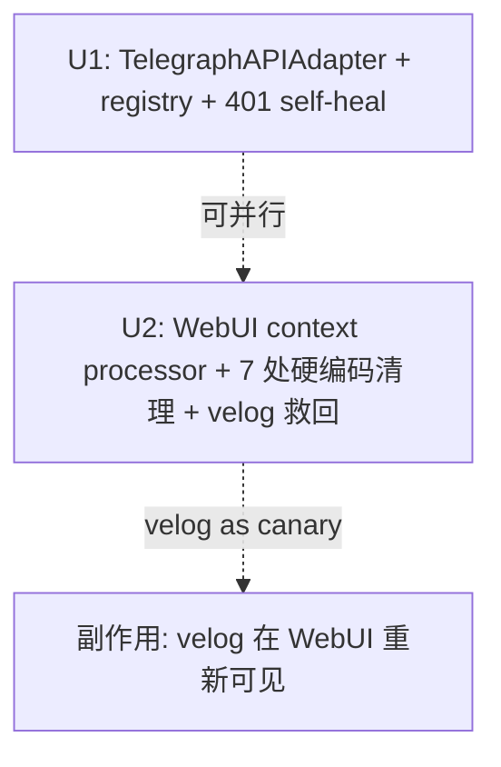

# Telegraph channel end-to-end wiring

## Overview

把 telegra.ph 从脱离 dispatcher 的 spike 升格为生产渠道。两条独立但同体量的工作：
1. **U1**：`TelegraphAPIAdapter` 接 `Publisher` ABC + `register("telegraph", …)`，含 401 INVALID_TOKEN 就地"再创账"恢复路径（重调 `createAccount` 一次，无 dispatcher fallback 链）。
2. **U2**：WebUI 从 registry 反向驱动 —— Flask context processor 注入 `platforms`，扫除剩余硬编码（主要在 JS 计数 dict）+ 删 wordpress 幽灵选项。

⚠ **U1/U2 合并必须串行**（不再"可并行"）：U2 测试若用精确集合断言（exact-set on JS counter keys），U1 land 会在 U2 之后把测试搞红。采用 **subset 断言**（`'velog' in keys` 而非 `keys == {…}`）规避；或显式 U2 → U1 顺序。

⚠ **velog 真实状态修正**（feasibility 反馈）：grep 显示 velog 已在 select option / filter chip / norm_platform tuple 出现 —— **仅** 在 JS 计数 dict `index.html:1656` 缺席。所以 U2 是"修正部分漂移 + 删 wordpress + 反向驱动以防再漂"，不是"从零救回 velog"。这缩小了 B 的修复面但**不**减少 R7-R11 的工作量（仍需建立 registry-driven 契约才能防止下次 register 时再漏一处）。

## Problem Frame

用户报告"发布渠道列表里看不到 telegraph"。诊断发现 3 个根因（见 origin），其中根因 C（API vs Playwright 技术路径）经评审收敛为"只做 API + 401 自愈"，Playwright fallback (Group 3) 砍掉。根因 A (registry) 和 B (WebUI 硬编码) 是本期 in-scope 的两条并行工作流。

关键事实（见 origin Dependencies）：
- 全仓零 wordpress 历史数据（已 grep）→ R10 直接砍，无需 migration
- WebUI 默认 127.0.0.1 单用户 bind（`webui.py:8-10/85-88`）→ context processor 暴露 platforms list 在默认部署下安全
- Phase 0 ship-seal routines 只读 `results-manifest.json`，不再调 spike → spike 不动也行

## Requirements Trace

来自 origin requirements doc（R2/R13(旧)/R14/R15 已砍）：

**U1 — TelegraphAPIAdapter 接线 (origin R1/R3/R4/R5/R12/R13/R14)**

> ⚠ 注：本文档中 `R13` / `R14` 是**本计划的新编号**，对应 401 自愈逻辑 + 错误传播。Origin brainstorm 中**已砍**的 R13/R14 是旧 Playwright 路径（Group 3），与此处无关。

- R1. 新增 `src/.../adapters/telegraph_api.py` 实现 `Publisher` ABC（复用 `telegraph_node.py` 转换器与 spike 的 createAccount/createPage 核心逻辑；spike 不动）
- R3. `register("telegraph", TelegraphAPIAdapter)` 单 adapter（**非元组**），无 dispatcher fallback
- R4. `verify_adapter_setup("telegraph", config)` **仅**校验 token 文件存在 + 可读 + 0600（**不**做 createAccount 端点 reachability 检查 —— 那样会让 adapter 健康度耦合到网络可达性，违背"匿名、无账号"USP；端点不可达让真实 publish 自然报错即可）
- R5. Token 文件 `~/.config/backlink-publisher/telegraph-token.json`（**砍掉 `-phase0-` 中缀**，理由见 Key Decisions：spike 写自己 `run_output/` 目录，路径独立，原"为 spike 兼容"理由不成立；保留 `-phase0-` 反而把一次性项目阶段名漏进永久产物路径）。Schema `{access_token, short_name}`，0600，**原子写**（tmp + chmod + rename）。**读取时向后兼容**：若新路径不存在但旧 `telegraph-phase0-token.json` 存在，读旧文件 + 静默迁移到新路径（保护 Phase 0 阶段已用过 adapter 的早期用户）
- R12. 默认走 API，无 token 时 createAccount → 写盘 → createPage
- R13. **401 INVALID_TOKEN 再创账恢复**（不是"自愈" —— 见 P0 决策）：API 401 → 调 createAccount 写新 token → 重试一次；仍失败抛 `ExternalServiceError`。WARN 日志 `telegraph_token_rotated` + **原账号 token 文件归档到 `telegraph-token.json.orphaned-<iso>`**（允许后续 Telegraph 工单恢复 / 至少留审计痕迹）。**file lock（fcntl.flock）**包整个 rotate-write 序列，避免并发 publish 进程双写丢失账号
- R14. Catch-all：429/5xx/network 直接抛（dispatcher 规则一致）；未预期异常传播

**U2 — WebUI registry-driven (origin R6-R11c)**
- R6. Flask context processor 注入 `platforms`，**不**新增 `/api/platforms` endpoint
- R7. `index.html:838-841` select 改为 `<option>`
- R7b. `index.html:1559/1574` `setVal('platform', p.platform || 'blogger')` 默认值改读 `platforms[0].slug`
- R7c. `index.html:1654` JS 计数 dict 从 platforms 序列化注入
- R8. `index.html:1253-1255` filter chip 行从 platforms 循环渲染（保留 `other` 兜底 chip）
- R8b. `index.html:1261` `norm_platform` 模板表达式从硬编码 tuple 改为 `platforms | map(attribute='slug') | list`
- R9. `settings.html:647/663` `setSelect` 默认值同 R7b
- R10a. `index.html:841` `<option value="wordpress">` 移除
- R10b. `webui_app/helpers.py:336-345` `detect_platform()` 移除 wordpress 分支；未知域名 fallback 由 `'medium'` 改为 `None`
- R11a. **velog-canary 集成测试**：断言 select/chip/norm/JS 计数都自动出现 `velog`
- R11b. **DummyAdapter 契约测试**：mock `register("dummy", DummyAdapter)` 验证零 HTML 改动
- R11c. **ROUTE_TIER_MATRIX 副作用决策**：telegraph 不进 matrix（markdown→nodes，无 content_html 直传 → 默认 tier "c" 安全）；velog 同（保持现状）。`tests/test_content_negotiation.py` drift 断言无需调整

**Success Criteria（origin SC1/2/3/4/5/6）** — 见各 unit Verification

## Scope Boundaries

- ✗ 不实现 `TelegraphBrowserAdapter` / 任何 Playwright 路径（P0-Q1）
- ✗ 不与 5-19 settings-browser-binding plan 发生交互（Group 3 砍后无机制差异需协调）
- ✗ 不改 spike 脚本（保留为 Phase 0 历史依赖）
- ✗ 不实现 wordpress adapter / 不加 wordpress migration（零历史数据）
- ✗ 不加 WebUI auth 中间件（默认 127.0.0.1 安全；远程模式用户自负责任）
- ✗ 不改 dispatcher / Publisher ABC（沿用 5-18-009 R9 解耦后的规则）
- ✗ 不加 Telegraph editPage/delete/list（只 createPage）
- ✗ 不引入 Telegram bot 绑定

## Context & Research

### Relevant Code and Patterns

**Closest analog — BloggerAPIAdapter (single API, no fallback)**
- `src/backlink_publisher/publishing/adapters/blogger_api.py` — `BloggerAPIAdapter(Publisher)` at line 95
  - 模块级 helpers: `_build_credentials`, `_near_expiry`, `json_from_creds`, `json_log`
  - 使用 `retry_transient_call(...)` from `.retry`，`is_retryable=lambda exc: isinstance(exc, HttpError) and exc.resp.status in RETRYABLE_HTTP_STATUSES` —— TelegraphAPIAdapter 应镜像此模式处理 5xx/429
  - 401/403 当前抛 `ExternalServiceError`（无 self-heal），告诉用户删 token —— telegraph 在此**分叉**：先就地 createAccount 自愈一次，仍 401 才抛
  - 返回 `AdapterResult(status="drafted"|"published", adapter="telegraph-api", platform="telegraph", published_url=…)`
- 测试：`tests/test_adapter_blogger_api.py`（主测）+ `tests/test_adapter_blogger_api_xss_contract.py`（tier "a" 平台需要 XSS contract 测试；telegraph tier "c" 不需要）

**Spike 代码源（不改动，仅复用核心逻辑）**
- `scripts/telegraph_spike/publish_batch.py`
  - `load_or_create_token(reuse_path, short_name, token_out)` at line 281 — token 文件读写 + 0600 chmod
  - `create_account(short_name)` 调用 `https://api.telegra.ph/createAccount`
  - createPage 用 `markdown_to_telegraph_nodes` from `src/.../adapters/telegraph_node.py`
  - 实际写入路径 line 340: `args.output_dir / "telegraph-phase0-token.json"`（**保留中缀 `-phase0-`**）
  - Schema line 290: `{"access_token": token, "short_name": short_name}`（**仅两字段**）

**Registry / Dispatcher**
- `src/backlink_publisher/publishing/registry.py` — `Publisher` ABC + `register()` / `dispatch()` / `registered_platforms()`
- `src/backlink_publisher/publishing/adapters/__init__.py:39-42` — 当前 4 个 register() 调用（blogger/medium/velog）
- `verify_adapter_setup(platform, config)` 也在此文件，per-platform if/elif 分支（参考 velog 分支模式）
- **再导出 shim**: `backlink_publisher.adapters` 是 `backlink_publisher.publishing.adapters` 的 re-export，测试 patch 通常走 shim 路径（见 `test_adapter_dispatcher.py`）

**Velog 单凭据路径模板**
- `src/backlink_publisher/publishing/adapters/velog_graphql.py:121` — `_load_cookies(cookies_path)`：检查存在、0600、parseable JSON；raise `DependencyError` with 修复指引
- Telegraph 镜像：`_load_token(token_path)` 检查存在、0600、parseable JSON，返回 access_token

**WebUI App Factory + 模板渲染**
- `webui_app/__init__.py:18` — `create_app()`，template_folder=`webui_app/templates/`
- `webui_app/helpers.py:721` — `_render(template_name, **kwargs)` shim，已 auto-inject `history / blogger_token_status / profiles / draft_queue / now_iso / suggested_next / incomplete_run`
- **当前零 context processor**（grep `context_processor` 返回 0 hits）
- `/` route: `webui_app/routes/main.py:13`
- **推荐方案**: `@app.context_processor` 加在 `create_app()` 蓝图注册后（保证 `settings.html` 等其他蓝图渲染的模板也覆盖到，而 `_render()` shim 只覆盖经过它的路由）

**Dispatcher 测试模式**
- `tests/test_adapter_dispatcher.py` — patch `@patch("backlink_publisher.adapters.<Class>.publish", return_value=...)`（走 shim 路径）；覆盖 routing/fall-through/dry-run/unknown
- `tests/test_r9_extension_readiness.py:53-64` — `fake_platform_registered` pytest fixture（_REGISTRY snapshot+restore），`FakeAdapter(Publisher)` at line 37 是 DummyAdapter 模板

**ROUTE_TIER_MATRIX 副作用监控**
- `src/backlink_publisher/publishing/content_negotiation.py:67-71` — `{"blogger": "a", "medium": "b"}`，默认 `_DEFAULT_TIER = "c"`（fail-closed）
- `_matrix_targets_registered_platforms()` at line 80 — drift 监控
- 断言点：`tests/test_content_negotiation.py:39`
- **决策**：telegraph 不进 matrix，默认 "c"；velog 同（保持现状）。无需新 XSS contract test

### Institutional Learnings

- **`docs/solutions/logic-errors/save-config-write-paths-bypass-preservation-2026-05-15.md`** — `save_config` 静默丢未管理段。**适用**：telegraph token 放独立文件 `telegraph-phase0-token.json`，不混入 `config.toml`，安全。
- **`docs/solutions/test-failures/tests-coupled-to-operator-config-state-2026-05-18.md`** — 测试经 `~/.config/backlink-publisher/config.toml` 操作者配置回污染 dispatcher。**适用**：U1/U2 测试必须用 env var 或 session-scope fixture 隔离操作者 token / state。`fake_platform_registered` 已是正确模板。
- **`docs/solutions/best-practices/document-review-catches-runtime-errors-at-plan-time-2026-05-14.md`** — 此 plan 已经过 brainstorm document-review 一轮；plan 阶段会再过一轮（5.3.8）。
- **`docs/solutions/best-practices/standalone-page-vs-retrofit-webui-2026-05-15.md`** — sibling-page 而非 retrofit。**适用度低**：本期是表面级模板/JS 改造，不是新页面，retrofit 是正确选择。

### External References

跳过外部研究 —— 仓库本地有 BloggerAPIAdapter / VelogGraphQLAdapter 两个直接模式，Telegraph API 是已跑通 spike，无未知技术层。

## Key Technical Decisions

| 决策 | 选择 | 理由 |
|---|---|---|
| **Adapter 形态** | 单 adapter `TelegraphAPIAdapter`，无 fallback 元组 | P0-Q1 决策：telegra.ph 无传统账号体系，401 自愈 5 行代码即可，无需独立 browser adapter |
| **401 处理位置** | adapter 内部就地自愈（仿 createAccount），**不**进 dispatcher fallback 链 | dispatcher fallback 是 cross-adapter 转移；这里是单 adapter 内部重试，语义不同。WARN 日志 + 计数器防"静默轮换掩盖入侵"（Threat Model #3） |
| **Token 文件名** | `telegraph-phase0-token.json`（保留 `-phase0-` 中缀） | 与 spike `publish_batch.py:340` 实际路径一致，避免 Phase 0 二次 publish 时写两个 token 文件 |
| **Token schema** | 仅 `{access_token, short_name}` | 与 spike line 290 一致；author_name/page_count 不存（spike 也不存）|
| **WebUI 注入方式** | Flask `@app.context_processor`，不新增 JSON endpoint | 无 loading/empty state 风险、无前端 fetch；默认 127.0.0.1 部署下不需要 auth；覆盖所有 blueprint 模板（settings_basic.py 等） |
| **Context processor 位置** | `webui_app/__init__.py:create_app()` 蓝图注册后 | 比加在 `helpers.py:_render()` shim 里覆盖面更全；与 Flask 惯用法一致 |
| **Wordpress cleanup** | 直接删 UI option + helpers detect 分支 | grep 验证零历史数据（jsonl/toml/json/yaml/fixtures 全空），无 migration 风险 |
| **Spike 脚本** | 完全不动 | Phase 0 routines 只读 manifest，spike 已是凝结态历史；adapter 复制核心逻辑（~150 行）换 routines 零回归风险 |
| **velog 作为 reverse-driven canary** | U2 测试以 velog 为真实 canary，DummyAdapter 仅补充 | velog 早已 register 但 WebUI 不可见 —— U2 顺带 fix pre-existing bug 是真实信号，不是合成测试 |
| **ROUTE_TIER_MATRIX** | telegraph 不进 matrix（默认 "c"），velog 不动 | telegraph 走 markdown → telegraph_node tree（已沙盒化），不直传 content_html；fail-closed 默认 tier "c" 拒绝 content_html 行，安全 |

## Open Questions

### Resolved During Planning

- **`verify_adapter_setup` 该 no-op 还是验 token 存在？** → 验 token 存在 + 可读 + 0600（仿 velog `_load_cookies` 模板）。若 token 缺失，给修复指引"运行一次 createAccount（adapter 会自动）或手动配置 token 路径"。
- **Context processor 在 create_app 哪个位置？** → 蓝图注册后（保证 settings.html 蓝图渲染时也有 `platforms`）。
- **DummyAdapter 测试 fixture 是新建还是复用？** → 直接复用 `tests/test_r9_extension_readiness.py:53-64` 的 `fake_platform_registered` 模板，在新测试文件里再定义一份（仓库现有做法），或提升至 `conftest.py`。U2 选**就地复制模式**，与仓库现有做法一致。
- **ROUTE_TIER_MATRIX 是否加 telegraph?** → 不加。Telegraph 走 markdown→nodes 路径，无 content_html 直传场景；默认 tier "c" 满足。XSS contract test 不需要新建。
- **Spike 提炼为薄壳还是不动？** → 不动。Adapter 复制 ~150 行核心逻辑，接受 DRY 损失换 routines 零风险。

### Deferred to Implementation

- **Telegraph API token 失效的确切 error code**：`INVALID_TOKEN` vs `INVALID_ACCESS_TOKEN` vs 其他。U1 实现时实测一次（删 token 文件后调 editPage 即可触发），代码里同时匹配两种字符串作 defense-in-depth
- **`telegraph_token_rotated` 计数器存储位置**：进 `~/.config/backlink-publisher/telegraph-state.json`（独立文件）还是 prometheus-style 内存计数？倾向独立文件 + WARN 日志（用户可 cat 自查），实现时定
- **Platform display name 源头**：是加 `display_name` 类属性到 Publisher ABC，还是在 context processor 里维护 `{"telegraph": "Telegraph"}` 字典？倾向类属性（registry 元数据），但目前 ABC 上没此字段；实现时若仅本期 4 个平台用，可先用 dict
- **i18n display name**：项目已支持 ko/zh-TW/ja —— platform display name 是否需要 i18n？本期先英文 + slug，留 follow-up
- **Spike CLI surface snapshot test**：是否加 snapshot test 防止后人误动 spike？本期不加，靠 scope boundary 文档化约束

## High-Level Technical Design

> *This illustrates the intended approach and is directional guidance for review, not implementation specification. The implementing agent should treat it as context, not code to reproduce.*

### U1 — TelegraphAPIAdapter 401 自愈流程

```
publish(payload, mode, config)
  ├─ token = _load_token(config.config_dir / "telegraph-phase0-token.json")
  │   └─ DependencyError if 文件不存在 + createAccount 不可达
  ├─ nodes = markdown_to_telegraph_nodes(payload['content_md'])
  ├─ try:
  │     result = _create_page(token, title, nodes)  # 带 retry_transient_call for 5xx/429
  │     return AdapterResult(status="published", url=result['url'], …)
  │
  ├─ except API401(INVALID_TOKEN | INVALID_ACCESS_TOKEN):
  │     log.warning("telegraph_token_rotated", reason="401_self_heal")
  │     _increment_token_rotated_counter()
  │     new_token = _create_account(short_name=token.short_name)
  │     _write_token(new_token, short_name)  # 0600
  │     # 重试一次 —— 第二次 401 不再自愈，传播
  │     result = _create_page(new_token, title, nodes)
  │     return AdapterResult(status="published", url=result['url'], …)
  │
  └─ except 401 第二次 / 其他 ExternalServiceError:
        raise ExternalServiceError(...)  # dispatcher 不 fall（无 fallback 元组）
```

### U2 — Context processor + 模板循环

```
webui_app/__init__.py:create_app():
    ...
    register_blueprints(app)

    @app.context_processor
    def inject_platforms():
        return {
            "platforms": [
                {"slug": slug, "display_name": _display_name(slug)}
                for slug in registered_platforms()
            ]
        }
    return app
```

模板侧（示意，非实现）：

```jinja
<select name="platform">
  
    <option value="{{ p.slug }}">{{ p.display_name }}</option>
  
</select>
```

JS 计数 dict 改为后端预渲染序列化：

```jinja
const platformCounts = {
    all: 0,
    {{ p.slug }}: 0,
    other: 0
};
```

## Implementation Units



- [ ] **Unit 1: TelegraphAPIAdapter + registry + 401 自愈**

**Goal:** 新增 telegraph 渠道的 Publisher adapter，接入 dispatcher，实现 401 INVALID_TOKEN 就地自愈。运行 `publish-backlinks --platform telegraph --mode publish` 走真实 createPage 成功；CLI 的 `--platform` choices 出现 telegraph。

**Requirements:** R1, R3, R4, R5, R12, R13, R14; SC1 (CLI 部分), SC2, SC3, SC5

**Dependencies:** 无（U1/U2 可并行）

**Files:**
- Create: `src/backlink_publisher/publishing/adapters/telegraph_api.py`
- Create: `tests/test_adapter_telegraph_api.py`
- Create: `tests/test_adapter_telegraph_api_self_heal.py`（单测 401 自愈路径，独立文件便于场景隔离）
- Modify: `src/backlink_publisher/publishing/adapters/__init__.py`（加 register + verify_adapter_setup 分支）
- Modify: `tests/test_adapter_dispatcher.py`（加 telegraph 的 routing/dry-run 用例）

**Approach:**
- **复用 `markdown_to_telegraph_nodes`** from `telegraph_node.py`（已就位）
- **核心 createAccount/createPage 逻辑直接从 spike `publish_batch.py` 复制**（约 150 行），不再走"提炼公共函数"路线（spike 不动是 scope boundary）
- **类形态镜像 `BloggerAPIAdapter`**：模块级 helpers (`_load_token`, `_write_token`, `_create_account`, `_create_page`, `_call_with_retry`)，类只暴露 `publish()`
- **Token 文件**：`config.config_dir / "telegraph-phase0-token.json"`，0600，schema `{access_token, short_name}`。`_load_token()` 仿 `velog_graphql.py:_load_cookies` 模式：检查存在 / 0600 / parseable
- **401 自愈**：try-except 包 `_create_page`；捕获 INVALID_TOKEN 或 INVALID_ACCESS_TOKEN → 调 `_create_account` → 覆写 token 文件 → 重试一次；第二次仍 401 抛 `ExternalServiceError`。日志格式 `log.warning("telegraph_token_rotated", reason="401_self_heal")`。计数器写 `~/.config/backlink-publisher/telegraph-state.json`（独立文件，schema `{rotated_count: int, last_rotated_at: iso}`）
- **重试 5xx/429**：用 `.retry.retry_transient_call`，`is_retryable=lambda exc: isinstance(exc, ExternalServiceError) and exc.status_code in {429, 500, 502, 503, 504}`
- **register**：`register("telegraph", TelegraphAPIAdapter)` 单 adapter，加在 `adapters/__init__.py` 现有 4 个 register 调用之后
- **verify_adapter_setup**：加 `if platform == "telegraph":` 分支，验 token 文件存在 OR createAccount 端点可达；否则 `DependencyError` 提示"`backlink-publisher telegraph-init` or 运行一次 publish 自动创建"

**Execution note:** 401 自愈路径**测试先行**（characterization）—— 先写一个 mock 返回 401-then-200 的集成测试，再实现自愈逻辑，避免静默吞 401 / 死循环重试 / 计数器漏写。

**Technical design:** 见 High-Level Technical Design § U1 自愈流程

**Patterns to follow:**
- `src/backlink_publisher/publishing/adapters/blogger_api.py` — 单 API adapter 整体形态、`retry_transient_call` 用法、AdapterResult 构造
- `src/backlink_publisher/publishing/adapters/velog_graphql.py:_load_cookies` — 单凭据文件校验模式
- `scripts/telegraph_spike/publish_batch.py:281-293` — token 文件读写 + 0600 chmod（直接 copy 模式）
- `tests/test_adapter_blogger_api.py` — adapter 单测整体结构
- `tests/test_adapter_dispatcher.py` — patch 走 `backlink_publisher.adapters.<Cls>` shim 路径

**Test scenarios:**
- **Happy path** — 有效 token + 正常 markdown payload → adapter 返回 `AdapterResult(status="published", platform="telegraph", published_url="https://telegra.ph/…", adapter="telegraph-api")`
- **Happy path** — Token 文件不存在 → 首次自动调 createAccount → 写盘 0600 → createPage 成功 → 返回 published_url
- **Happy path** — Token schema 仅写 `{access_token, short_name}`（断言 JSON keys 集合精确）
- **Edge case** — config 未配 `[telegraph]` 段 → 使用默认 short_name="backlink-publisher" 创建账户
- **Edge case** — Markdown payload 含 unsupported HTML tags → 经 `markdown_to_telegraph_nodes` unwrap 后正常发布（不抛错）
- **Error path** — API 返回 401 INVALID_TOKEN → 自愈 createAccount → 重写 token 文件 → 重试一次成功 → AdapterResult.published_url 正常；WARN 日志含 `telegraph_token_rotated` + `reason=401_self_heal`；计数器文件 rotated_count +1
- **Error path** — API 返回 401 INVALID_ACCESS_TOKEN（同义但不同字符串） → 同上自愈
- **Error path** — 自愈后第二次仍 401 → raise `ExternalServiceError("Telegraph rejected token after rotation")`，**不再重试**，计数器 +1
- **Error path** — API 返回 429 → `retry_transient_call` 重试 3 次后抛 `ExternalServiceError(status_code=429)`；dispatcher 不 fall
- **Error path** — API 返回 503 → 同 429 路径，重试后抛
- **Error path** — 网络超时 → 抛 `ExternalServiceError`
- **Error path** — Token 文件存在但 perms 是 0644 → `_load_token` 抛 `DependencyError("telegraph-phase0-token.json must be 0600")`
- **Integration** — `register("telegraph", TelegraphAPIAdapter)` 后，`registered_platforms()` 返回的列表含 `"telegraph"`；`schema.supported_platforms()` 含 `"telegraph"`；`publish-backlinks --platform telegraph --help` 不报错（subprocess 验证 CLI choices 已动态）
- **Integration** — `dispatch(payload, mode="publish", config, dry_run=True)` for telegraph 返回 dry-run 哨兵 AdapterResult，不调真实 API
- **Integration** — `verify_adapter_setup("telegraph", config_without_token)` 抛 `DependencyError`；配上 token 后 verify 通过
- **Integration** — Telegraph token 文件与 spike `publish_batch.py:340` 写入路径完全一致（断言路径字符串）

**Verification:**
- `pytest tests/test_adapter_telegraph_api.py tests/test_adapter_telegraph_api_self_heal.py tests/test_adapter_dispatcher.py -v` 全绿
- `publish-backlinks --platform telegraph --help` 输出含 telegraph 在 choices
- 手动 smoke：`publish-backlinks --platform telegraph --mode publish` 用 fixture payload 真实发布到 telegra.ph，校验返回 URL 可访问
- spike 脚本未被改动（`git diff scripts/telegraph_spike/` 为空）
- Phase 0 ship-seal `results-manifest.json` 未被改动

---

- [ ] **Unit 2: WebUI registry-driven + 清幽灵选项 + velog 救回**

**Goal:** WebUI 平台 select / filter chip / norm tuple / JS 计数 / settings 默认值 / helpers.detect_platform 全部从 `registered_platforms()` 反向驱动；删除 wordpress 幽灵选项；velog（早已 register 但 UI 不可见）作为真实 canary 自动重新可见。

**Requirements:** R6, R7, R7b, R7c, R8, R8b, R9, R10a, R10b, R11a, R11b, R11c; SC1 (WebUI 部分), SC4

**Dependencies:** 无（U2 测试用 velog 作 canary，velog 已 register；不依赖 U1 完成）

**Files:**
- Modify: `webui_app/__init__.py`（加 `@app.context_processor`）
- Modify: `webui_app/templates/index.html`（7 处硬编码：行 838-841, 1253-1255, 1261, 1559, 1574, 1654, 841 wordpress option）
- Modify: `webui_app/templates/settings.html`（行 647, 663 默认值）
- Modify: `webui_app/helpers.py`（行 336-345 detect_platform 移除 wordpress 分支 + 改 unknown fallback 从 `'medium'` 到 `None`）
- Create: `tests/test_webui_platforms_context.py`（velog-canary + DummyAdapter contract）
- Modify: `tests/test_webui_routes.py`（若存在）— 加 platform select 内容断言

**Approach:**
- **Context processor 加 `create_app()` 蓝图注册之后**（`webui_app/__init__.py:18`）；返回 `{"platforms": [{"slug": s, "display_name": _display_name_map.get(s, s.title())} for s in registered_platforms()]}`
- **`_display_name_map`** 本期硬编码 dict in `webui_app/__init__.py`：`{"telegraph": "Telegraph", "velog": "Velog", "medium": "Medium", "blogger": "Blogger"}`，未来迁 Publisher ABC class attribute 是 follow-up（见 Deferred）
- **`index.html` 7 处硬编码逐一替换**：
  - `:838-841` `<select>`：`<option value="{{p.slug}}" selected>{{p.display_name}}</option>`
  - `:841` wordpress option 直接删除（grep 验证无后向兼容需求）
  - `:1253-1255` filter chip 行：`<button class="filter-chip" data-filter-group="platform" data-filter-value="{{p.slug}}">{{p.display_name}} <span class="chip-count">0</span></button>`；保留 `other` chip
  - `:1261` `norm_platform`：``
  - `:1559/:1574` setVal default：`setVal('platform', p.platform || '{{ platforms[0].slug if platforms else "blogger" }}')`
  - `:1654` JS 计数 dict：`const platformCounts = { all: 0, {{p.slug}}: 0, other: 0 };`
- **`settings.html:647/663`** 同 R7b
- **`helpers.py:336-345` detect_platform**：移除 `wordpress.com → "wordpress"` 分支；未知域名 fallback 从 `return 'medium'` 改为 `return None`。调用方（`webui_app/routes/pipeline.py:110` 等）需检查 None 并降级处理（可能需配合微调，扫一遍 caller）
- **velog-canary 集成测试** (`test_webui_platforms_context.py`)：
  - 启 Flask test_client → GET `/` → 解析返回 HTML → 断言 `<option value="velog">Velog</option>` 出现在 select；filter chip 含 `data-filter-value="velog"`；JS 计数 dict 含 `velog: 0` 子串；norm_platform 模板逻辑接受 `item.platform = "velog"` 时不归 `other`
  - 同测试**断言 wordpress 已消失**：select 不含 `<option value="wordpress">`；helpers.detect_platform("https://example.wordpress.com/foo") 返回 None
- **DummyAdapter 契约测试** (`test_webui_platforms_context.py`)：
  - 用 `tests/test_r9_extension_readiness.py:53-64` 的 `fake_platform_registered` 模板，就地定义 `dummy_platform_registered` fixture（register `DummyAdapter` 临时入 _REGISTRY，teardown pop）
  - 在 fixture 内 GET `/` → 断言 dummy 出现在 select / chip / 计数 dict 三处
  - 出 fixture 后再 GET → 断言 dummy 消失（fixture restore 正确）
- **ROUTE_TIER_MATRIX 决策落地** (R11c)：本期 telegraph + velog 都不进 matrix，沿用默认 "c"。无 code change，但需在 `test_content_negotiation.py:39` 的 drift 断言中确认 telegraph 不被误标 stale（默认行为应该正确）

**Execution note:** velog-canary 测试**先于实现**写 —— 现在跑应该 fail（velog 当前 UI 不可见），实现完应该 pass。这是 characterization 模式的正向例子：测试本身证明本期 fix 了 pre-existing bug。

**Technical design:** 见 High-Level Technical Design § U2 模板循环示意

**Patterns to follow:**
- `tests/test_r9_extension_readiness.py:37-64` — `FakeAdapter` + `fake_platform_registered` fixture 模板（直接复制）
- `webui_app/helpers.py:721` `_render` — auto-inject 上下文的现有模式（context processor 是它的 Flask-native 版本）
- 项目现有 Jinja 模板循环用法（见 `index.html` 其他 `` 块，如 history 渲染）

**Test scenarios:**
- **Happy path** — Flask test_client GET `/` → response.html 含 `<option value="velog">Velog</option>`、`<option value="telegraph">Telegraph</option>`（若 U1 已 land）、`<option value="medium">`、`<option value="blogger">`
- **Happy path** — Filter chip 行包含 velog chip（`data-filter-value="velog"`），且 `chip-count` span 初始为 0
- **Happy path** — JS 计数 dict 渲染为 `{ all: 0, velog: 0, medium: 0, blogger: 0, telegraph: 0, other: 0 }`（顺序不重要，键集精确）
- **Edge case** — Wordpress option 消失：`<option value="wordpress">` 不在 HTML 中
- **Edge case** — `helpers.detect_platform("https://foo.wordpress.com/post")` 返回 `None`（不再返回 `"wordpress"`）
- **Edge case** — `helpers.detect_platform("https://unknown-domain.example/foo")` 返回 `None`（未知域名 fallback 改为 None，不再默认归 medium）
- **Edge case** — `norm_platform` 模板表达式接受 `item.platform = "velog"` 时不归 `other`（断言渲染后的 `data-platform="velog"`）
- **Integration** — `fake_platform_registered("dummy", DummyAdapter)` fixture 内 GET `/` → HTML 同时含 `<option value="dummy">Dummy</option>` 和 filter chip；fixture 退出后 GET → dummy 消失
- **Integration** — `tests/test_content_negotiation.py:39` drift 断言保持绿（telegraph/velog 默认 tier "c" 不触发 stale）
- **Integration** — Settings page (`/settings`) 也通过 context processor 拿到 platforms（确认 context processor 覆盖所有 blueprint，不只是 main blueprint）

**Verification:**
- `pytest tests/test_webui_platforms_context.py -v` 全绿
- `pytest tests/test_content_negotiation.py -v` 全绿（drift 断言不被破坏）
- 手动 smoke：启 `python webui.py` → 浏览器开 `http://127.0.0.1:5000/` → 看到 4 个 platform option（含 telegraph + velog）+ wordpress 消失 + filter chip 行同步
- Settings 页同样可见 platforms 上下文

## System-Wide Impact

- **Interaction graph：**
  - `register("telegraph", …)` → 自动激活 `registered_platforms()` 下游所有读者：`schema.supported_platforms()` / `plan_backlinks.py:1541` argparse choices / `publish_backlinks.py` validate / `content_negotiation.py:_matrix_targets_registered_platforms` drift 检查 / 新增的 WebUI context processor
  - 凡 `webui_app/helpers.py:detect_platform` 被调用的地方都受 R10b 影响：grep `detect_platform` 已知调用点 `webui_app/routes/pipeline.py:110`，**必须** 验证它处理 None 返回（可能默认归 'other' chip / 或抛验证错；实现时确认行为合理）
- **Error propagation：**
  - 401 自愈失败（第二次仍 401）→ `ExternalServiceError` 经 dispatcher → publish_backlinks CLI 写 JSONL `status=failed` + 退出码非零
  - WARN 日志 `telegraph_token_rotated` 会出现在主日志流，需确认日志聚合（若有）能 surface 出来给运营者
- **State lifecycle risks：**
  - Token 文件被并发改写（同时跑两个 publish_backlinks 进程 + 都触发 401 自愈）→ 后写胜出，前写丢失。本期不加锁；约束在 README/AGENTS.md 文档化"不要并发跑同平台"
  - 计数器文件同上风险，但只是审计指标，丢失非致命
- **API surface parity：**
  - 沿用 BloggerAPIAdapter 的 `AdapterResult` shape (`adapter="telegraph-api"`, `platform="telegraph"`)；JSONL 行下游消费者（recheck.py 等）无需改动
  - WebUI context processor 加的 `platforms` 上下文变量是新增，不冲突现有 `_render` shim 的注入
- **Integration coverage：**
  - U2 velog-canary 测试本身就是 cross-layer 验证（registry ↔ context processor ↔ template ↔ HTML output）
  - U1 dispatcher 集成测试覆盖 registry → dispatch → adapter 三层
- **Unchanged invariants：**
  - **Spike 脚本零改动**（`scripts/telegraph_spike/*.py` git diff 应为空）
  - **dispatcher 行为零改动**（不改 `registry.py` 的 dispatch/Publisher ABC）
  - **Phase 0 ship-seal manifest 零改动**（`scripts/telegraph_spike/results-manifest.json`）
  - **medium/blogger/velog adapter 行为零改动**
  - **CLI choices 动态机制不变**（5-18-009 R9 解耦后已是动态，本期只是利用既有机制）

## Risks & Dependencies

| Risk | Mitigation |
|------|------------|
| **401 自愈死循环**（每次重试又触发自愈） | 严格限定"只自愈一次"：第二次 401 直接抛，由 publish_backlinks CLI 的 retry policy 处理；测试覆盖此场景 |
| **detect_platform 改 fallback 后 caller 炸**（pipeline.py:110 等接收 None） | U2 实现前 grep `detect_platform` 所有调用点；逐一确认处理 None 的行为；必要时 caller 也微改 |
| **Context processor 渲染开销**（每次请求调 `registered_platforms()`） | `registered_platforms()` 是 dict.keys() 即时返回，O(1)；无性能风险。如未来 registry 接 DB 查询再加缓存 |
| **JSON5 风格的 JS dict 渲染语法错误**（trailing comma 等） | 用模板循环时按 `{{p.slug}}: 0,` —— 现代 JS 容忍 trailing comma；测试断言渲染后 JS 可解析（如 `json.loads` after strip） |
| **velog-canary 测试在 telegraph land 前可能不稳**（先跑 U2 时 telegraph 不在 registry） | U2 测试以 velog 为主 canary，velog 已 register；telegraph 出现是 U1 land 后的额外断言，可用 `pytest.mark.skipif` gate 或后续补加 |
| **wordpress 已删但 caller 仍传 platform="wordpress"**（虽然 grep 没找到历史数据） | `schema.reject_unsupported_platform` 会硬拒；本身是正确行为，让错误尽早暴露。Threat Model #1 备注：未来若发现遗漏数据，加 migration script |
| **Token 文件被备份系统泄露**（Dropbox/iCloud） | 见 origin Threat Model #1：在 README/AGENTS.md 明示此目录不应纳入备份；planning 后置 follow-up 评估 OS keychain |
| **静默 token 轮换掩盖入侵** | R13 WARN 日志 + 计数器；用户可 `cat telegraph-state.json` 看 rotated_count 异常 |

## Documentation / Operational Notes

- **README 增补**：新增"Telegraph 渠道"段，说明 token 文件位置 / 0600 / 不应纳入备份；CLI 用法 `publish-backlinks --platform telegraph`
- **AGENTS.md 增补**：在"Adding a new publisher adapter"小节末尾加一行 cross-ref —— "WebUI 自动渲染（无需 HTML 改动）由 `webui_app/__init__.py` 的 context processor 保证"
- **CHANGELOG**：feat 条目 + breaking note "WebUI no longer shows wordpress placeholder option"
- **运维提示**：若日志看到大量 `telegraph_token_rotated` warning（一周内 >1 次），可能是 token 失效频繁或被外部使用 → 调查 + 可选 revokeAccessToken（若 Telegraph 支持）
- **Phase 0 ship-seal 协调**：本期 land 后通知 Phase 0 owner（参考 memory `project_telegraph_phase0_ship_seal.md`），确认 routines T+7/14/21 不受影响（应不受影响 —— 已在 SC5 验证）

## Sources & References

- **Origin document:** [docs/brainstorms/2026-05-19-telegraph-channel-end-to-end-wiring-requirements.md](../brainstorms/2026-05-19-telegraph-channel-end-to-end-wiring-requirements.md)
- Adapter analog: `src/backlink_publisher/publishing/adapters/blogger_api.py` (BloggerAPIAdapter)
- Single-credential pattern: `src/backlink_publisher/publishing/adapters/velog_graphql.py` (`_load_cookies`)
- Token file source of truth: `scripts/telegraph_spike/publish_batch.py:281-293, 340`
- Registry / dispatcher: `src/backlink_publisher/publishing/registry.py`, `src/backlink_publisher/publishing/adapters/__init__.py`
- Fixture template: `tests/test_r9_extension_readiness.py:37-64` (FakeAdapter + fake_platform_registered)
- WebUI app factory: `webui_app/__init__.py:18` (`create_app()`)
- Related solutions: `docs/solutions/logic-errors/save-config-write-paths-bypass-preservation-2026-05-15.md`; `docs/solutions/test-failures/tests-coupled-to-operator-config-state-2026-05-18.md`
- Related plans (concurrent / coordinated): `docs/plans/2026-05-19-001-feat-settings-browser-binding-plan.md` (与本期解耦后无直接交互)
- Related memory: `project_telegraph_phase0_ship_seal`, `project_r9_plan_recovered`, `feedback_invert_drift_check_when_invariant_becomes_dynamic`
