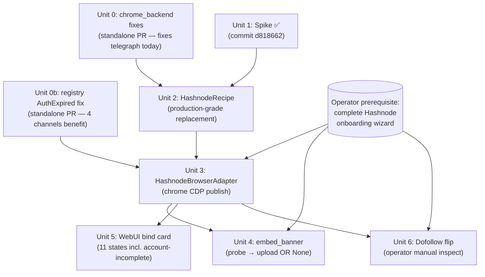

# Hashnode Browser-Bind Adapter (Free-tier Replacement for Paywalled GraphQL)

## Overview

Hashnode 在 2026-05-13 把整個 GraphQL API 搬到 Pro 訂閱後面（`reference_hashnode_graphql_paywall`），repo 內既有的 `HashnodeAPIAdapter` 對 free-tier operator 從那天起等同壞掉。本 plan 用 **Chrome CDP backend + cookies-only 認證** 重建 hashnode 可用性；Unit 1 spike 證實 Playwright Chromium 過不了 Cloudflare 而 real Chrome 過得了。

Plan delivers eight units in two independently-shippable tranches:

- **Tranche A — Cross-cutting fixes (standalone PRs, do not depend on plan-016):**
  - **Unit 0**: 3 fixes to `chrome_backend.py` — fixes telegraph cookie cross-domain leak in production today, plus unblocks hashnode + future chrome-backend channels.
  - **Unit 0b**: registry `AuthExpired` fallthrough fix — benefits medium / velog / blogger / telegraph today + hashnode after Unit 3.
- **Tranche B — Hashnode-specific stack (stacked PR series on top of Tranche A):**
  - **Unit 1** ✅ COMPLETE (spike commit `d818662`).
  - **Units 2–6**: recipe, adapter, banner, WebUI card, dofollow flip.

## Problem Frame

- **Current state**: `HashnodeAPIAdapter` (publishing/adapters/hashnode.py) returns 4xx on every call since 2026-05-13. Dashboard shows hashnode "暫不啟用". Per PR #126 (`d8e6079`) origin/main, dofollow status is declared at `register(..., dofollow="uncertain", rationale=...)` call site (`publishing/registry.py`), and read by `webui_app/binding_status.py:get_channel_status()` via `dofollow_status(name)`. The previously-cited module-level `_DOFOLLOW_BY_CHANNEL` dict has been removed.
- **Spike evidence (Unit 1, `d818662`)**: CF blocks Playwright Chromium even with `--disable-blink-features=AutomationControlled`. Only real Chrome via CDP backend clears the challenge and gets `cf_clearance` issued. `hashnode-session` cookie (HttpOnly, 760-day expiry on `.hashnode.com`) is the single auth credential. Auth.js / NextAuth stack confirmed.
- **Business value**: Hashnode is one of the highest-DA dofollow blog aggregators on the shortlist. But complexity is ~2× original estimate (CDP backend + 5 prerequisite chrome fixes + onboarding-wizard gating + dofollow uncertainty). Product-lens P0 ("six units of work for one channel") remains worth a final sanity check before Tranche B starts.

## Requirements Trace

- **R1**. `bind-channel --channel hashnode` 透過 chrome backend 成功 emit `channel.bind.persisted`，cookies (`hashnode-session` + `cf_clearance`) 落 `<config_dir>/hashnode-cookies.json` (0600)。 → Units 0, 2
- **R2**. `publish-backlinks` 對 `platform=hashnode` 透過 chrome backend publish 路徑成功，回傳真實 `*.hashnode.dev/<slug>` URL。 → Unit 3
- **R3**. Adapter chain 錯誤語義：cookies 缺 → `DependencyError` → fallthrough；cookies 過期 → `AuthExpiredError` → **不 fallthrough** → operator UX 提示 re-bind。 → Unit 0b
- **R4**. WebUI Settings 顯示 hashnode bind 卡，跟 Telegraph / Medium / Velog 視覺一致，並新增 `account-incomplete` 狀態 + 15-min budget。 → Unit 5
- **R5**. `embed_banner()` 走 chrome backend short-lived session OR `None`-return per spike Step 0 verdict — probe deferred until operator account complete。 → Unit 4
- **R6**. Hashnode dofollow declaration: Unit 3 ships `register("hashnode", ..., dofollow="uncertain", rationale=<≥80 chars>)`; Unit 6 flips to `dofollow=True`/`False` (or keeps `"uncertain"`) based on operator inspect-element on 5 sample posts. The flip is a single edit at the `register()` call site, NOT a dict mutation (per PR #126 architecture).  → Unit 6
- **R7**. 既有 `tests/test_adapter_hashnode.py` 仍通過（chain fallthrough 仍 reach `HashnodeAPIAdapter`）。 → Unit 3
- **R8**. `tests/test_r9_extension_readiness.py` 通過（新 adapter 透過 `register()` 一行延伸）。 → Unit 3
- **R9** (NEW from spike): chrome backend NEVER persists cross-domain cookies. `recipe.cookie_host_filter` MUST be honored. → Unit 0
- **R10** (NEW from spike): chrome backend works on Chrome 148+ (IPv6-only loopback binding) and Chrome 111+ (`--remote-allow-origins=*`). → Unit 0

## Scope Boundaries

**In scope (amended from spike findings):**
- Chrome CDP backend for hashnode bind + publish + banner (was originally OUT; spike invalidated)
- Pre-flight cross-cutting fixes (Unit 0 / 0b) that ship independently

**Out of scope:**
- Pro plan subscription integration (paywall reversal monitored separately via `reference_hashnode_graphql_paywall`).
- Plain Playwright Chromium path for hashnode bind / publish (empirically non-viable — 3 spike attempts failed identically).
- Schema changes — `[hashnode]` config + channel name reused.
- Real account onboarding (operator prerequisite, not engineering work).

## Context & Research

### Relevant Code and Patterns

- `src/backlink_publisher/cli/_bind/chrome_backend.py` (398 LOC) — CDP launcher. `_launch_or_connect()` at L140, `_launch_chrome()` at L160, `_provider()` callback at L127, `_CdpClient.all_cookies()` at L324.
- `src/backlink_publisher/cli/_bind/driver.py` — Playwright reference for cookie host_filter shape: `_apply_host_filter()` at L524, called inside `_provider` at L509–521. Mirror this exact mechanic for chrome backend.
- `src/backlink_publisher/cli/_bind/recipes/medium.py` (507 LOC) — reference recipe with `post_persist` cookies-only hardcut + identity guard + per-channel cookie sanity gate. Hashnode recipe (Unit 2) should mirror this shape.
- `src/backlink_publisher/cli/_bind/recipes/__init__.py` (on `feat/bind-medium-pipeline-repair` branch, PR #138, commit `8293fed`) — adds `required_backend: str | None = None` field on `ChannelRecipe`. Note: there is no `recipes/telegraph.py` — telegraph uses the API adapter directly, not a browser-bind recipe.
- `src/backlink_publisher/publishing/registry.py:148–183` — `dispatch()` chain walk. L172 is the `except DependencyError` site that needs Unit 0b's `except AuthExpiredError: raise` insertion ABOVE it.
- `src/backlink_publisher/publishing/adapters/telegraph_api.py` (640 LOC) — adapter pattern reference for Unit 3 (chrome CDP short-lived session, NOT a 1:1 mirror of `medium_browser.py`).
- `src/backlink_publisher/publishing/adapters/__init__.py` — `register()` call site for Unit 3.
- `webui_app/binding_status.py` (origin/main): `HIDDEN_FROM_UI` (~L39 frozenset) + `get_channel_status()` (~L48) which reads `dofollow_status(name)` from `publishing.registry`. Note: `_DOFOLLOW_BY_CHANNEL` dict no longer exists (replaced by `register(dofollow=...)` per PR #126).
- `webui_app/services/bind_job.py:29` (`BIND_ERROR_MESSAGES`).
- `webui_app/templates/_settings_channel_binding.html` — bind card macro; use as base for Unit 5.

### Institutional Learnings

- `[[feedback-chrome-devtools-cdp-traps]]` — currently documents 4 traps; spike adds **trap #5** (Chrome 148 IPv6-only) and **trap #6** (5-min BIND_TIMEOUT too short for CF + SSO + onboarding). Memory update is part of Unit 0.
- `[[feedback-bind-channel-diagnostic-playbook]]` — 5 铁律 for diagnosing bind failures; spike empirically validated rules (3) and (4) (91s `bound_predicate_timeout` = idle vs. 1200s = absolute).
- `[[feedback-grep-dofollow-map-before-shipping-adapter]]` — historical: pre-PR-#126 era used `_DOFOLLOW_BY_CHANNEL` dict + manual grep. PR #126 replaced the grep with a structural import-time gate (missing `dofollow=` kwarg → TypeError). Lesson still applies: Unit 3 PR description must justify the `dofollow="uncertain"` choice + rationale; Unit 6 PR description must justify the flip.
- `[[feedback-bind-credentials-persist-across-sessions]]` — Unit 5 UI copy MUST say "重新绑定" not "重新登入"; one bind = file on disk + reuse.
- `[[reference-telegraph-adapter-credential-rotation-pattern]]` — Unit 3 inherits flock + atomic write + verify-without-network pattern.
- `[[reference-hashnode-graphql-paywall]]` — explains why API adapter is dead and why this plan exists.
- `[[feedback-probe-then-pivot-when-api-unverifiable]]` — Unit 4's banner-upload pivot follows the same playbook used for Hashnode (paywall) + Velog (introspection-disabled).

### External References

- Hashnode docs (free-tier remnants): blog URL pattern `https://<username>.hashnode.dev/<slug>` confirmed in dofollow probe attempts.
- Auth.js / NextAuth session behavior: `hashnode-session` is a session JWT — 760-day expiry implies long-lived refresh, no separate refresh token needed at bind time.
- Chrome 111 release notes: `--remote-debugging-port` rejects HTTP requests from non-allowlisted origins unless `--remote-allow-origins=*` set.
- Cloudflare bot-detection: same-origin cf_clearance cookies are issued per-host (apex vs. each `*.hashnode.dev` subdomain has its own challenge). Confirms why Unit 6 cannot use Playwright sampling.

### Spike Evidence

Full evidence in `docs/spike-notes/2026-05-20-hashnode-bind-discovery.md`. Key facts carried forward:

- **Logged-in cookies on `.hashnode.com` apex** (9 total): 1 auth (`hashnode-session`, 1289 bytes HttpOnly), 1 CF clearance, 7 trackers (3 GA streams + FPID + FPLC + _gcl_au + PostHog).
- **`cookie_host_filter` design** (Unit 2): apex `hashnode.com` + `*.hashnode.dev`. Required-for-publish whitelist: `{hashnode-session, cf_clearance}`. Blacklist: `{cf_clearance, _cfuvid, __cf_bm, cf_chl_rc_ni, xsrf-token, xsrf, _ga, _gcl_au, FPID, FPLC}` + prefixes `(_ga_*, ph_phc_*_posthog)`. Note `cf_clearance` is both load-bearing for publish AND in the sanity-gate blacklist (it must be persisted but cannot be the *positive* bind signal).
- **`bound_predicate`** (Unit 2): cookie presence — `hashnode-session` value present + non-empty on apex. URL pattern unreliable (operator-incomplete accounts redirect to `/onboard/...`; URL-pattern bind would never fire).
- **Editor / selectors (Unit 3 + 4)**: BLOCKED on operator account completion. Spike profile redirects all editor URLs to `/onboard?callbackUrl=...`.
- **Dofollow (Unit 6)**: CF challenges every `*.hashnode.dev` probe because `cf_clearance` is `.hashnode.com`-scoped. Recommended path: operator manual inspect-element on 3-5 posts (5 min, zero engineering).

## Key Technical Decisions

| # | Decision | Rationale |
|---|---|---|
| KTD-1 | Ship Unit 0 and Unit 0b as **independent PRs** that DO NOT depend on plan-016 | Unit 0 fixes telegraph cookie cross-domain leak in **production today** (security blast-radius P0); Unit 0b fixes silent AuthExpired fallthrough for 4 existing channels. Both have value standalone — bundling into plan-016's stack delays the fixes for any plan-016 review friction. |
| KTD-2 | `HashnodeRecipe.required_backend = "chrome"` (not auto/playwright) | Empirical: 3 spike attempts with Playwright Chromium failed CF identically. Forces chrome backend at recipe layer so operators don't accidentally pick `--backend playwright` and waste 15 min. |
| KTD-3 | `bound_predicate` = cookie-presence on `hashnode-session`, NOT URL pattern | Operator-incomplete Hashnode accounts redirect to `/onboard/<step>?callbackUrl=...` even after session is established. URL-pattern predicate would never fire. Cookie presence is robust against the onboarding wizard. |
| KTD-4 | Required-for-publish whitelist includes `cf_clearance` (not just `hashnode-session`) | Without `cf_clearance`, next publish triggers a fresh CF challenge that the cookies-only session cannot solve. Recipe broadens "auth-only" → "required-for-publish" to honor both. |
| KTD-5 | Unit 3 mirrors `telegraph_api.py` (chrome backend), NOT `medium_browser.py` (Playwright) | Hashnode needs CDP-attached real Chrome for both `available()` health-check AND `publish()`. medium_browser uses Playwright `launch_persistent_context` which spike proved fails CF for Hashnode. |
| KTD-6 | `HashnodeBrowserAdapter` registered BEFORE `HashnodeAPIAdapter` in chain | Chain order: browser → API fallback. Browser adapter's `available()` returns True when `hashnode-cookies.json` exists + non-expired. If cookies missing → `DependencyError` → fallthrough to `HashnodeAPIAdapter` → that one raises its own `DependencyError` (paywalled) → final `last_dep_error` surfaces. Preserves R7 (existing API adapter test). |
| KTD-7 | Unit 4 `embed_banner()` choice deferred to probe phase, default `None`-return | `None` is legal per banner contract (banner_dispatcher falls back to dispatcher source_url). Adapter ships with a documented `embed_banner` attribute that returns `None`; **upgrades to chrome short-lived upload session only if** Unit 4 probe shows Hashnode media-upload reachable without Pro plan. Avoids shipping dead BannerUploadError code path (`[[feedback-probe-then-pivot-when-api-unverifiable]]`). |
| KTD-8 | Unit 6 verification = operator manual inspect-element (5 min), NOT engineered probe | CF blocks Playwright on every subdomain. Engineering a real-Chrome-CDP-driven Unit 6 probe would be 1-2 days of work for a gate decision the operator can make in 5 min with browser devtools. Cheaper + faster + no maintenance burden. |
| KTD-9 | Unit 5 adds **state 11** (`account-incomplete`) — operator session OK but blog not editor-ready | Spike found: bind succeeds (cookie issued) but operator's account hasn't finished onboarding wizard, so `/draft` 302s to `/onboard`. Without explicit state, Unit 3 publishes would fail with cryptic redirect error. State 11 + Chinese error message ("請先在 Hashnode 完成 onboarding wizard") surfaces this clearly. |
| KTD-10 | `BIND_TIMEOUT_MS` raised from 5 → 15 min | Spike empirically: CF challenge (1-2 min) + SSO (1 min) + onboarding wizard (5-10 min for fresh accounts) easily exceeds 5 min. Lands in Unit 0 alongside chrome_backend fixes (driver.py:44 is a 1-line change). |
| KTD-11 | Unit 0b inserts `except AuthExpiredError: raise` BEFORE `except DependencyError` | Order matters: Python catches the first matching except. AuthExpired IS-A DependencyError (subclass), so listing the subclass first is the only way to short-circuit. Also need to clear `last_dep_error` is unchanged (it's only set in the DependencyError branch). |

## Open Questions

### Resolved During Planning

- **Q**: Should Unit 0's `--remote-allow-origins=*` patch land here or wait on `dev/fc41561`? → **A**: Land here. Origin/main does not have it; the spike branch has it as a comment-marked patch. Unit 0 promotes the spike patches to mainline.
- **Q**: How to express `required_backend` on this branch when it's only on `feat/bind-medium-pipeline-repair`? → **A**: Unit 2 PR includes the `required_backend` field on `ChannelRecipe` if it has not already landed via PR #138 / bind-medium-pipeline-repair by then. Verify pre-Unit-2: `git fetch && grep required_backend src/backlink_publisher/cli/_bind/recipes/__init__.py`.
- **Q**: Should Unit 3 share session with Unit 0's chrome backend, or open new session per `publish()`? → **A**: New short-lived session per `publish()`. Matches telegraph_api invocation pattern. Long-lived session adds zombie-process risk + cross-row state bleed; the ~2-3s launch cost is acceptable for publish cadence.
- **Q**: Hashnode dofollow default if Unit 6 inspect-element shows MIXED (some rel=nofollow, some dofollow)? → **A**: Keep `dofollow="uncertain"` at the `register()` call site. The Capability Manifest (PR #126) treats `"uncertain"` as "do not surface to scheduler". Better safe than mis-labeled. Rationale string explains the mixed-result observation.
- **Q**: Where does `embed_banner = None` return live — on the adapter class or returned at runtime? → **A**: Class attribute returning `None` from method (per `[[feedback-embed-banner-lazy-config-load]]`). Banner contract is `embed_banner(self, artifact_path, alt) → str | None`; `None` is legal.

### Deferred to Implementation

- **Unit 3 editor selectors** (title input / body / publish button / tag input): probe-then-commit when operator binds against a fully-set-up Hashnode account. Spike account is incomplete; selectors unprovable from current data.
- **Unit 3 identity identifier** (for `hashnode-last-account.txt`): probe `/api/me`-style endpoint or scrape from session JWT once editor URL probable. Identity-mismatch guard pattern from medium recipe applies.
- **Unit 4 banner-upload mechanism**: probe Hashnode media upload (likely `/api/upload` or `cdn.hashnode.com/_uploads`) during Unit 3 implementation. If Pro-gated → ship `None`-return. If free-tier reachable → chrome short-lived session upload.
- **Unit 6 dofollow probe verdict**: operator runs 5-min inspect-element. Three outcomes possible: all dofollow → flip to `True`; mixed → stay `None`; all nofollow → flip to `False` + likely abort plan-016 deployment.
- **Onboarding wizard automation**: deferred indefinitely. Operator manual wizard once per account is acceptable; building automation duplicates Hashnode's UX work.

## High-Level Technical Design

> *This illustrates the intended approach and is directional guidance for review, not implementation specification. The implementing agent should treat it as context, not code to reproduce.*

### Unit dependency graph



### Tranche A — independent PRs (Unit 0 + 0b)

```
PR-A1 (Unit 0):  chrome_backend.py    PR-A2 (Unit 0b):  registry.py
  ┌─────────────────────────────┐       ┌─────────────────────────────┐
  │ + --remote-allow-origins=*  │       │ try:                        │
  │ + 127.0.0.1 → localhost     │       │   return adapter.publish()  │
  │ + apply host_filter in      │       │ except AuthExpiredError:    │
  │   _provider callback        │       │   raise   ←── NEW           │
  │ + BIND_TIMEOUT_MS 5→15min   │       │ except DependencyError as e:│
  └─────────────────────────────┘       │   last_dep_error = e        │
                                        │   continue                  │
                                        └─────────────────────────────┘
```

### Tranche B — Hashnode stack

```
seeds.jsonl → plan-backlinks → publish-backlinks
                                    │
                                    ▼  platform=hashnode
                          publishing.registry.dispatch()
                                    │
                       ┌────────────┴────────────┐
                       ▼                         ▼
            HashnodeBrowserAdapter      HashnodeAPIAdapter
              (Unit 3, NEW)               (existing, paywall-dead)
                       │                         │
              available()?                 available()?
              cookies file fresh?          PAT in config?
                  yes ┃ no                    yes ┃ no
                      ▼                          ▼
              publish via chrome CDP     publish via GraphQL
              short-lived session         (Pro paywall: 403)
              + embed_banner(Unit 4)
              → URL or DependencyError    → ExternalServiceError
                                            (paywall) or success
```

## Implementation Units

---

### TRANCHE 0 — Pre-Tranche-B Premise Spike (gates whether Tranche B is the right architecture)

- [ ] **Unit 1b: Playwright stealth premise re-test (1-day time-boxed spike) — gates Tranche B**

**Goal**: Falsify or confirm the load-bearing premise that "CF blocks Playwright Chromium". Original Unit 1 spike (`d818662`) used only `--disable-blink-features=AutomationControlled`, the weakest stealth flag. Per adversarial review A1: if any of patchright / playwright-extra-stealth / undetected-playwright-python / rebrowser-playwright clears hashnode.com CF in 1 day of spike work, ~80% of Tranche B engineering (chrome backend, IPv6 fix, --remote-allow-origins, BIND_TIMEOUT bump, CDP security controls, Unit 3 chrome session wrapper) becomes unnecessary.

**Requirements**: Premise-gate for KTD-2, KTD-5, Tranche B as a whole.

**Dependencies**: None. Runs independently. **Strongly recommended before Tranche A starts** — if Unit 1b passes, Tranche A scope shrinks (cookie host_filter fix still valuable for telegraph; CDP security controls become unneeded).

**Files** (throwaway spike — branch `spike/hashnode-stealth-re-test`, no merge):
- New: `docs/spike-notes/2026-05-22-hashnode-playwright-stealth-spike.md` (findings + verdict)
- New: `docs/spike-notes/2026-05-22-hashnode-stealth-runners/*.py` (one runner per stealth library)
- No production code changes.

**Approach (time-boxed budget: 1 day; abort if no progress at 4h):**
- Test each library against `https://hashnode.com/onboard` in this order, recording outcome (CF cleared / CF blocked / library-broken):
  1. **patchright** (`pip install patchright`) — rebrowser-playwright fork with stealth patches built in. Fastest to test.
  2. **playwright-extra + plugin-stealth** (`pip install playwright-extra puppeteer-extra-plugin-stealth`) — most popular. Plugin-based stealth applied to standard Playwright.
  3. **undetected-playwright-python** (`pip install undetected-playwright-python`) — explicit undetected fork. May be stale.
  4. (Stretch) **camoufox** (Firefox-based with anti-fingerprinting) — only if 1-3 all fail.
- For each library: launch headed, navigate to hashnode.com/onboard, operator manually attempts login (max 5 min per attempt). Record final URL + presence of `hashnode-session` cookie.
- Verdict matrix:
  - **Any** library clears CF + issues `hashnode-session` → PIVOT: rewrite KTD-2 / KTD-5 / Unit 3 to use that library, drop chrome backend dependency for hashnode. Tranche A reduces to cookie-host_filter fix only (still valuable for telegraph). Tranche B Unit 3 becomes ~50% smaller (no CDP session machinery).
  - **All** libraries fail CF → CONFIRM original premise; Tranche A + B proceed as written. Document each library's failure mode in spike notes for future re-evaluation.
  - **Library broken / unmaintained** (e.g., undetected-playwright-python is years stale) → record and move on; not a CF verdict.

**Patterns to follow:**
- Original Unit 1 spike harness shape (`docs/spike-notes/2026-05-20-hashnode-chrome-bind.py`) — same logging, same operator-manual-login flow, same timeouts.
- Treat library output as observational; do not modify production code from this spike.

**Test scenarios (operator-driven, not pytest):**
- patchright launches → operator can interact with CF challenge → CF clears → final URL + cookie capture observed.
- playwright-extra-stealth same flow.
- undetected-playwright-python same flow.

**Verification:**
- Spike notes file exists at `docs/spike-notes/2026-05-22-...md` with verdict + per-library outcome table + sample cookies (if captured).
- Verdict committed via PR comment on plan-016 deepening: "Unit 1b verdict: PASS (use library X) / FAIL (all libraries blocked) / ABORTED (timeboxed out)".
- If PASS: open a follow-up plan-016 amendment block + re-deepen Tranche B before Tranche A starts.

**Execution note**: Operator-supervised, 1-day budget. If a fork shows quick progress at hour 2, extend up to 8 hours; otherwise return verdict and proceed.

---

### TRANCHE A — Standalone PRs (do not depend on plan-016)

- [ ] **Unit 0: chrome_backend.py — three fixes + timeout bump (standalone PR)**

**Goal**: Promote spike patches to mainline so chrome backend is production-safe for telegraph (today) and unblocks hashnode (Unit 2). Three independent fixes + one timeout bump, all in `cli/_bind/`.

**Requirements**: R9, R10 (and indirectly R1, R5).

**Dependencies**: None. Origin/main is the base. **Ships independently of plan-016.**

**Files:**
- Modify: `src/backlink_publisher/cli/_bind/chrome_backend.py` (398 LOC; 3 fixes)
- Modify: `src/backlink_publisher/cli/_bind/driver.py` (line 44, BIND_TIMEOUT_MS)
- Test: `tests/test_chrome_backend_host_filter.py` (NEW — host_filter applied in `_provider`)
- Test: `tests/test_chrome_backend_launch_args.py` (NEW — `--remote-allow-origins=*` present, localhost vs 127.0.0.1)
- Test: `tests/test_bind_timeout_constants.py` (NEW or extend existing — BIND_TIMEOUT_MS = 15 min)

**Approach:**
- **Fix 1 (security P0 — telegraph today)**: in `chrome_backend.py:_provider()` (around L127), filter `cdp.all_cookies()` through `recipe.cookie_host_filter` BEFORE `json.dumps(state)`. Mirror exact shape of `driver.py:_apply_host_filter()` (L524) — same dict shape `{"cookies": [...], "origins": []}`. **Fail-CLOSED on missing filter** (revised per security review Sec2): if `getattr(recipe, "cookie_host_filter", None) is None`, raise `ConfigurationError("recipe missing cookie_host_filter — refusing to persist cookies")` rather than persist-all. Rationale: silent persist-all is the exact bug being patched; a recipe forgetting the field would silently re-introduce the cross-domain leak. Pair this with a recipe-registration test (Unit 2 verification or new module-level test) asserting every entry in `RECIPES` declares a non-None `cookie_host_filter`. Migration: telegraph + medium + velog + blogger + hashnode recipes already declare it; the field is required for all 5 existing channels, no operational breakage expected.
- **Fix 2 (Chrome 148 compat)**: in `chrome_backend.py:_launch_or_connect()` (around L140-142), replace any remaining `http://127.0.0.1:` references with `http://localhost:`. Spike branch already has this for L142; double-check whole file.
- **Fix 3 (Chrome 111+ compat + CDP attack-surface controls)**: in `_launch_chrome()` (around L173), ensure `"--remote-allow-origins=*"` is in `args` list. Spike branch already has this with comment; promote comment to "Plan 016 Unit 0 — Chrome 111+ requirement, see `feedback_chrome_devtools_cdp_traps`". Because the wildcard origin opens the debug port to ANY local process or web page during the bind window, pair it with these four compensating controls (Sec1):
  1. **Loopback-only bind**: assert the port binds to `127.0.0.1` / `::1` only, never `0.0.0.0`. Verify post-launch via `lsof -a -p <PID> -i :<port> -Fn` (per `[[lsof-a-flag-required-for-per-pid-scoping]]`) — abort launch if remote bind detected.
  2. **Per-launch randomized port**: keep the existing `_chrome_port()` random-port behavior (already in code); add a unit test asserting two consecutive launches use different ports.
  3. **Process-lifetime scoping**: `_terminate_proc()` (already L237) MUST run on every exit path including `KeyboardInterrupt` + uncaught exceptions in `bound_predicate`. Add `try/finally` if not already present. Confirms debug port doesn't outlive the bind operation.
  4. **No CDP auth wrapper attempted**: Chrome's `--remote-debugging-port` has no native auth and Chromium upstream refuses to add it. Documented; mitigation is the 3 controls above plus short bind window (15 min cap from Bump below) and operator-supervised launch.
- **Bump**: `driver.py:44` `BIND_TIMEOUT_MS = 5 * 60 * 1000` → `15 * 60 * 1000`. Document why in code comment (CF + SSO + onboarding wizard budget).
- Update memory `feedback_chrome_devtools_cdp_traps.md` from "4 traps" to "6 traps" (add #5 IPv6, #6 timeout) — track in PR description, no code change.

**Execution note**: Test-first. Each fix gets a regression test that fails on origin/main and passes after.

**Patterns to follow:**
- `driver.py:_apply_host_filter()` for host_filter shape.
- `telegraph_api.py` test fixture style for chrome CDP mock (look for `_FakeWebSocket` or `_FakeRequests` helpers in `tests/test_chrome_backend.py` if it exists).

**Test scenarios:**
- **Happy path — host filter applied**: recipe with `cookie_host_filter` accepting only `.example.com` + `cdp.all_cookies()` mock returning 5 cookies (3 example.com, 2 google.com) → `_provider(path=tmpfile)` writes JSON containing only the 3 example.com cookies.
- **Edge — recipe without `cookie_host_filter`**: revised per Sec2 — `_provider` MUST raise `ConfigurationError` (fail-closed). Test asserts the exception is raised and NO state file is written (`Path(path).exists() is False`).
- **Defense-in-depth — recipe registration test**: a new module-level test iterates `RECIPES.values()` and asserts each has a non-None `cookie_host_filter`. Prevents future recipes from silently regressing.
- **Happy path — `--remote-allow-origins=*` in launch args**: assert the literal string is present in `subprocess.Popen` argv via injected `_popen` test seam.
- **Happy path — localhost discovery on IPv6-only loopback**: mock `_requests.get("http://localhost:9222/json/version")` → 200; verify no fallback to `127.0.0.1`.
- **Error path — cookie host_filter raises on malformed cookie dict**: cookies list contains a non-dict entry → `_provider` skips it (matches driver.py:540 `isinstance(c, dict)` check) instead of raising.
- **Integration — telegraph regression**: realistic 50-cookie mock (5 telegraph.org apex + 45 cross-domain from operator's pre-existing Chrome profile) → persisted JSON contains only 5 telegraph.org cookies. Confirms the security P0 fix.
- **Security control — loopback bind asserted**: post-launch `lsof -a -p <PID> -i :<port> -Fn` parse confirms only `localhost` / `127.0.0.1` / `::1`. Test with mocked lsof output; integration smoke-test against a real launch.
- **Security control — port randomization**: two consecutive `RealChromeBrowserRunner` launches in the same test produce different ports (probabilistic; assert `port_a != port_b` with `_chrome_port()` real implementation, not mocked).
- **Security control — terminate-on-exit**: `bound_predicate` raises `RuntimeError("simulated")` mid-flight → `_terminate_proc()` is called → no Chrome process left running (assert via injected `_popen` test seam tracking `.terminate()` calls).
- **Constant**: `BIND_TIMEOUT_MS == 15 * 60 * 1000`.

**Verification:**
- All 9 scenarios above pass.
- `pytest tests/test_chrome_backend* tests/test_bind_timeout_constants.py` green.
- Manual telegraph re-bind: `bind-channel --channel telegraph --backend chrome` then inspect `<config_dir>/telegraph-storage-state.json` — only telegra.ph + telegram.org cookies present (no google / youtube / cross-site trackers).

---

- [ ] **Unit 0b: registry.dispatch AuthExpired fallthrough fix (standalone PR)**

**Goal**: Plug the silent fallthrough where `AuthExpiredError` (subclass of `DependencyError`) is caught by the dispatch chain and incorrectly tries the next adapter. Three-line code change + four regression tests.

**Requirements**: R3 (directly), benefits R1 / publish UX for medium / velog / blogger / telegraph today, plus hashnode after Unit 3.

**Dependencies**: None. Origin/main is the base. **Ships independently of plan-016.**

**Files:**
- Modify: `src/backlink_publisher/publishing/registry.py` (insert at line 172, just before `except DependencyError`)
- Test: `tests/test_registry_auth_expired_fallthrough.py` (NEW — 4 regression tests, one per existing bind channel)

**Approach:**
- Edit `publishing/registry.py:152-176`: between the `try:` block at L152 and the `except DependencyError` at L172, insert:
  ```
  except AuthExpiredError:
      raise
  ```
  Order matters — `AuthExpiredError` IS-A `DependencyError`; Python catches the first matching except, so the subclass clause MUST come first to short-circuit.
- Add `from backlink_publisher._util.errors import AuthExpiredError` at the top (line 48 already imports DependencyError + ExternalServiceError from same module).
- Update the dispatcher docstring (around L65-75) to reflect the new semantics: AuthExpired → propagate (force re-bind UX), DependencyError → fallthrough.

**Execution note**: Test-first. Write the 4 regression tests against origin/main, watch them fail (current behavior is fallthrough), then ship the fix.

**Patterns to follow:**
- `tests/test_registry_dispatch.py` (if it exists; otherwise model after `tests/test_adapter_hashnode.py` for two-adapter chain harness).
- Existing dispatch tests likely use a fake adapter class with controllable `available()` + `publish()` behaviors. Reuse that scaffold.

**Test scenarios:**
- **Happy path — AuthExpiredError propagates (medium)**: register a fake `MediumFakeAdapter` raising `AuthExpiredError(channel="medium", reason="cookies expired")` + a second-chain `MediumAPISecondAdapter` that asserts `publish()` was NEVER called → `dispatch()` raises `AuthExpiredError`, not `DependencyError`. Repeat for velog / blogger / telegraph (parametrize the test).
- **Edge — DependencyError still fallthroughs**: first adapter raises plain `DependencyError("missing token")` → second adapter's `publish()` IS called. Confirms we did not regress the non-Auth case.
- **Edge — AuthExpiredError raised AFTER successful banner upload**: banner_dispatcher runs (line 159-168) and succeeds, then `adapter.publish()` raises AuthExpiredError → still propagates without trying next chain entry. (Confirms we caught the right block.)
- **Edge — second adapter raises AuthExpiredError after first raises plain DependencyError**: first DependencyError → fallthrough → second AuthExpired → propagate. Confirms semantics compose correctly across the chain.
- **Integration — webui bind_job error code surfacing**: with the fix, dispatch raising AuthExpiredError reaches webui's publish-flow and triggers the "请重新绑定 <channel>" UX. (Smoke test the contract; full UI test deferred to Unit 5 for hashnode.)

**Verification:**
- All 5 scenarios pass.
- `pytest tests/test_registry_auth_expired_fallthrough.py -v` green.
- No existing tests regress (`pytest tests/test_registry*.py tests/test_adapter_*.py`).

---

### TRANCHE B — Stacked PR series on top of Tranche A

- [x] **Unit 1: Spike — chrome CDP backend required (COMPLETE)**

Spike committed `d818662` on `feat/hashnode-browser-bind`. Findings carried forward into all of Tranche B. No further work; Unit 1 row is here for plan completeness only.

---

- [ ] **Unit 2: HashnodeRecipe — production-grade replacement for spike stub**

**Goal**: Replace `cli/_bind/recipes/hashnode.py` (78-line spike stub with `bound_predicate = no-op` and lax host filter) with a production recipe: cookie-presence predicate, narrow host filter, cookies-only `post_persist`, cookie sanity gate, identity guard.

**Requirements**: R1, R9 (also satisfies sanity-gate goals from spike Step 0).

**Dependencies**: Unit 0 must land first (chrome backend needs to honor `cookie_host_filter`). Unit 1 spike findings. `required_backend` field on `ChannelRecipe` (already on `feat/bind-medium-pipeline-repair`; verify pre-implementation via `grep required_backend src/backlink_publisher/cli/_bind/recipes/__init__.py` — if missing, this unit also adds the field per `8293fed` shape, mirroring telegraph recipe).

**Files:**
- Modify: `src/backlink_publisher/cli/_bind/recipes/hashnode.py` (rewrite, ~150 LOC target)
- Modify: `src/backlink_publisher/cli/_bind/recipes/__init__.py` (no-op if `_HASHNODE_RECIPE` already imported; confirm registry entry)
- Test: `tests/test_recipe_hashnode.py` (NEW; mirror `tests/test_recipe_medium.py` shape if present)

**Approach:**
- **`required_backend = "chrome"`** on the `ChannelRecipe(...)` constructor call.
- **`bound_predicate`**: callable taking `page` (a `_CdpPage` since backend is chrome). Logic:
  1. Wait up to `BIND_TIMEOUT_MS` for `hashnode-session` cookie value to be present + non-empty on `hashnode.com` apex. Use `page.cookies()` API (verify `_CdpPage` has this — if not, add small helper). Polling interval 1s.
  2. Once cookie present, scrape identity from `/api/me` endpoint (or fall back to GraphQL `query { me { username } }` against the still-paywalled endpoint — operator's session may unlock minimal user queries even on free tier; if both fail, use cookie JWT decode as last resort). Identity is the operator's Hashnode username (lowercase, no `@`).
  3. Identity-mismatch check against `<config_dir>/hashnode-last-account.txt`: if file exists and value differs → raise `IdentityMismatch` (no storage_state written by driver).
  4. Write `<config_dir>/hashnode-last-account.tentative`; driver promotes after `_persist_storage_state` succeeds.
- **`cookie_host_filter`**: apex `hashnode.com` exact + any `*.hashnode.dev` subdomain. (No `*.hashnode.com` subdomains — auth lives on apex only.)
- **`post_persist` (cookies-only hardcut)**: mirror `medium.py` `post_persist` exactly. Read just-written storage_state, extract cookies array, apply per-channel sanity gate (whitelist `hashnode-session` present + non-empty; blacklist explicit + prefix list rejects trackers), write `<config_dir>/hashnode-cookies.json` (0600), unlink storage_state.json. Returns the cookies.json path as new canonical credential.
- **Sanity gate constants** at module top:
  ```
  HASHNODE_REQUIRED_FOR_PUBLISH = {"hashnode-session", "cf_clearance"}
  HASHNODE_AUTH_WHITELIST = {"hashnode-session"}
  HASHNODE_BLACKLIST = {"_cfuvid", "__cf_bm", "cf_chl_rc_ni",
                        "xsrf-token", "xsrf",
                        "_ga", "_gcl_au", "FPID", "FPLC"}
  HASHNODE_BLACKLIST_PREFIXES = ("_ga_", "ph_phc_")
  ```
  (`cf_clearance` is in `REQUIRED_FOR_PUBLISH` but NOT in `AUTH_WHITELIST` — it must be persisted but cannot be the bind-positive signal.)
- **`login_url = "https://hashnode.com/onboard"`** (per spike — surfaces both SSO and email signin paths).

**Technical design**: *(directional)*

```
recipe.bound_predicate(page):
    deadline = now + BIND_TIMEOUT_MS
    while now < deadline:
        cookies = page.cookies(url="https://hashnode.com/")
        if any(c.name == "hashnode-session" and c.value for c in cookies):
            break
        sleep(1)
    else:
        raise BoundPredicateTimeout

    identity = scrape_identity(page)  # /api/me → JWT → fail
    if last_account_file.exists() and last_account_file.read() != identity:
        raise IdentityMismatch(stored=..., current=identity)
    last_account_tentative.atomic_write(identity)
```

**Patterns to follow:**
- `cli/_bind/recipes/medium.py` for `post_persist` cookies-only structure (lines 250-400ish).
- `cli/_bind/recipes/medium.py` for identity-mismatch + tentative-file pattern.
- `cli/_bind/recipes/__init__.py` (on `feat/bind-medium-pipeline-repair`, `8293fed`) — `ChannelRecipe.required_backend: str | None` field. No telegraph recipe exists (telegraph uses an API adapter, not a browser-bind path).

**Test scenarios:**
- **Happy path — cookie present + identity match**: `_CdpPage` mock returns cookies including `hashnode-session=jwt-blob` + `last-account.txt = "dexops"` + `/api/me` returns `{"username": "dexops"}` → predicate returns None. Driver writes cookies.json with sanity-gate filtered cookies + storage_state.json unlinked.
- **Happy path — first-time bind (no `last-account.txt`)**: predicate writes `last-account.tentative` only, identity match skipped. Driver promotes to `.txt` after persist.
- **Edge — cookie present but value empty**: predicate keeps polling (empty value ≠ logged in). Timeout after 15 min raises `BoundPredicateTimeout`.
- **Edge — cookie persists but identity scrape fails on all paths**: predicate falls back to JWT decode; if JWT-decoded `sub` is missing, raises `BoundPredicateTimeout` with reason "identity_unscrappable" rather than writing partial state. (Conservative.)
- **Error path — identity mismatch**: `last-account.txt = "dexops"`, `/api/me` returns `"otheruser"` → raises `IdentityMismatch`. Driver does not write storage_state.
- **Sanity gate — whitelist passes**: cookies array contains `hashnode-session` (value non-empty) + 7 trackers → `post_persist` writes cookies.json with `hashnode-session` + `cf_clearance` only; 7 trackers filtered out by blacklist + prefix.
- **Sanity gate — whitelist fails (no `hashnode-session`)**: cookies array missing the auth cookie → `post_persist` raises (or driver wraps into a clear failure event). Storage_state NOT promoted.
- **Sanity gate — blacklist prefix matching**: cookies include `_ga_72XG3F8LNJ` and `ph_phc_8kd2luK_posthog` → both rejected by prefix list.
- **Host filter — accepts apex + dev subdomains**: `hashnode.com` ✓, `tanujabhatnagar.hashnode.dev` ✓, `hashnode.dev` (no subdomain) ✗, `engineering.hashnode.com` ✗ (subdomain not accepted on apex side).
- **Integration — `RECIPES["hashnode"]` resolves to this recipe** with `required_backend == "chrome"`.

**Verification:**
- All 10 scenarios pass.
- `bind-channel --channel hashnode` against a real Chrome profile succeeds end-to-end (operator manual smoke).
- `<config_dir>/hashnode-cookies.json` contains exactly 2 cookies (`hashnode-session` + `cf_clearance`), no trackers, mode 0600.
- `<config_dir>/hashnode-last-account.txt` matches scraped username.
- Spike's stub `_hashnode_bound_predicate` no-op and lax host filter are removed.

---

- [ ] **Unit 3: HashnodeBrowserAdapter — chrome CDP publish path**

**Goal**: New `HashnodeBrowserAdapter` registered BEFORE the existing paywall-dead `HashnodeAPIAdapter`. Uses chrome CDP short-lived session per `publish()` call. Mirrors telegraph_api invocation pattern, not medium_browser.

**Requirements**: R2, R7 (don't break existing API adapter test), R8 (r9 extension readiness).

**Dependencies**: Unit 0 + Unit 0b + Unit 2 must land first. Operator must have completed Hashnode onboarding wizard on the bind account (otherwise `/draft` redirects to `/onboard` and publish fails — Unit 5 surfaces this as `account-incomplete` state but Unit 3 should also detect + raise a clear error).

**Files:**
- Create: `src/backlink_publisher/publishing/adapters/hashnode_browser.py` (~300-400 LOC est.)
- Modify: `src/backlink_publisher/publishing/adapters/__init__.py` — replace the existing `register("hashnode", HashnodeAPIAdapter, dofollow=..., rationale=...)` with a single call that lists BOTH adapters in chain order (browser first, API fallback): `register("hashnode", HashnodeBrowserAdapter, HashnodeAPIAdapter, dofollow="uncertain", rationale="<≥80 chars: CF blocks subdomain probe + Hashnode API paywalled 2026-05-13; final dofollow flip happens in Unit 6 after operator inspect-element survey on 5 sample posts>")`. Per PR #126 (`d8e6079`) the `dofollow=` kwarg is REQUIRED and `rationale` is required when dofollow ≠ True. Missing kwarg → TypeError at import time.
- Modify: `src/backlink_publisher/_util/errors.py` if a hashnode-specific error class is warranted (probably reuses existing `AuthExpiredError(channel="hashnode")` + `DependencyError` + `ExternalServiceError`)
- Test: `tests/test_adapter_hashnode_browser.py` (NEW)
- Existing test that must still pass: `tests/test_adapter_hashnode.py` (API adapter — chain fallthrough behavior)
- Existing test that must still pass: `tests/test_r9_extension_readiness.py` (registry shape)

**Approach:**
- **`available(config) -> bool`**: returns True iff `<config_dir>/hashnode-cookies.json` exists, is mode 0600, parseable, and contains `hashnode-session` with non-empty value. False → chain falls through to `HashnodeAPIAdapter`. Match telegraph_api's `_load_telegraph_token` defensive parse shape.
- **`publish(payload, mode, config)`**:
  1. If `mode == "draft"`, return sentinel `{"status": "drafted"}` per repo convention (matches hashnode_api + ghpages).
  2. Load cookies via `_load_hashnode_cookies()` (lazy file read, no config param).
  3. Launch chrome CDP session via `RealChromeBrowserRunner` (or a publish-specific subclass). Short-lived: launch → load cookies via `Network.setCookies` CDP method → navigate to `https://hashnode.com/draft` → fill editor (selectors TBD per "Deferred to Implementation") → click publish → wait for redirect → capture URL → terminate.
  4. Cookie freshness check: if `/draft` redirects to `/onboard` → raise `AuthExpiredError(channel="hashnode", reason="account_incomplete")`. If `/draft` redirects to `/auth` → raise `AuthExpiredError(channel="hashnode", reason="cookies_expired")`. Distinguish via final URL.
  5. On publish success, return `{"status": "published", "url": "<captured_url>", "title": "<echoed>"}`.
  6. On chrome launch failure → `DependencyError("chrome_not_available")` (matches telegraph_api error vocabulary).
- **Identity rotation**: on `AuthExpiredError`, do NOT auto-rotate cookies (unlike telegraph's createAccount path). Hashnode requires operator re-bind. AuthExpired propagates per Unit 0b fix → webui surfaces re-bind prompt.
- **Chain order assertion**: `tests/test_r9_extension_readiness.py` already validates the registry pattern; add an assertion to the new test file that the `_REGISTRY["hashnode"]` list lists `HashnodeBrowserAdapter` at index 0 and `HashnodeAPIAdapter` at index 1, AND that `dofollow_status("hashnode") == "uncertain"` until Unit 6 lands.
- **`embed_banner`**: declared as a method (returns `None` for v1 per KTD-7). Unit 4 may flip to real upload. Per `[[feedback-embed-banner-lazy-config-load]]`: NO config param on the method signature; lazy `load_config()` inside if needed.

**Execution note**: Test-first for the cookie-loading + chain-order + AuthExpired-discrimination paths. Editor selectors are probe-then-commit during implementation against a real operator account.

**Patterns to follow:**
- `publishing/adapters/telegraph_api.py` for short-lived session + fcntl.flock + atomic write pattern (where Unit 3 needs to refresh cookies post-publish).
- `publishing/adapters/medium_brave.py` or `medium_browser.py` for editor-interaction shape (NOT for the Playwright launch — but for the editor-state-machine logic: navigate → fill → submit → wait → extract URL).
- `publishing/adapters/__init__.py` existing `register()` calls for ordering syntax.

**Test scenarios:**
- **Happy path — cookies fresh + publish succeeds**: mock CDP session returns final URL `https://dexops.hashnode.dev/test-post-abc123`. `publish()` returns `{"status": "published", "url": "https://dexops.hashnode.dev/test-post-abc123", "title": "..."}`.
- **Happy path — `mode="draft"`**: returns sentinel without launching chrome (no side effect).
- **Edge — `available()` False (no cookies file)**: dispatch chain falls through to `HashnodeAPIAdapter` (existing R7 test still passes).
- **Edge — `available()` False (cookies file mode 0644 — security violation)**: `available()` returns False + emits warning. (Defensive.)
- **Error path — `/draft` redirects to `/onboard`**: raises `AuthExpiredError(channel="hashnode", reason="account_incomplete")`.
- **Error path — `/draft` redirects to `/auth`**: raises `AuthExpiredError(channel="hashnode", reason="cookies_expired")`.
- **Error path — chrome not available**: `RealChromeBrowserRunner.available()` returns False → `publish()` raises `DependencyError("chrome_not_available")` → dispatch falls through to HashnodeAPIAdapter → that raises its own `DependencyError` → last_dep_error surfaces. Operator UX explains "需要安裝 Chrome OR 設定 hashnode PAT (Pro plan)".
- **Error path — chrome CDP session loses connection mid-publish**: `_CdpClient.send()` raises → adapter catches → raises `ExternalServiceError` (NOT DependencyError — fallthrough to API adapter would silently lose the row). Confirmed: ExternalService DOES propagate per registry.dispatch contract (no catch block).
- **Integration — chain order**: `registered_platforms()["hashnode"]` returns `[HashnodeBrowserAdapter, HashnodeAPIAdapter]` in that order.
- **Integration — Unit 0b interaction**: when `HashnodeBrowserAdapter.publish()` raises `AuthExpiredError`, dispatch propagates (does NOT fall through to API adapter). Smoke test via the test harness from Unit 0b.
- **R9 readiness**: `tests/test_r9_extension_readiness.py` passes — confirms zero edits to CLI argparse / schema / throttle / tier matrix layer.

**Verification:**
- All 11 scenarios pass.
- `tests/test_adapter_hashnode.py` (existing API adapter test) still green.
- `pytest tests/test_r9_extension_readiness.py` green.
- Manual smoke: publish a real post against operator's hashnode account, capture URL, click URL, see post live.

---

- [ ] **Unit 4: `embed_banner` — chrome backend short-lived upload OR `None`-fallback**

**Goal**: Add `embed_banner()` to `HashnodeBrowserAdapter`. v1 ships with `None` return (banner falls back to dispatcher source_url per banner_dispatcher contract); v1.1 upgrades to real upload IF probe shows Hashnode media-upload reachable on free tier.

**Requirements**: R5.

**Dependencies**: Unit 3 must land. Operator account completion (probe needs editor-reachable session).

**Files:**
- Modify: `src/backlink_publisher/publishing/adapters/hashnode_browser.py` (add `embed_banner` method; module docstring expands "Banner upload policy" section)
- Test: `tests/test_adapter_hashnode_browser_banner.py` (NEW — regression guard against accidental flip to broken upload)
- Modify: `tests/test_banner_dispatcher_contract.py` if present, to include hashnode in the `embed_banner-returns-None`-is-legal channel list.

**Approach:**
- v1 default: `embed_banner(self, artifact_path, alt) -> str | None` returns `None`. Docstring explains: "Hashnode media upload mechanism unverified on free tier as of 2026-05-21; defaults to `None`-return so banner falls back to dispatcher source_url per banner_dispatcher contract. To upgrade to real upload, see Unit 4 v1.1 probe checklist in `docs/spike-notes/2026-05-20-hashnode-bind-discovery.md`."
- **Probe checklist (in adapter docstring, NOT executed automatically)**:
  1. With operator account complete, navigate via chrome CDP to `/draft`, open browser devtools, attempt manual image upload, capture the network request URL + payload shape.
  2. If endpoint is `cdn.hashnode.com/_uploads` or similar accepting cookies-only auth → ship v1.1 upload path.
  3. If endpoint requires `Authorization: <PAT>` header → STAY on `None`-return (paywall-gated, would just produce auth failure).
- **v1.1 (deferred) implementation sketch**: chrome short-lived session POSTs multipart to upload endpoint with cookies attached. Wraps any failure as `BannerUploadError` (NOT DependencyError — per `[[feedback-embed-banner-lazy-config-load]]` family rule).
- **Lazy config**: no `config` param on signature. If v1.1 needs config (unlikely — cookies file has everything), call `load_config()` lazily inside the method.

**Patterns to follow:**
- `[[feedback-embed-banner-lazy-config-load]]` — `BannerUploadError` for ALL failure modes from this method; never `DependencyError` (would short-circuit publish exit-3).
- `[[feedback-probe-then-pivot-when-api-unverifiable]]` — same playbook applied to Hashnode + Velog same-day in 2026-05-20.
- `publishing/adapters/writeas.py` for `embed_banner = None`-return shape (writeas ships this v1 contract).

**Test scenarios:**
- **Happy path — v1 returns `None`**: `adapter.embed_banner(Path("/tmp/img.png"), "alt text")` returns `None`. (Regression guard against accidental flip to broken upload code.)
- **Contract — `embed_banner` attribute exists**: `hasattr(HashnodeBrowserAdapter(), "embed_banner") and callable(adapter.embed_banner)`. (Per banner_dispatcher contract.)
- **Contract — banner_dispatcher.apply() falls back when None returned**: integration test confirms publish row succeeds with banner-source-url fallback, no banner upload attempt.
- **v1.1 (when implemented) — happy path**: chrome session mocked, upload endpoint mocked, returns `https://cdn.hashnode.com/_uploads/abc.png`.
- **v1.1 (when implemented) — error**: upload endpoint returns 403 → `BannerUploadError` (NOT DependencyError, NOT AuthExpired).

**Verification:**
- v1 tests pass.
- Manual smoke: publish a row with `banner.path = /tmp/test.png` → result includes banner (source_url fallback) inline in post body, no upload to Hashnode media. Post still renders banner visibly because dispatcher source_url is a public URL.

---

- [ ] **Unit 5: WebUI bind card — 11 states + 15-min budget + account-incomplete UX**

**Goal**: Render hashnode bind card in Settings with parity to Telegraph / Medium / Velog. Add state 11 (`account-incomplete`) and align timer with new 15-min `BIND_TIMEOUT_MS`. Update Chinese error messages.

**Requirements**: R4, KTD-9.

**Dependencies**: Unit 0 (`BIND_TIMEOUT_MS` bump). Unit 2 (recipe). Unit 3 (`AuthExpiredError(reason="account_incomplete")` discriminator). HIDDEN_FROM_UI pattern `[[hidden-from-ui-pattern-for-retiring-channels]]` does NOT apply (hashnode is being ADDED to UI).

**Files:**
- Create: `webui_app/templates/_settings_channel_hashnode.html` (model after `_settings_channel_velog.html`)
- Modify: `webui_app/templates/settings.html` (include the new partial in render order; verify section anchor key + nav alignment)
- Modify: `webui_app/templates/_settings_channel_binding.html` (the shared bind card macro — add `account_incomplete` to states dict, expand timer to 15 min)
- Modify: `webui_app/services/bind_job.py` (lines 29-40 `BIND_ERROR_MESSAGES`): add new entries AND patch the existing 5-min message:
  - Patch line 30 `bound_predicate_timeout`: `"登录超时，请在 5 分钟内完成浏览器登录后重试"` → `"登录超时，请在 15 分钟内完成浏览器登录后重试"` (synchronizes with `BIND_TIMEOUT_MS` bump in Unit 0)
  - Add `"account_incomplete": "您的 Hashnode 账户尚未完成 onboarding (需选 username + 建 blog subdomain)。请先在 hashnode.com 完成设置后再重新绑定。"`
  - Add `"cookies_expired": "Hashnode 凭据已过期，请重新绑定"` (this already partially exists in pattern; verify)
- Modify: `webui_app/binding_status.py` if dashboard state list hardcodes channel-states
- Modify: `webui_app/helpers.py` if `_channel_status_card` or similar dispatches on channel name — add hashnode case (verify it falls through to default rendering with new partial; OR add explicit branch matching velog shape)
- Test: `tests/test_webui_hashnode_bind_card.py` (NEW — renders the partial against fake channel_status; asserts visibility + 11 states + timer label)
- Test: `tests/test_bind_error_messages.py` (NEW or extend existing — confirms new error codes have Chinese messages)

**Approach:**
- Mirror velog's partial: same DOM structure, swap `velog`→`hashnode` in IDs / labels / endpoints.
- Bootstrap tab pattern (per `[[bootstrap-tab-api-reuse-for-non-tab-toggle-ui]]`): no changes needed — bind card is not a tab.
- Use `_render` auto-injection pattern (per `[[render-auto-inject-over-per-route-plumbing]]`) — no per-route context plumbing.
- "重新绑定" not "重新登入" per `[[bind-credentials-persist-across-sessions]]`.
- Grep before writing claims per `[[grep-before-writing-brainstorm-plan-claims]]`: confirm partial location, template render order, helpers.py dispatch shape BEFORE editing.

**Patterns to follow:**
- `webui_app/templates/_settings_channel_velog.html` (closest sibling — uses chrome backend in production for velog).
- PR #134 / Plan 012 Phase B-1 single/batch toggle (recent webui pattern in this codebase, `8967533`).

**Test scenarios:**
- **Happy path — partial renders for fresh state**: `channel_status["hashnode"] = {"status": "unbound"}` → partial shows "绑定 Hashnode" button + 15-min timer label.
- **State 11 — `account-incomplete`**: `channel_status["hashnode"] = {"status": "account_incomplete", "last_attempt": "..."}` → partial shows the Chinese onboarding message + deep link to `https://hashnode.com/onboard` + "重新绑定" button.
- **State 10 — `awaiting-operator`**: 15-min countdown timer visible (was 5 min for other channels).
- **State — `bound`**: partial shows username + bound_at + "重新绑定" button.
- **State — `identity_mismatch`**: shows confirmation card (keep vs replace) per existing pattern.
- **State — `cookies_expired`**: shows Chinese "凭据已过期" + "重新绑定" button.
- **Settings page integration**: hashnode partial renders in correct DOM order (alongside telegraph + medium + velog + blogger).
- **`BIND_ERROR_MESSAGES` contains `account_incomplete` + `cookies_expired`** with Chinese strings.
- **HTML/JSON drift guard** (per `[[fetch-json-must-guard-content-type]]`): bind-status poll endpoint returns JSON only on `GET`, returns 405 on POST; partial's JS guards `await resp.json()` with content-type check.
- **`dashboard_channels` drift test**: total channel-card count remains correct (no off-by-one from HIDDEN_FROM_UI changes).

**Verification:**
- All 9 scenarios pass.
- Open WebUI → Settings → see hashnode bind card visually consistent with other 4 channels.
- Click "绑定 Hashnode" → chrome opens, operator authenticates (manual smoke), bind card transitions through `bind_in_progress` → `bound`.
- Trigger an expired-cookie scenario (manually delete `hashnode-cookies.json`, attempt publish) → UI surfaces "凭据已过期, 请重新绑定" within 1s.

---

- [ ] **Unit 6: Dofollow flip — operator manual inspect-element gate**

**Goal**: Flip the `dofollow=` argument on the Unit 3 `register("hashnode", ...)` call from `"uncertain"` to `True` / `False` (or keep `"uncertain"`) based on a 5-min operator inspect-element survey of 3-5 sample hashnode posts. NO engineered probe (CF makes that prohibitively expensive).

**Requirements**: R6.

**Dependencies**: Unit 3 must have landed (it introduces the `register()` call site with initial `dofollow="uncertain"`). Operator action.

**Files:**
- Modify: `src/backlink_publisher/publishing/adapters/__init__.py` — edit the `register("hashnode", HashnodeBrowserAdapter, HashnodeAPIAdapter, dofollow="uncertain", rationale=...)` call: change `dofollow=` value AND update / shorten `rationale=` per survey outcome (length must stay ≥80 chars stripped when result is not `True`).
- Create: `docs/solutions/2026-XX-XX-hashnode-dofollow-verdict.md` — institutional record of survey method + result + sample URLs.
- Test (existing — must still pass): `tests/test_r9_extension_readiness.py` (registry shape invariant).
- Test (likely new in PR #126's wave): any drift-test asserting `dofollow_status("hashnode")` matches the registry call. Verify what exists; add if missing.

**Approach:**
- **Operator survey protocol** (documented in solution doc):
  1. Operator opens 5 randomly-chosen public hashnode posts in their own Chrome (no special tools).
  2. For each, right-click the post body's external link → Inspect → check `<a>` tag for `rel=` attribute.
  3. Record: dofollow / nofollow / sponsored / ugc per post.
  4. Verdict matrix:
     - All 5 dofollow → flip to `dofollow=True` (and the `register()` call no longer requires a `rationale` arg).
     - All 5 nofollow → flip to `dofollow=False` + ≥80-char rationale; consider whether plan-016 still ships.
     - Mixed → stay `dofollow="uncertain"` + update rationale to record the criterion that triggers each variant (e.g., "verified author → dofollow, otherwise nofollow").
- **Pre-flip discovery**: PR #126's structural gate replaces the pre-PR-#126 grep ritual. The single source of truth is the `register()` call site. Grep `register.*hashnode` in `publishing/adapters/__init__.py` to confirm location before editing.
- **Capability Manifest**: `dofollow_status(name)` reader in `publishing/registry.py` returns the value declared at `register()` — no parallel map to update. The Unit 6 edit is one call-site change.

**Patterns to follow:**
- `[[feedback-grep-dofollow-map-before-shipping-adapter]]` — pre-PR-#126 grep ritual; superseded by structural gate but the operational rule "PR description must justify the dofollow choice" remains.
- PR #126 (`d8e6079`) — `register()` signature with required `dofollow=` kwarg.
- Existing `register(...)` calls in `publishing/adapters/__init__.py` for current dofollow values across telegraph / medium / velog / blogger / ghpages / writeas.

**Test scenarios:**
- **Happy path — dofollow True**: after flip, `dofollow_status("hashnode") == True`; the `register()` call's `rationale` arg becomes optional and may be removed.
- **Sad path — dofollow False**: `dofollow_status("hashnode") == False`; `rationale` arg is required, ≥80 chars stripped, documents the survey result.
- **Mixed — uncertain held**: `dofollow_status("hashnode") == "uncertain"`; rationale updated with mixed-result criteria.
- **Drift test (PR #126 invariant)**: any existing test asserting registry-vs-manifest agreement continues to pass.
- **Documentation**: solution doc exists with 5 sample URLs + per-post verdict + operator's overall interpretation.

**Verification:**
- Operator confirms verdict in plan checkbox or PR description.
- `dashboard_channels` UI updates the dofollow badge for hashnode.
- Capability Manifest CLI / dashboard reflects the change.

---

## System-Wide Impact

- **Interaction graph (chrome backend)**: Unit 0 changes affect EVERY existing chrome-backend channel (telegraph today; hashnode after Unit 3; future channels). The cookie host_filter fix in particular changes telegraph's persisted credential file shape (cross-domain cookies disappear); existing telegraph operators may need to re-bind. Add a release note + operator migration check.
- **Interaction graph (registry.dispatch)**: Unit 0b changes the error semantics for ALL channels with multi-adapter chains. Today only medium has a chain (browser + API); after Unit 3, hashnode does too. Behavior change is positive (no more silent fallthrough on expired credentials), but any downstream code that relied on "DependencyError + continue" semantics for AuthExpired is now broken. None known in current repo, but the change should be highlighted in the PR description.
- **Error propagation**:
  - `AuthExpiredError` from `HashnodeBrowserAdapter.publish()` → Unit 0b → propagates straight to webui/CLI → operator sees re-bind prompt.
  - `DependencyError("chrome_not_available")` from same → falls through to `HashnodeAPIAdapter` → API adapter raises its own `DependencyError` (paywall) → final `last_dep_error` surfaces with a combined hint message.
  - `ExternalServiceError` (CF rejected publish, network hiccup) → propagates per existing dispatcher contract.
  - `BannerUploadError` from Unit 4 (v1.1) → handled by banner_dispatcher per `image_gen.strict` flag; never propagates as `DependencyError`.
- **State lifecycle**:
  - `<config_dir>/hashnode-cookies.json` (0600) — written by Unit 2 `post_persist`, read by Unit 3 `available()` + `publish()`.
  - `<config_dir>/hashnode-last-account.txt` — written by Unit 2 + driver promote; read by Unit 2 identity guard.
  - `<config_dir>/hashnode-storage-state.json` — never lands (Unit 2 unlinks immediately after cookies-only conversion).
  - `<config_dir>/telegraph-storage-state.json` — Unit 0 changes its content shape (filters out cross-domain cookies). Document migration: operators may need to re-bind telegraph once after Unit 0 lands to get a clean cookie set.
- **API surface parity**:
  - `HashnodeBrowserAdapter` honors the same `Publisher` ABC as all other adapters (per registry pattern). `available()`, `publish()`, `embed_banner` are the only public surface.
  - WebUI partial parity with other 4 bind channels (Unit 5).
- **Integration coverage** (cross-layer scenarios mocks alone won't prove):
  - Real chrome launches + cookies persisted + cookies reloaded + publish succeeds (manual smoke).
  - Real registry.dispatch chain: browser adapter `available()` False (no cookies file) → fallthrough to API adapter → paywall DependencyError → final user-facing error.
  - Real telegraph re-bind after Unit 0 lands: existing operators' storage_state file may include cross-domain trackers; confirm rebind cleans it up.
- **Unchanged invariants**:
  - `HashnodeAPIAdapter` (existing) is NOT removed. Still in the chain as fallback. Tests in `tests/test_adapter_hashnode.py` MUST pass unchanged.
  - `tests/test_r9_extension_readiness.py` MUST pass — no edits to CLI argparse / schema / throttle / tier matrix.
  - Footprint budget on `cli/plan_backlinks.py` etc. is NOT touched.
  - `monolith_budget.toml` ceilings unaffected (Unit 3 adds a new adapter file, doesn't bloat existing files).
  - `PYTHONHASHSEED=0` invariant preserved (no new dict-iteration-order dependencies).
  - WebUI section anchor + nav ordering preserved (Unit 5 adds in the existing slot, doesn't reorder).

## Risks & Dependencies

| Risk | Likelihood | Impact | Mitigation |
|------|-----------|--------|------------|
| Hashnode reverses the paywall (free tier returns) | Low (operator-watched) | Medium — most of plan-016 becomes scaffolding for an unused path | `reference_hashnode_graphql_paywall` memory tracks; if reversed, re-evaluate Unit 3 / 4 priority before merging Tranche B. Tranche A still ships regardless. |
| CF tightens further and blocks even real Chrome (e.g., adds device-binding) | Low | High — kills hashnode entirely | No mitigation in plan; would force product reconsideration. Spike evidence shows current state works as of 2026-05-21. |
| Operator account never completes onboarding wizard (lazy / abandoned account) | Medium | Plan-016 stalls at Unit 3 implementation | Unit 5 surfaces `account_incomplete` state with deep link; operator can complete async without engineering work. Alternative: bind against pre-existing account. |
| Unit 6 verdict comes back "all nofollow" | Low-Medium | High — plan-016 produces dofollow gain of zero | Survey is 5 min, runs early. If verdict is bad, pause Tranche B before Unit 3 implementation begins. |
| Unit 0 cookie host_filter regression: existing telegraph operators' cookies wiped | High — by design | Low — easy re-bind | Release note + operator migration check ("re-bind telegraph once after this PR lands; runs in 1 minute"). |
| Unit 0b breaks a hidden downstream consumer that depended on fallthrough | Low | Medium | `pytest -v` full suite as tripwire. None known in current repo. |
| Concurrent foreign-agent edits in main worktree mid-plan (per `[[foreign-agent-wip-spreads-as-broken-replace]]`) | Medium | Variable | Each Tranche unit lands in its own worktree on its own branch. Sweep `git diff` across `bp-*/` before push per `[[worktree-concurrent-switching]]`. |
| Chrome backend `_provider` host_filter fix interacts badly with telegraph's existing `cookie_host_filter` (recipe may not have one) | Medium | Medium | Defensive `getattr(recipe, "cookie_host_filter", None)` in Unit 0 — if missing, persist all cookies (preserves current behavior). Document the defensive fallback. |
| `required_backend` field not yet on origin/main when Unit 2 starts | Medium | Low (rebase friction) | Unit 2 verifies pre-implementation via grep; if missing, include the field in Unit 2 PR (3-line change to `ChannelRecipe`) per `8293fed` shape. |
| WebUI memory budget exceeded by added Hashnode partial | Low | Low | `_settings_channel_hashnode.html` is ~100 LOC; well under any budget. |

## Documentation / Operational Notes

- **PR descriptions**:
  - PR-A1 (Unit 0): call out the cookie host_filter as a **security P0** fixing telegraph in production today. Include before/after diff of a telegraph operator's `telegraph-storage-state.json`.
  - PR-A2 (Unit 0b): call out the behavior change — `AuthExpiredError` no longer silently swallowed. List the 4 existing channels that benefit.
  - PR-Bx (Tranche B PRs): each stacks on the previous; reference the spike notes + this plan; require operator manual smoke before merge.
- **Memory updates** (during Unit 0 PR):
  - `[[feedback-chrome-devtools-cdp-traps]]`: 4 traps → 6 traps (add #5 IPv6 + #6 BIND_TIMEOUT).
- **Memory updates** (during Unit 6):
  - Add `[[reference-hashnode-dofollow-verdict-2026-XX-XX]]` linking to the solution doc.
- **Rollout**:
  - Tranche A: standard squash-merge to main. Operator re-binds telegraph next time they touch Settings (no automated migration; the existing storage_state still works for publish, just includes vestigial cross-domain cookies).
  - Tranche B: stacked PR series, each requiring manual smoke. Final merge of Unit 3 + Unit 5 enables hashnode publishing for free-tier operators.
- **Monitoring**:
  - After Unit 3 lands, watch publish-history for hashnode rows. Expected pattern: most rows succeed; `AuthExpiredError` triggers operator re-bind via webui; chrome backend launch failures are rare (< 1 per week).
  - No new metrics emitted (in line with adapter convention).
- **Plan-claims gate**: this plan's date (2026-05-20) is on the grandfather cutoff. `claims: {}` block is implicit (no completed-and-claimed SHAs to record). Per `[[plan-doc-on-cutoff-needs-claims-block]]`, the empty default is correct.

## Threat Model (Tranche A + Tranche B combined)

Three exploit scenarios this plan's infrastructure introduces — listed by likelihood, then by blast radius:

1. **MOST LIKELY — Local CDP debug-port hijack during bind window.** While Chrome runs with `--remote-debugging-port=<random> --remote-allow-origins=*`, ANY local process or web page the operator browses to can reach the port (loopback-bound, so not over network) and drive the attached Chrome — DOM access, cookie extraction, screenshot, navigation. Because we attach to the operator's real Chrome profile, the attacker reaches all sites the operator is logged into (banking, email, SSO IdPs).
   - **Mitigations (Unit 0 Fix 3)**: loopback-only bind assertion, per-launch randomized port, terminate-on-exit covering all exception paths, 15-min hard cap on the bind window via `BIND_TIMEOUT_MS`. Combination shrinks the exploit window to a 15-min operator-supervised slice.
   - **Residual risk**: a co-resident malicious process or browser tab opened during the bind window. Document in operator-facing release note: "do not browse to untrusted sites during a `bind-channel` operation".

2. **HIGHEST IMPACT — Cookie host_filter regression silently re-leaks entire cookie jar.** A future recipe (or a refactor) drops `cookie_host_filter` from its `ChannelRecipe` constructor → on next bind, the operator's full CDP-extracted cookie jar (every site they're logged into, hundreds of cookies) lands in `<config_dir>/<channel>-storage-state.json`. Filesystem theft of that one file = lateral takeover.
   - **Mitigations (Unit 0 Fix 1 revised)**: fail-CLOSED on missing filter (raise `ConfigurationError`, refuse to persist). Module-level registration test iterates `RECIPES.values()` asserting non-None filter on every entry. Combined, a regression cannot ship without breaking import + tests.
   - **Residual risk**: a recipe with a filter that's TOO BROAD (e.g., accepts `*.com`). No structural guard — relies on code review of new recipes.

3. **MOST SUBTLE — Bearer-credential exfiltration grants 760-day silent access.** `hashnode-cookies.json` is a long-lived bearer credential (760-day expiry per spike). Anyone who can read the file impersonates the operator on Hashnode indefinitely; there's no compromise-detection path, no IP/UA binding on Hashnode's side that we know of, and the operator gets no signal that the cookie is in use elsewhere.
   - **Mitigations (current)**: `0600` file mode, atomic write, parent dir mode (verify in Unit 2 `post_persist`).
   - **Mitigations (not yet planned — Sec5 follow-up)**: document the file as bearer-credential parity with passwords (operator-facing release note); add a CLI `revoke-channel --channel hashnode` path that deletes the file AND walks the operator through logging out of Hashnode in their real browser; periodic re-bind reminder.
   - **Residual risk accepted**: no Hashnode-side revocation API available for free tier; revocation requires manual logout in Hashnode UI.

Secondary surfaces not addressed in v1 (deferred to follow-up PRs):
- **Secrets redaction in logs/events** (Sec3): cookie values + JWT contents must never appear in `channel.bind.persisted` event JSON, stderr diagnostics, or test fixtures. Owner: Unit 2 + Unit 3 verification. Add a `pytest` regression that publishes/binds with a sentinel cookie value `__BACKLINK_SENTINEL__` and asserts it never appears in captured stdout/stderr/event stream.
- **JWT identity fallback** (Sec4): Unit 2's `JWT decode as last resort` accepts unverified attacker-influenceable claims. Revised stance: **drop the JWT fallback**. If `/api/me` and GraphQL both fail, raise `BoundPredicateTimeout(reason="identity_unscrappable")` rather than silently writing a tampered-claim identity. Identity-mismatch guard MUST fail closed.

## Operator Prerequisite Checklist (gating Tranche B implementation)

Before Unit 2 begins:
- [ ] **Unit 1b stealth-premise spike** complete with verdict recorded (1-day time-boxed). If PASS → re-deepen plan to use Playwright stealth fork; skip most of Tranche B chrome machinery.
- [ ] Tranche A (Units 0 + 0b) merged to main.
- [ ] Operator completes Hashnode account onboarding wizard (pick username, build blog subdomain) on the bind account.
  - Alternative: operator binds against an existing fully-set-up Hashnode account.
- [ ] Operator runs 5-min manual inspect-element dofollow survey (Unit 6 protocol) and records verdict.
  - GATING DECISION: if verdict is "all nofollow", pause Tranche B and re-discuss whether plan-016 still makes sense.

## Sources & References

- **Spike report**: `docs/spike-notes/2026-05-20-hashnode-bind-discovery.md` (canonical evidence — 313 lines)
- **Spike commit**: `d818662` on `feat/hashnode-browser-bind`
- **Spike runners** (one-shot scripts, kept for reference):
  - `docs/spike-notes/2026-05-20-hashnode-chrome-bind.py`
  - `docs/spike-notes/2026-05-20-hashnode-probes.py`
  - `docs/spike-notes/2026-05-20-hashnode-bind-inspector.py`
  - `docs/spike-notes/2026-05-20-hashnode-dofollow-probe.py`
  - `docs/spike-notes/extract_hashnode_cookies.py`
- **Related code (current state)**:
  - `src/backlink_publisher/cli/_bind/chrome_backend.py:127-138` (`_provider` callback — Unit 0 fix site)
  - `src/backlink_publisher/cli/_bind/chrome_backend.py:140-142` (localhost discovery — Unit 0 fix site)
  - `src/backlink_publisher/cli/_bind/chrome_backend.py:173-185` (Chrome launch args — Unit 0 fix site)
  - `src/backlink_publisher/cli/_bind/driver.py:44` (`BIND_TIMEOUT_MS` — Unit 0 fix site)
  - `src/backlink_publisher/cli/_bind/driver.py:509-521` + `:524-546` (`_apply_host_filter` shape — Unit 0 reference)
  - `src/backlink_publisher/publishing/registry.py:148-183` (`dispatch()` — Unit 0b fix site)
  - `src/backlink_publisher/_util/errors.py:54-86` (`AuthExpiredError` definition)
  - `src/backlink_publisher/cli/_bind/recipes/hashnode.py:1-78` (Unit 2 rewrite target)
  - `src/backlink_publisher/cli/_bind/recipes/medium.py:1-507` (Unit 2 reference recipe)
  - `src/backlink_publisher/publishing/adapters/__init__.py` (Unit 3 register site)
  - `src/backlink_publisher/publishing/adapters/hashnode.py` (existing API adapter — preserved as fallback)
  - `src/backlink_publisher/publishing/adapters/telegraph_api.py:1-640` (Unit 3 reference adapter pattern)
  - `webui_app/binding_status.py` origin/main: `HIDDEN_FROM_UI` + `get_channel_status()` calling `dofollow_status(name)` (Unit 5 reference; Unit 6 does NOT edit this file per PR #126 architecture)
  - `webui_app/services/bind_job.py:29-40` (`BIND_ERROR_MESSAGES` — Unit 5 fix site, including patching `bound_predicate_timeout` Chinese 5-min → 15-min)
  - `webui_app/templates/_settings_channel_velog.html` (Unit 5 template reference)
  - `src/backlink_publisher/publishing/registry.py:145-165` origin/main: `register()` new signature (`dofollow=` required kwarg + ≥80-char `rationale=` when not True) — Unit 3 call-site contract
  - `src/backlink_publisher/publishing/adapters/__init__.py` origin/main: existing `register(...)` calls for telegraph/medium/velog/blogger/ghpages/writeas — reference for dofollow value + rationale shape
- **Related PRs**:
  - PR #129 (`a8e42f2`) — real Chrome / CDP channel-binding backend (origin/main; the layer Unit 0 fixes)
  - PR #126 (`d8e6079`) — Adapter dofollow gate (Capability Manifest v1; Unit 6 surface)
  - `feat/bind-medium-pipeline-repair` (PR #138, OPEN per memory) — `required_backend` field on `ChannelRecipe` (Unit 2 dependency)
  - PR #108 → #109 (Phase 4 9-min revert) — historical precedent for Unit 6 grep guard
- **Related memory**:
  - `[[reference-hashnode-graphql-paywall]]`
  - `[[feedback-chrome-devtools-cdp-traps]]` (4 → 6 traps update during Unit 0)
  - `[[feedback-bind-channel-diagnostic-playbook]]`
  - `[[feedback-grep-dofollow-map-before-shipping-adapter]]`
  - `[[feedback-embed-banner-lazy-config-load]]`
  - `[[feedback-probe-then-pivot-when-api-unverifiable]]`
  - `[[feedback-bind-credentials-persist-across-sessions]]`
  - `[[hidden-from-ui-pattern-for-retiring-channels]]` (NOT applicable here, but referenced for negative-space awareness — hashnode is being ADDED, not retired)
  - `[[grep-before-writing-brainstorm-plan-claims]]`
  - `[[reference-telegraph-adapter-credential-rotation-pattern]]`
  - `[[fetch-json-must-guard-content-type]]`
  - `[[render-auto-inject-over-per-route-plumbing]]`
  - `[[bootstrap-tab-api-reuse-for-non-tab-toggle-ui]]`
  - `[[worktree-concurrent-switching]]`
  - `[[foreign-agent-wip-spreads-as-broken-replace]]`
  - `[[plan-doc-on-cutoff-needs-claims-block]]`
