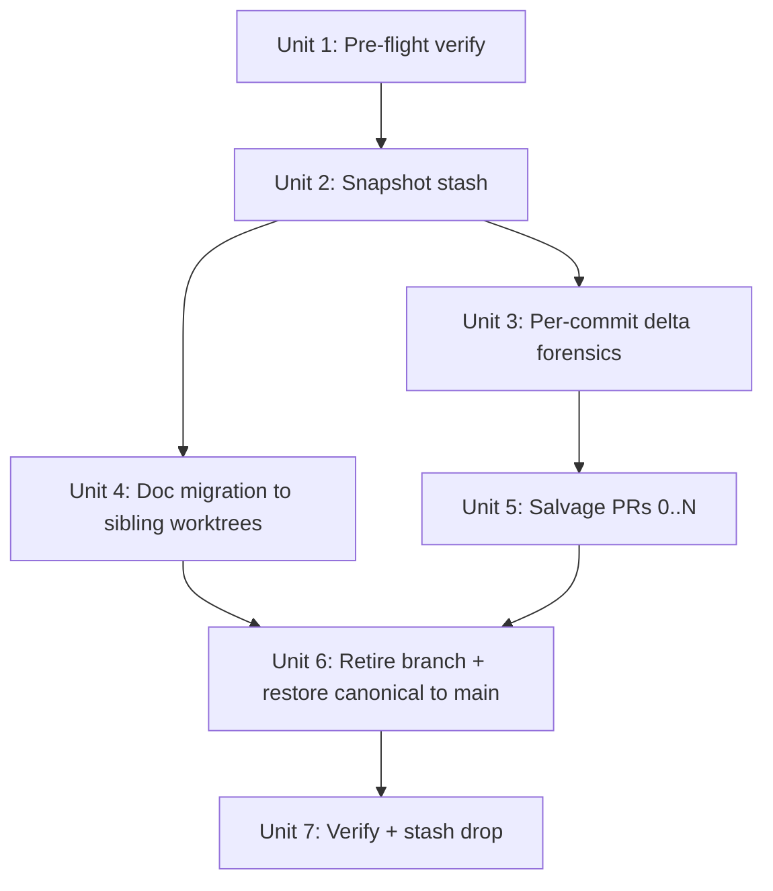

# refactor: Retire feat/bind-medium-pipeline-repair + salvage delta

## Overview

Retire the dead `feat/bind-medium-pipeline-repair` branch from canonical, salvage only its genuine additive delta vs. `origin/main` as small theme-PRs, migrate 4 stranded plan/brainstorm docs to their target worktrees, and return canonical to a clean state on `origin/main`. No rebase, no cherry-pick — the 16 ahead commits' subject matter has already shipped to main through 15+ unrelated PRs (#138, #146, #147, #149, #152, #155, #156, #160, #161, etc.) using different patches; fighting that divergence is more expensive than salvaging the delta.

## Problem Frame

See origin: `docs/brainstorms/2026-05-21-retire-feat-bind-medium-pipeline-repair-requirements.md`.

Canonical sits on `feat/bind-medium-pipeline-repair` with 16 ahead / 27 behind / 58 dirty (46 tracked modify + 3 deleted writeas-related + 4 untracked plan docs). `git cherry origin/main HEAD` flags all 16 commits as patch-id-novel, but the subject matter (chrome backend, telegraph bootstrap, velog cookie/recipe, writeas content-blocked) is already implemented on main via different patches. Continuing rebase/cherry-pick wastes effort and produces duplicate work. The 4 untracked docs in `docs/brainstorms/` + `docs/plans/` belong to sibling worktrees (`bp-canonical-contract`, `bp-fix-publish-false-success`, `bp-fix-verify-ascii`), not canonical.

## Requirements Trace

- R1-R2 Snapshot — protect 58 dirty entries via `git stash -u` + audit log before any mutation
- R3-R4 Delta forensics — per-commit semantic comparison vs. `origin/main` to identify the genuine novel deltas worth salvaging (expected ≤5 small PRs)
- R5-R6 Doc migration — move 4 stranded docs to their target worktrees with `claims: {}` opt-out where the target PR already merged
- R7-R8 Salvage PRs — each genuine delta becomes a single-theme PR off freshly-pulled main
- R9-R11 Retirement — canonical → main, local + remote branch delete, egg-info refresh, stash drop after verification

## Scope Boundaries

(carried from origin)

- Not refactoring/rebasing the other 20+ `bp-*/` worktrees
- Not migrating salvaged plan docs to `docs/solutions/`
- Not promoting `feat/canonical-contract` itself — only the docs migrate
- Not addressing stale local `main` on dormant worktrees (e.g., `bp-launcher-self-heal` shows `[main]` at old SHA — separate concern)

## Context & Research

### Relevant Code and Patterns

- `scripts/prune-stale-worktrees.sh` — already-built cleanup tool (see `AGENTS.md` line 227). **Do not run it during salvage**: per `[[scaffold-worktree-must-commit-before-writes]]`, it kills worktrees whose branch-tip equals `origin/main`, which is exactly the state target worktrees may enter after their PRs merged. Reserve for the deferred bulk worktree cleanup pass.
- `claims: {}` opt-out examples to mirror: `docs/plans/2026-05-20-008-refactor-worktree-branch-cleanup-r2-plan.md`, `docs/plans/2026-05-20-002-feat-homepage-url-autoderive-v1-plan.md`, `docs/plans/2026-05-20-006-refactor-delete-legacy-import-bridge-plan.md`.
- `BACKLINK_PUBLISHER_CONFIG_DIR` — must be considered if any salvage PR touches config code (memory `[[webui_store-config-dir-frozen]]`).
- `monolith_budget.toml` — if any salvage PR touches a tracked file (`cli/plan_backlinks/core.py` is on this branch's dirty list), the PR includes ceiling raise + rationale ≥80 chars in the same commit (AGENTS.md "Monolith budget").

### Institutional Learnings

- `[[worktree-concurrent-switching]]` — stash protection critical; `--keep-index` pop has 4 known traps. Use plain `git stash push -u` with descriptive message.
- `[[ce-work-must-check-concurrent-rebase-before-commit]]` — re-verify `git rev-parse HEAD` + `status --short` immediately before each mutation step; if another agent advanced the branch, stop and `git reflog`.
- `[[plan-doc-on-cutoff-needs-claims-block]]` — plans dated `>= 2026-05-20` need `claims: {}` to opt out of drift detector. This plan + the 3 migrated plan docs all need it.
- `[[verify-external-commits-before-push]]` — before any `git push`, grep memory + `git log origin/main..HEAD` to confirm no foreign commits.
- `[[grep-all-legacy-import-forms]]` — if any salvage PR touches imports, watch all 7 forms (4 absolute + 3 relative + mock.patch targets); pytest is the only tripwire.

### External References

(none — local git ops + workspace cleanup only)

## Key Technical Decisions

- **Retire, do not rebase or cherry-pick.** Rebase conflicts with every restructured file in main (`publishing/registry.py`, `config/__init__.py`, `webui_app/helpers.py`, all adapters). Cherry-pick produces patches that duplicate subject matter already on main. Salvaging only the additive delta is cheaper and verifiable.
- **Stash, not commit-WIP onto the dying branch.** Stashes survive `branch -D`; commit-WIP would not. `git stash push -u` includes untracked plan docs.
- **Delta detection method: per-commit per-file `git diff origin/main..<sha> -- <file>` semantic read, not `git cherry`.** `git cherry` already misclassified all 16 as novel because patch-IDs differ from main's squash-merged versions — semantic line-level inspection is required (resolves origin Q1).
- **Plan-doc migration target = sibling worktree's current branch, not new branch.** `bp-canonical-contract` is on `feat/canonical-contract` (in-flight) — commit on that branch directly. `bp-fix-publish-false-success` and `bp-fix-verify-ascii` correspond to merged PRs (#156, #160) — after the PR merged, the worktree's branch is functionally dead too, so commit on its `main` after `git pull` (resolves origin Q3).
- **Monolith ceiling handling: defer to each salvage PR's own review.** If a salvage PR touches a `monolith_budget.toml`-tracked file (most likely `cli/plan_backlinks/core.py`), the PR raises the ceiling with ≥80 char rationale in the same commit per AGENTS.md (resolves origin Q2).
- **Salvage log location: workspace root, not canonical.** Path: `/Users/dex/YDEX/INPORTANT WORK/外链/0511_backlink  publisher/.salvage-2026-05-21.log`. Outside any git repo. Provides recovery anchor without adding new dirty WIP to canonical during the salvage.

## Open Questions

### Resolved During Planning

- Origin Q1 (delta granularity): full per-file `git diff origin/main..<sha>` read; `git log -S<symbol>` is supplementary, not sufficient.
- Origin Q2 (monolith re-check): defer to each salvage PR; raise ceiling + rationale in the same PR if a tracked file's SLOC grows.
- Origin Q3 (plan-doc target branch for merged-PR worktrees): commit on the target worktree's `main` after `git pull --ff-only`, not on a new branch — the docs are historical record only.

### Deferred to Implementation

- Exact count of genuine deltas (R4 output) — only knowable after Unit 3 runs. Plan accommodates 0-5 salvage PRs without restructuring.
- Whether the `monolith_budget.toml` ceiling change for `cli/plan_backlinks/core.py` is needed at all — depends on whether the WIP touching it is itself a genuine delta worth salvaging (likely the article_urls normalize from `acbea6a`).
- Whether to bundle multiple small deltas into one PR or keep 1:1 — judgment call once deltas are enumerated; default 1:1 unless deltas are obviously coupled (same file, same intent).

## High-Level Technical Design

> *This illustrates the intended approach and is directional guidance for review, not implementation specification. The implementing agent should treat it as context, not code to reproduce.*

Unit 4 (doc migration) and Unit 3/5 (delta forensics + salvage PRs) are parallelizable after Unit 2's snapshot lands. Unit 6 must wait for both branches of the fan-out. Unit 7 is the final safety verification before destroying the stash.

## Implementation Units

- [ ] **Unit 1: Pre-flight verification & audit log bootstrap**

**Goal:** Confirm canonical's branch state matches plan assumptions and audit the 3 target sibling worktrees before any mutation.

**Requirements:** R1, R2

**Dependencies:** None

**Files:**
- Create: `/Users/dex/YDEX/INPORTANT WORK/外链/0511_backlink  publisher/.salvage-2026-05-21.log` (workspace root, outside git)

**Approach:**
- In canonical: capture `git rev-parse HEAD`, `git rev-list --left-right --count HEAD...origin/main`, `git status --short | wc -l`, `gh pr list --head feat/bind-medium-pipeline-repair --state all`. Record to salvage log.
- For each target sibling worktree (`bp-canonical-contract`, `bp-fix-publish-false-success`, `bp-fix-verify-ascii`): record current branch + HEAD + dirty count. Confirm branches are as expected (`feat/canonical-contract`, `fix/webui-publish-false-success`, `fix/verify-non-ascii-url`).
- Assertion: canonical HEAD must equal `5d3b210` and ahead/behind must be `16/27` (the state at plan time). Any drift means another agent has acted — stop and re-plan.
- Assertion: no open PR uses `feat/bind-medium-pipeline-repair` as head OR base.

**Patterns to follow:** `[[ce-work-must-check-concurrent-rebase-before-commit]]` — re-check immediately before each subsequent mutation step too, not just here.

**Test scenarios:**
- Happy path: all assertions pass; salvage log shows 6 entries (canonical + 3 siblings + ahead/behind + PR-list result).
- Error path: canonical HEAD ≠ `5d3b210` — STOP execution; emit `ce-work concurrent activity detected, see reflog` and exit.
- Error path: a target sibling worktree is missing or on an unexpected branch — STOP and surface to user; do not auto-correct.
- Error path: an open PR references `feat/bind-medium-pipeline-repair` — STOP; PR retirement is a separate prerequisite, not in this plan's scope.

**Verification:**
- Salvage log exists at the workspace-root path and contains the assertion outputs.
- Confirmation that the 3 target sibling worktrees exist at expected paths and branches.

---

- [ ] **Unit 2: Snapshot stash with descriptive message**

**Goal:** Protect all 58 dirty entries in canonical (46 tracked + 4 untracked + 3 deletions) against any subsequent branch mutation.

**Requirements:** R1, R2

**Dependencies:** Unit 1

**Files:**
- Modify: `/Users/dex/YDEX/INPORTANT WORK/外链/0511_backlink  publisher/.salvage-2026-05-21.log` (append stash SHA)

**Approach:**
- In canonical: `git stash push -u -m "salvage feat/bind-medium-pipeline-repair 2026-05-21 (58 entries)"`. Capture stash SHA (`git rev-parse refs/stash`).
- Verify `git status --short` after stash is empty (or shows only egg-info noise from prior `pip install -e .`).
- Append stash SHA + `git stash list | head -3` to salvage log.

**Patterns to follow:** `[[worktree-concurrent-switching]]` — plain `push -u`; do not use `--keep-index`. Stash SHA gives a recoverable anchor even after `git stash drop`.

**Test scenarios:**
- Happy path: post-stash `git status --short` is empty; stash SHA recorded; `git stash list` shows 1+ entry.
- Edge case: pre-stash `git diff --cached` shows staged changes — include in stash via `-u` semantics (stash captures both staged and unstaged; document in log).
- Error path: stash command fails (e.g., merge conflict from concurrent op) — STOP; do not attempt rollback automatically.

**Verification:**
- `git status --short` shows clean working tree (or only egg-info).
- Salvage log contains the stash SHA, recoverable via `git stash apply <sha>` independent of stash-list position.

---

- [ ] **Unit 3: Per-commit delta forensics**

**Goal:** For each of the 16 ahead commits, classify the diff vs. `origin/main` as `already-shipped` / `partial-delta-novel` / `wholly-novel` and produce a salvage checklist.

**Requirements:** R3, R4

**Dependencies:** Unit 2

**Files:**
- Modify: salvage log — append per-commit classification table

**Approach:**
- For each commit `<sha>` in `git log origin/main..HEAD --reverse --pretty=%h`:
  1. List touched files with `git show --stat <sha>`.
  2. For each touched file, run `git diff origin/main..<sha> -- <file>` AND `git log origin/main --oneline -- <file> | head -5`. Read the diff semantically.
  3. Classify per file: (a) the diff is already on main (look for the same logical change in main's history of that file); (b) the diff conflicts with main but the intent is shipped; (c) the diff adds something main genuinely lacks.
  4. Record file-level + commit-level classification.
- Aggregate: produce a deltas-to-salvage list — only `wholly-novel` and the genuinely additive part of `partial-delta-novel`.
- Likely candidates per initial scan (subject to verification):
  - `a5361f6` medium login Playwright lifecycle — check if #135 (launcher self-heal) or #138 already covered it
  - `16b263a` hashnode UI rationale (16 lines in `webui_app/helpers.py`) — likely tiny novel doc note
  - `acbea6a` article_urls normalize across checkpoint/publish/history — check vs #156 (publish false-success) territory
  - `1878bfe` velog settings template polish — verify vs #132/#134/#162/#163 Plan 012 work
- Skip exhaustive forensics on commits whose subject is obviously shipped (`fc41561` Chrome/CDP Telegraph → #138, `5d3b210` writeas offline-verify → #146, the velog `551386f`/`16ddd50`/`070eee1` cluster → #152).

**Test scenarios:**
- Happy path: classification table has 16 rows; salvage list has 0-5 entries.
- Edge case: a commit is `wholly-novel` but its diff depends on a `already-shipped` commit's restructuring — flag as "rebase-dependent" and decide whether to salvage as-is or pivot to a fresh patch on main.
- Edge case: `2de4dd8` ("wip: bundle in-flight follow-ups") mixes multiple subjects — split mentally; each subject classified independently; salvage entries reference file ranges within the commit, not the whole commit.

**Verification:**
- Salvage log contains a table with one row per ahead commit and per-file classification.
- Aggregated salvage list (next-unit input) is explicit and bounded — between 0 and 5 candidate PRs.

---

- [ ] **Unit 4: Migrate 4 stranded plan/brainstorm docs to target worktrees**

**Goal:** Land the 4 untracked docs in their owning sibling worktrees and remove them from canonical's stash-set as separately-managed artifacts.

**Requirements:** R5, R6

**Dependencies:** Unit 2 (stash must contain the docs)

**Files:**
- Source (in canonical's stash): `docs/plans/2026-05-21-003-feat-canonical-contract-and-platform-expansion-plan.md`, `docs/plans/2026-05-21-004-fix-webui-publish-false-success-plan.md`, `docs/plans/2026-05-21-005-fix-verify-non-ascii-url-ascii-codec-plan.md`, `docs/brainstorms/2026-05-21-canonical-contract-and-platform-expansion-requirements.md`
- Target: `bp-canonical-contract/docs/plans/2026-05-21-003-*.md` + `bp-canonical-contract/docs/brainstorms/2026-05-21-canonical-contract-*.md` (on branch `feat/canonical-contract`); `bp-fix-publish-false-success/docs/plans/2026-05-21-004-*.md` (on `main` after `git pull`); `bp-fix-verify-ascii/docs/plans/2026-05-21-005-*.md` (on `main` after `git pull`)

**Approach:**
- For each doc, extract from canonical's stash via `git show stash@{N}:docs/plans/2026-05-21-XXX.md > <target-path>` (do NOT `git stash apply` to canonical's working tree — would re-introduce dirty WIP).
- For 003 + brainstorm into `bp-canonical-contract`: commit on `feat/canonical-contract` (work is in-flight). Re-verify worktree branch + HEAD before commit. Add `claims: {}` to plan frontmatter if not already present.
- For 004 + 005 into their respective worktrees: first `git checkout main && git pull --ff-only` in that worktree; then write doc; ensure frontmatter has `claims: {}` (PRs #156/#160 already merged, so the plan is historical record only — `claims: {}` opts out of `plan-check` drift gate). Commit.
- One docs PR per target worktree (3 PRs total) OR push directly to main if the user accepts direct-push for retroactive docs (decide via Q&A during execution).

**Patterns to follow:**
- `[[plan-doc-on-cutoff-needs-claims-block]]` — `claims: {}` for any plan dated `>= 2026-05-20`.
- Existing claims-block examples: `docs/plans/2026-05-20-008-refactor-worktree-branch-cleanup-r2-plan.md`.

**Test scenarios:**
- Happy path: 3 sibling worktrees each gain their target docs; canonical's stash unchanged; salvage log records target SHAs.
- Edge case: a target worktree has uncommitted dirty WIP — STOP and surface; do not auto-stash someone else's work.
- Edge case: a target worktree's PR is open (not merged) — re-evaluate whether the doc should land on that PR's branch or wait. Plan assumes #156 + #160 are merged (verified 2026-05-21) and `feat/canonical-contract` is in-flight.
- Error path: `git pull --ff-only` fails (local main diverged from origin) — STOP; investigate the divergence before forcing.

**Verification:**
- Each target worktree's `git log -1` shows the new doc commit.
- `git log -1 --stat` confirms file additions match expectation.
- Canonical's stash still contains all 58 entries (untouched).

---

- [ ] **Unit 5: Open salvage PRs (0..N)**

**Goal:** For each genuine delta from Unit 3, open a single-theme PR off freshly-pulled `origin/main`.

**Requirements:** R7, R8

**Dependencies:** Unit 3 (forensics output), Unit 4 (decouples doc migration from PR creation)

**Files:**
- Create: 0-5 fresh branches off `origin/main` named by theme (e.g., `fix/medium-login-playwright-crash`, `feat/publish-article-urls-normalize`, `docs/hashnode-ui-blocker-rationale`)
- Modify: salvage log — record PR URLs

**Approach:**
- For each entry in Unit 3's salvage list:
  1. Spin a new worktree off `origin/main` at `bp-salvage-<theme>/` OR work in an existing clean sibling — depending on user preference.
  2. Apply the delta. Source the diff from canonical's stash via `git show stash@{0}:<file>` for file content, or `git diff origin/main..<sha> -- <file>` from the dying branch for partial-novel sections.
  3. Re-run any affected tests in that worktree (`PYTHONPATH=src pytest tests/...` if no per-worktree venv).
  4. If diff touches a `monolith_budget.toml`-tracked file and the new SLOC exceeds the ceiling, raise the ceiling in the same commit with rationale ≥80 chars (per AGENTS.md).
  5. Commit with descriptive message; do NOT reference the dead branch name (e.g., no "from feat/bind-medium-pipeline-repair").
  6. `gh pr create` with a short body noting provenance ("Salvaged delta from retired branch; original commit was <sha>; reason main's <PR#> didn't cover X").
- If Unit 3's salvage list is empty: skip this unit entirely. Log "no salvage PRs needed" and proceed to Unit 6.

**Patterns to follow:**
- AGENTS.md "Adding a new publisher adapter" recipe if a salvage PR touches registry surface (unlikely for these deltas).
- `[[grep-all-legacy-import-forms]]` if any salvage PR touches imports.
- `[[atomic-write-canonical-for-secrets]]` if any salvage PR writes credential JSON.

**Test scenarios:**
- Happy path: each salvage PR opens; CI passes; PR body cites the original commit SHA + reason main's prior PR didn't cover the delta.
- Edge case: salvage list is empty — unit no-ops cleanly; salvage log records "no deltas to salvage" with explicit reason for each ahead commit.
- Edge case: a salvage PR's tests fail because the delta depended on dying-branch restructuring — surface to user; either pivot patch shape or drop the salvage.
- Error path: PR creation fails (gh auth, network) — record in salvage log; retry; do not lose the local branch.
- Integration scenario: a salvage PR that raises `monolith_budget.toml` ceiling must include the rationale ≥80 chars and pass `tests/test_no_monolith_regrowth.py` locally.

**Verification:**
- Salvage log lists each opened PR with URL + title + which original SHA it salvages.
- For each PR, `gh pr view <#> --json statusCheckRollup` shows CI in-flight or passed.

---

- [ ] **Unit 6: Retire branch + restore canonical to main**

**Goal:** Put canonical on a clean `origin/main` HEAD; delete the dead branch locally and remotely; refresh editable install.

**Requirements:** R9, R10

**Dependencies:** Unit 4 (docs migrated), Unit 5 (salvage PRs opened — but unit can run before they merge; opened-not-merged is acceptable)

**Files:**
- Modify: `src/backlink_publisher.egg-info/*` (regenerated by `pip install -e .`)
- Modify: salvage log

**Approach:**
- Re-verify canonical HEAD still `5d3b210` and stash still intact (concurrent-activity guard).
- `git fetch origin --prune` to refresh remote refs.
- `git checkout main` (canonical's local main may be stale; that's OK).
- `git pull --ff-only origin main` — if it fails (local main diverged), STOP and investigate. Expected fast-forward.
- `git branch -D feat/bind-medium-pipeline-repair`.
- `git push origin :feat/bind-medium-pipeline-repair` to delete remote ref. If remote ref doesn't exist (already deleted), absorb the warning.
- `pip install -e ".[dev]"` to refresh egg-info to match main's package layout.
- `git status --short` — expect zero or only-egg-info entries; `git diff` to confirm only egg-info if any.

**Patterns to follow:**
- `[[verify-external-commits-before-push]]` — before `git push origin :feat/...`, double-check no other agent reused the branch name in the last few minutes (unlikely but trivially cheap).

**Test scenarios:**
- Happy path: canonical lands on `origin/main` HEAD; `git branch --show-current` returns `main`; `git status --short` is clean (or only egg-info); dead branch absent from `git branch -a`.
- Edge case: local main was stale and has diverged from origin — `pull --ff-only` rejects; STOP; investigate; do NOT `pull --rebase` or `pull` without `--ff-only`.
- Error path: `branch -D` refuses because the branch is checked out somewhere — `git worktree list | grep feat/bind-medium-pipeline-repair`; resolve before retry.
- Error path: `push origin :branch` rejected by remote — likely branch protection; surface and skip remote delete; document in salvage log; user resolves separately.

**Verification:**
- `git rev-parse HEAD` matches `origin/main`.
- `git branch -a | grep feat/bind-medium-pipeline-repair` returns nothing.
- `git status --short` is empty.
- Tests still pass: `pytest tests/test_no_monolith_regrowth.py` (canary).

---

- [ ] **Unit 7: Final verification + stash drop**

**Goal:** Confirm every salvage outcome is in place, then release the stash.

**Requirements:** R11

**Dependencies:** Unit 4, Unit 5, Unit 6 all complete

**Files:**
- Modify: salvage log (final entry: dropped stash SHA, success summary)

**Approach:**
- Verify:
  - Canonical: on `main`, clean, at `origin/main` HEAD (re-check post-#163+ HEAD SHA).
  - Each of 3 sibling worktrees: target docs committed (and pushed if a PR or direct-push was chosen).
  - Salvage PRs (0..N) all opened and reachable via `gh pr view`.
- Compare the salvage log's pre-state assertions against current state: anything unaccounted-for surfaces a missing item.
- Only after ALL above pass: `git stash drop <stash@{N}>` (target by SHA, not by stack position — stash list may have shifted).
- Append final salvage log entry: stash dropped, salvage complete, post-state snapshot.

**Test scenarios:**
- Happy path: all checks pass; stash drops; salvage log shows final "complete" entry.
- Edge case: salvage list was empty in Unit 3 — Unit 7 still runs; just verifies branch retirement + doc migration; stash drops cleanly.
- Error path: any check fails — do NOT drop the stash; surface what's missing; user decides recover via `git stash apply <sha>` or finish manually.

**Verification:**
- `git stash list` no longer contains the salvage stash SHA.
- Salvage log final entry timestamped and explicit.
- Optional follow-up: `bash scripts/prune-stale-worktrees.sh --dry-run` to preview which `bp-*/` worktrees are now stale post-cleanup (informational only; not part of this plan's scope to act on).

## System-Wide Impact

- **Interaction graph:** Canonical's `.git/` is shared with all 20+ `bp-*/` worktrees (`git worktree` semantics). Any branch ref deletion in canonical is visible everywhere. The 3 target sibling worktrees are independently checked out; commits there don't affect canonical until canonical fetches+pulls.
- **Error propagation:** Stash failures, push rejections, or pull divergences must STOP execution and surface — no auto-recovery. Salvage log + stash SHA together provide recovery anchor.
- **State lifecycle risks:** egg-info noise — `pip install -e .` regenerates it on every install; whatever salvage state leaves behind gets reset by Unit 6's reinstall.
- **API surface parity:** None of this plan changes any code API. Salvage PRs in Unit 5 may, but each is judged independently.
- **Integration coverage:** Per-worktree pytest in Unit 5 only covers that PR's delta. The retired branch's broader test integration is irrelevant — main's CI is the source of truth post-retirement.
- **Unchanged invariants:**
  - Canonical's commit history on `main` (only fast-forwards in Unit 6).
  - The 16 ahead commits' diffs are NOT cherry-picked; they are explicitly abandoned (delta lives in salvage PRs, not in their original commit form).
  - Other 20+ `bp-*/` worktrees are not touched by this plan (separate cleanup deferred).

## Risks & Dependencies

| Risk | Mitigation |
|---|---|
| Concurrent agent advances canonical HEAD between units | Re-verify `git rev-parse HEAD` at start of each unit (Pattern: `[[ce-work-must-check-concurrent-rebase-before-commit]]`); abort on drift. |
| Stash partial-restore fails (e.g., conflict) when extracting docs for Unit 4 | Use `git show stash@{N}:<path>` (read-only blob extraction), not `git stash apply --keep-index` — bypasses conflict surface. |
| Salvage PR's diff depends on dying-branch restructuring | Surface during Unit 5 forensics step 2; pivot to fresh patch on main OR drop the salvage. |
| `bp-fix-publish-false-success` or `bp-fix-verify-ascii` has uncommitted WIP from another agent | Unit 4 STOPs and surfaces; user resolves; plan does not auto-stash sibling worktrees. |
| Remote branch delete rejected by branch protection | Document in salvage log; skip; resolve separately (rarely applies to feature branches but possible). |
| Salvage list (Unit 3) larger than 5 — implies more delta than expected | Plan still works; just runs Unit 5 N times; consider grouping closely-coupled deltas. |
| Stash dropped prematurely (Unit 7 misjudges success) | Stash SHA in salvage log → `git stash apply <sha>` recovers from object store until garbage collection; window is several days. |
| The plan doc itself is in the stash and never lands on main | Plan doc is in canonical's stash. Post-Unit 6, manually restore via `git show stash@{0}:docs/plans/2026-05-21-006-*.md > docs/plans/2026-05-21-006-*.md`, commit on main, push as a tiny docs PR (or include in the stash-drop summary as "plan landed via direct-push"). Recommend a small docs PR for traceability. |

## Documentation / Operational Notes

- After Unit 7, consider authoring a `docs/solutions/` entry capturing the salvage pattern for future use — but per origin scope boundary, don't promote brainstorm/plan docs (operator names). Author a fresh solution doc instead, stripped of operator-specific names.
- Run `bash scripts/prune-stale-worktrees.sh --dry-run` after Unit 7 to surface which other `bp-*/` worktrees became stale during the salvage period (informational; cleanup is a separate plan).

## Sources & References

- **Origin document:** [docs/brainstorms/2026-05-21-retire-feat-bind-medium-pipeline-repair-requirements.md](../brainstorms/2026-05-21-retire-feat-bind-medium-pipeline-repair-requirements.md)
- Related main PRs (subject-superseding): #138, #146, #147, #149, #152, #155, #156, #160, #161
- AGENTS.md: "Worktree Cleanup" (line 223), "Monolith budget" (line 232), "Adding a new publisher adapter"
- Claims-block opt-out reference: `docs/plans/2026-05-20-008-refactor-worktree-branch-cleanup-r2-plan.md`
- Salvage tooling reference: `scripts/prune-stale-worktrees.sh` (deferred-use only — see Risks)
