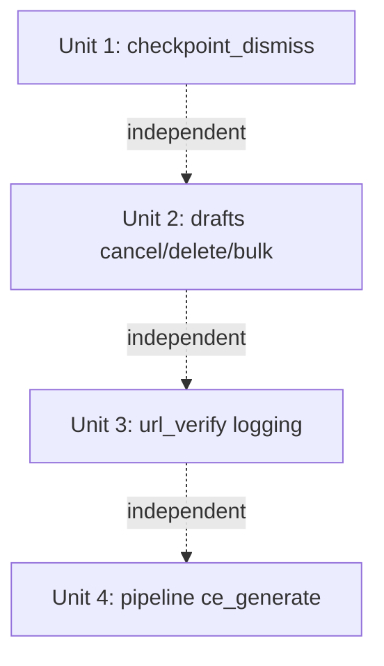

# fix: Close remaining WebUI false-success routes (UX honesty O1)

## Overview

Four WebUI routes catch a broad `Exception`, fall back to a safe default (or `pass`),
and then report success to the operator even though the underlying action silently
failed. This is the **same bug class** as the already-fixed PR #156 (`/ce:publish`
rendered "发布成功！" with zero URLs). The operator's view of "did it work?" is
untrustworthy in these paths.

This plan closes the four remaining instances. The fix is **honesty, not behavior
change**: surface the real failure (flash error / logged event / differentiated
reason) instead of swallowing it. Where a swallow is *legitimately* benign (e.g.
removing a scheduler job that never existed), we keep the swallow but narrow it to the
specific benign exception so genuine failures stop hiding behind it.

This is item **O1** from `docs/ideation/2026-05-25-codebase-optimization-backlog.md`
(the doc's named "highest-leverage" theme). It compounds with the just-merged health
dashboard / projector work (PR #222) to make the operator's success signal trustworthy
end-to-end.

## Problem Frame

The recurring pain class in this project — PR #156 false-success, velog
null-after-retry, the events projector silently dropping successes — is all "the
operator was told something succeeded when it didn't." Closing the remaining
false-success routes is the truest reading of the original request "讓這個服務更優質".

Origin: `docs/ideation/2026-05-25-codebase-optimization-backlog.md` → O1 (no
requirements doc; this is a bounded bug-class cleanup, planned direct).

## Requirements Trace

- R1. A swallowed delete/cancel/fetch failure must never render an unqualified success
  message to the operator.
- R2. Every genuinely-swallowed exception path must emit a `plan_logger` event with the
  exception class for observability (mirrors `sites.py` / `pipeline.py` convention).
- R3. Benign expected exceptions (scheduler job absent for an unscheduled draft, missing
  checkpoint on idempotent dismiss) must NOT be reported to the operator as failures —
  no false-negative spam.
- R4. No change to the success-path behavior or response shape that existing tests and
  the frontend already depend on (uniform JSON shape for `url_verify`; query-param flash
  redirects for drafts/checkpoint).

## Scope Boundaries

- **In scope:** the four named routes' error/fallback paths only.
- **Out of scope (O2):** silent `except` in *adapters* (`medium_browser.py`,
  `linkedin_api.py`) — different backlog item, hot contention zone, deferred.
- **Out of scope (O3):** frontend `fetch().then(r.json())` content-type hardening —
  this plan does not change any response status code or shape, so no frontend change is
  required (see Key Technical Decisions). O3 remains a separate deferred item.
- **No new endpoints, no new dependencies, no schema changes.**

## Context & Research

### Relevant Code and Patterns

- **Canonical fix pattern — PR #156** (`eca5fd7`): surface a real multi-state outcome to
  the UI instead of an unconditional success banner; log `plan_logger.info` on success /
  `.warn` otherwise; add a regression test asserting the success string can never appear
  on a failure path. This plan mirrors that philosophy at smaller scale.
- **Logger convention:** `from backlink_publisher._util.logger import plan_logger`, then
  `plan_logger.warn("<event>", reason=type(exc).__name__, ...)`. Live examples:
  `webui_app/routes/sites.py:157` (`tdk_fetch_failed`),
  `webui_app/routes/pipeline.py:196` (`json_parse_error`),
  `webui_app/routes/pipeline.py:265`.
- **Flash convention (NOT Flask `flash()`):** routes communicate via query params
  (`redirect('/?tab=draft&flash_type=danger&flash_msg=...')`) or `_render(..., error=...)`
  / `_render(..., flash={"type": ..., "msg": ...})`. Follow the per-route existing form.
- **`checkpoint_resume()`** in the same file is already correct (fixed under Plan
  2026-05-19-006 Unit 1) — it refuses to persist a fake "published" row when exit 0
  returns no URLs. Use it as the in-file reference for the honesty bar.
- **Scheduler:** `webui_app/scheduler.py` uses APScheduler `BackgroundScheduler`.
  `_scheduler.remove_job(id)` raises `apscheduler.jobstores.base.JobLookupError` when the
  job is absent — which is the *expected* state for a draft in `pending` status that was
  never scheduled. This is why the current bare `except Exception: pass` exists; the fix
  must preserve that benign case while surfacing real failures.

### Institutional Learnings

- `feedback_fetch_json_must_guard_content_type` — relevant only if a route changes its
  response status/shape. **This plan deliberately keeps `url_verify`'s uniform 200+JSON
  shape**, so the frontend `resp.json()` callers are unaffected. Recorded here to
  document that the trap was considered and is N/A.
- `feedback_dead_code_audit_blind_spots` — the backlog notes most other broad catches in
  the codebase are *documented* cleanup paths (`# noqa: BLE001` with reasons). Do not
  touch those; only the four named genuinely-silent paths.

### External References

- None needed — fully grounded in repo patterns (PR #156, `plan_logger`, APScheduler
  `JobLookupError`).

## Key Technical Decisions

- **Honesty over behavior change.** Each fix surfaces or logs the failure; none changes
  the success path. Rationale: minimizes blast radius and keeps existing
  success-path tests green (R4).
- **Narrow the swallow, don't remove it (drafts/checkpoint).** Catch the specific benign
  exception (`JobLookupError`; missing-checkpoint) and `pass`/log-debug it; let or
  surface everything else. Rationale: removing the catch entirely would turn the normal
  "cancel an unscheduled draft" flow into a 500 / false error (violates R3).
- **`url_verify`: log internally, keep the response generic.** Add
  `plan_logger.warn("url_verify_fetch_error", host=..., reason=type(exc).__name__)` in
  the existing `except`, but keep returning the uniform failure shape to the client. The
  dishonesty being fixed is the *total absence of any log* — the real cause currently
  vanishes. Optionally map `TimeoutError`/`socket.timeout` to a distinct `"timeout"`
  reason for operator clarity (decided in Unit 3). Rationale: don't leak internal error
  detail to the browser; do make it diagnosable from logs (R2). Keeps shape → satisfies
  R4 and sidesteps the content-type trap.
- **`ce_generate`: distinguish "no input" from "corrupt input".** Falling back to stored
  urls is fine when the form genuinely supplied nothing; it is dishonest when the form
  supplied a non-empty value that failed to parse (operator's new input is silently
  discarded for stale data). Surface an error in the corrupt-with-content case.

## Open Questions

### Resolved During Planning

- *Should `url_verify` change its HTTP response on error?* No — keep uniform 200+JSON.
  Only add logging (+ optional reason differentiation). Avoids frontend changes.
- *Should removing the scheduler-job swallow break the cancel-pending flow?* No — narrow
  to `JobLookupError`.

### Deferred to Implementation

- **Exact behavior of `backlink_publisher.checkpoint.delete()` on a missing run_id** —
  read it during Unit 1. If it is already idempotent (no error on missing), then the only
  exceptions reaching the handler are genuine failures and all should surface. If it
  raises a "not found" variant, treat that as benign and surface the rest.
- **Whether `ce_preview`'s bare `return "Invalid URLs"` (pipeline.py:~340) is worth
  upgrading** — it already returns an error string (not a false success), so it is the
  weakest candidate. Decide in Unit 4 whether to add a `plan_logger.warn` only, or leave
  it. Do not expand scope to a full template render.

## Implementation Units

All four units are independent (different files, no shared helper changes) and may land
as separate atomic commits in any order. Grouped in one plan because they are one
bug-class sweep.

- [ ] **Unit 1: `checkpoint_dismiss` surfaces delete failure**

**Goal:** Stop redirecting "/" as if the dismiss worked when `_checkpoint_mod.delete`
fails.

**Requirements:** R1, R2, R3

**Dependencies:** None

**Files:**
- Modify: `webui_app/routes/checkpoint.py` (`checkpoint_dismiss`, ~line 84–93)
- Test: `tests/test_webui_checkpoint.py` (extend; `tests/test_checkpoint.py` also exists —
  pick the one already covering the dismiss route, confirm by grep first)

**Approach:**
- Read `backlink_publisher.checkpoint.delete` to learn its missing-run_id behavior
  (Deferred question above).
- Replace `except Exception: pass` with: log `plan_logger.warn("checkpoint_dismiss_failed",
  run_id=run_id, reason=type(exc).__name__)` and redirect with a danger flash
  (`/?flash_type=danger&flash_msg=...`) on genuine failure. Treat a missing-checkpoint
  "not found" as benign (idempotent dismiss → keep success redirect).

**Patterns to follow:** `plan_logger.warn` usage in `sites.py:157`; the honesty bar set by
`checkpoint_resume` in the same file.

**Test scenarios:**
- Happy path: `delete` succeeds → redirect to `/` (no danger flash). Assert existing
  behavior preserved.
- Error path: `delete` raises a non-benign exception (monkeypatch `_checkpoint_mod.delete`
  to raise) → response redirects with `flash_type=danger`; a `checkpoint_dismiss_failed`
  log event is emitted with the exception class.
- Edge case (if `delete` is NOT idempotent): missing run_id → benign, still success
  redirect, no danger flash.

**Verification:** Dismissing a checkpoint whose delete fails no longer silently returns
the operator to a "clean" home view; the still-present checkpoint is explained by a
surfaced error.

- [ ] **Unit 2: drafts cancel/delete/bulk distinguish benign job-absence from real failure**

**Goal:** When scheduler job removal genuinely fails, the operator is warned that the
scheduled job may still fire — instead of seeing "已取消排程 / 已删除" unconditionally.

**Requirements:** R1, R2, R3

**Dependencies:** None

**Files:**
- Modify: `webui_app/routes/drafts.py` (`ce_draft_cancel` ~91–96, `ce_draft_delete`
  ~105–110, `_remove_job_silent` ~118–123 used by `bulk_delete`/`bulk_cancel`)
- Test: `tests/test_drafts_bulk_routes.py` (extend; covers bulk + likely single routes)

**Approach:**
- Replace bare `except Exception: pass` with: `except JobLookupError: pass` (benign — the
  draft was never scheduled), and a second `except Exception as exc:` that logs
  `plan_logger.warn("draft_job_remove_failed", item_id=..., reason=type(exc).__name__)`.
- Keep the store mutation (`update_item`/`delete_item`) — the danger is an *orphan job*,
  so the store should still reflect the operator's intent, but the redirect flash should
  warn when removal failed (e.g. `flash_type=warning&flash_msg=已删除，但排程任务可能仍会触发`).
- For `_remove_job_silent` (bulk): change signature to return a bool (removed-cleanly vs
  real-failure); bulk routes tally genuine failures and append a warning to the flash
  when `>0`. `JobLookupError` counts as clean.
- Import `from apscheduler.jobstores.base import JobLookupError`.

**Patterns to follow:** existing query-param flash redirects in the same file; bulk
tally pattern already present in `ce_draft_bulk_cancel` (`cancelled` counter).

**Test scenarios:**
- Happy path (scheduled draft): `remove_job` succeeds → status reverts to pending /
  item deleted, success flash unchanged.
- Edge case (pending draft, no job): `remove_job` raises `JobLookupError` → treated as
  benign, success flash, no warning, no `draft_job_remove_failed` log.
- Error path: `remove_job` raises a generic `Exception` → store still mutated, redirect
  carries a warning flash, `draft_job_remove_failed` log emitted with exception class.
- Integration (bulk): mix of ids where one job removal raises generic Exception → bulk
  flash reports the genuine-failure count; clean ones unaffected.

**Verification:** Cancelling/deleting an unscheduled draft is still silent-success;
cancelling one whose job removal truly fails now warns the operator the job may still run.

- [ ] **Unit 3: `url_verify` logs the real fetch exception (+ optional reason split)**

**Goal:** Stop collapsing every fetch exception into an unlogged generic `network_error`.

**Requirements:** R2, R4

**Dependencies:** None

**Files:**
- Modify: `webui_app/routes/url_verify.py` (the `except Exception` at ~181–185)
- Test: `tests/test_url_verify_throttle.py` or a sibling `test_webui_url_verify_*`
  (confirm which already drives the verify route; extend it)

**Approach:**
- In the existing `except Exception as exc:` block add
  `plan_logger.warn("url_verify_fetch_error", host=host_ascii, reason=type(exc).__name__)`
  before setting the uniform failure tuple.
- Optional (decide while implementing): map `TimeoutError`/`socket.timeout` to
  `reason="timeout"` so the operator-facing reason is less misleading; everything else
  stays `network_error`. Keep the uniform JSON shape and 200 status (R4).
- Do **not** alter the RECON emit or throttle release semantics.

**Patterns to follow:** `plan_logger.recon` / `.warn` already used in this file and in
`sites.py`.

**Test scenarios:**
- Error path: monkeypatch `content.fetch.verify_url_has_content` to raise a generic
  exception → response keeps uniform shape with `ok=false`; a `url_verify_fetch_error`
  log event is emitted carrying `reason` = exception class.
- Edge case (if reason-split implemented): raise `TimeoutError` → reason surfaces as
  `"timeout"` (or remains `network_error` if split deferred — assert whichever is shipped).
- Happy path: successful verify still returns `ok=true` with title — unchanged (R4
  regression guard).

**Verification:** A failing URL verify now leaves a diagnosable log line with the real
exception class; the browser response shape is byte-for-byte unchanged.

- [ ] **Unit 4: `ce_generate` surfaces corrupt-input instead of silently using stale urls**

**Goal:** When the operator submits a non-empty `urls_json` that fails to parse, don't
silently generate against stale `stored_config` urls as if nothing was wrong.

**Requirements:** R1, R2

**Dependencies:** None

**Files:**
- Modify: `webui_app/routes/pipeline.py` (`ce_generate` ~135–141; consider `ce_preview`
  ~338–340 per deferred question)
- Test: `tests/test_webui_publish_route.py` or the pipeline route test (confirm which
  drives `/ce:generate`; extend it)

**Approach:**
- Distinguish "form supplied nothing / default `'[]'`" (legitimate fallback to stored
  urls — keep current behavior) from "form supplied a non-empty value that failed to
  parse" (surface `_render('index.html', error="连结格式无效，未使用旧数据", ...)` and log
  `plan_logger.warn("urls_json_parse_error", reason=type(exc).__name__)`).
- `ce_preview`: at minimum add a `plan_logger.warn`; it already returns an error string
  (not a false success), so do not expand its scope.

**Patterns to follow:** `pipeline.py:196` already logs `json_parse_error` for the
per-line plans parse — mirror that event style and the `_render(..., error=...)` form.

**Test scenarios:**
- Happy path: valid `urls_json` → generates normally (unchanged).
- Edge case: empty / `'[]'` form value with stored urls present → still falls back to
  stored urls silently (legitimate, unchanged).
- Error path: non-empty malformed `urls_json` (e.g. `'[not json'`) → renders an error,
  does NOT generate against stale urls, emits `urls_json_parse_error` log.

**Verification:** Submitting corrupt URL JSON no longer silently produces content for a
previous session's URLs.

## System-Wide Impact

- **Interaction graph:** all four are leaf POST handlers; no shared helper is modified
  except `_remove_job_silent` (Unit 2), used only by the two bulk draft routes — both
  covered in Unit 2's tests.
- **Error propagation:** failures now travel to the operator via the existing query-param
  flash / `_render(error=...)` channels and to logs via `plan_logger.warn`. No new
  exception types escape the handlers.
- **State lifecycle risks:** the orphan-job concern (Unit 2) is explicitly addressed —
  store mutation is kept, operator is warned. No partial-write risk introduced.
- **API surface parity:** `url_verify` JSON shape is intentionally unchanged (R4); no
  frontend or contract update required.
- **Unchanged invariants:** success-path behavior of all four routes; `url_verify`
  response shape/status; the documented benign-swallow for unscheduled drafts.

## Risks & Dependencies

| Risk | Mitigation |
|------|------------|
| Removing the drafts swallow turns "cancel pending draft" into a false error | Narrow to `JobLookupError`; explicit edge-case test (Unit 2) |
| `checkpoint.delete` semantics on missing run_id unknown | Read it first (Unit 1 deferred question); branch benign vs genuine |
| Over-surfacing `url_verify` internals to the browser | Log-only; keep generic client-facing reason (Key Decision) |
| Collision with concurrent multi-agent WIP | Isolated worktree off origin/main; the four route files verified clean in canonical tree at plan time |

## Documentation / Operational Notes

- New `plan_logger` events introduced: `checkpoint_dismiss_failed`,
  `draft_job_remove_failed`, `url_verify_fetch_error`, `urls_json_parse_error`. These
  feed the same log stream the health-dashboard/observability work reads — no dashboard
  change required, but worth noting for log-grep runbooks.
- Run `plan-check` after writing (today > 2026-05-20 → `claims: {}` opt-out required,
  already in frontmatter). Full suite must keep `PYTHONHASHSEED=0`.

## Sources & References

- **Origin:** `docs/ideation/2026-05-25-codebase-optimization-backlog.md` → O1
- Canonical pattern: PR #156 (`eca5fd7`) — false-success publish banner fix
- Logger pattern: `webui_app/routes/sites.py:157`, `webui_app/routes/pipeline.py:196`
- Scheduler: `webui_app/scheduler.py`; APScheduler `JobLookupError`
- In-file honesty reference: `checkpoint_resume` (Plan 2026-05-19-006 Unit 1)
