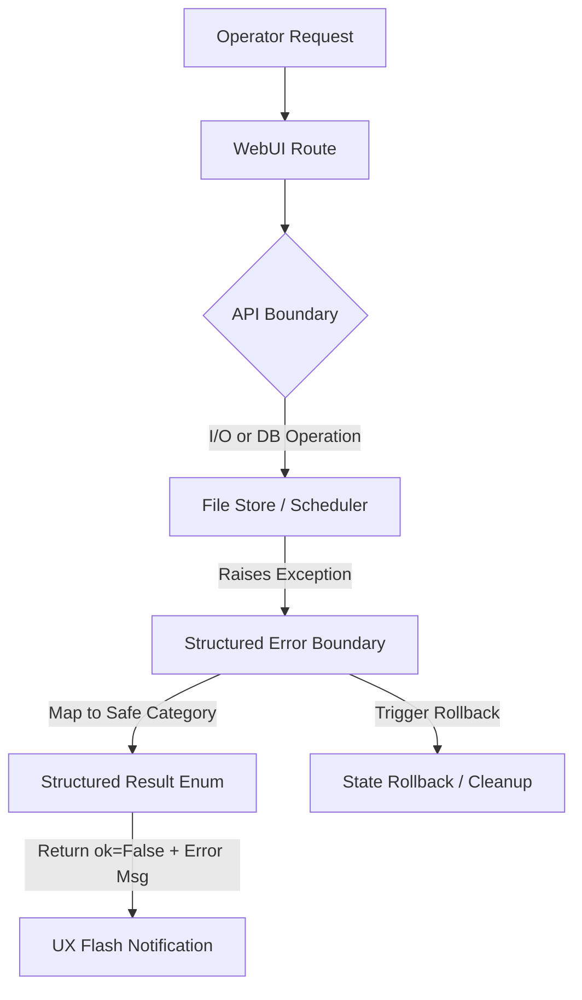

# Blueprint: WebUI False-Success & Exception Swallowing Resolution

This document presents the engineering design and implementation blueprint for resolving **"false success"** UX routes and silent exception swallowing across the `backlink-publisher` WebUI. 

By enforcing **UX Honesty**, the system ensures that operational failures, database persistence errors, and scheduler synchronization issues are never swept under the rug. Instead, they are captured, categorized, safely sanitized, and surfaced transparently to the operator.

---

## 1. Executive Summary & Principles

An audit of the WebUI route handlers under `webui_app/` revealed multiple locations where exceptions are either silently swallowed (leaving the operator to believe an action succeeded) or result in raw, unhandled HTTP 500 crashes that disrupt the operator workflow.

To solve this, we establish three core architectural principles:

1. **Transactional UX Honesty**: If an action (such as saving a draft, persisting configuration, or rescheduling a job) fails either partially or fully, the UI must explicitly notify the operator using structured danger or warning banners.
2. **Graceful Sanitized Propagation**: Raw Python tracebacks or internal OS error messages must not be leaked to the UI (preventing information disclosure). Instead, they must be mapped to standardized, localized error classes (e.g., `DiskFullError`, `SchedulerSyncError`, `SSLHandshakeError`).
3. **Atomic Recovery / Rollback**: Bulk operations (like bulk scheduling or bulk deletion) must not leave the system in a split-state (e.g., updated in the JSONL store but failed to register in the APScheduler).

---

## 2. Route Audit & Pinpointed Vulnerabilities

### 2.1. Draft Lifecycle & Scheduler (`webui_app/routes/drafts.py` & `webui_app/api/drafts_api.py`)

#### Vulnerabilities:
- **I/O Persistence Swallowing / 500s**: In `DraftAPI.create`, `DraftAPI.schedule`, `DraftAPI.delete`, and others, the JSONL persistence calls (e.g., `_drafts_store.insert_first`, `_drafts_store.update_item`) are executed without any `try-except` blocks. If the local disk is full, the file is read-only, or another process locks the store, the thread crashes, yielding a generic HTTP 500 page.
- **Split-State in Bulk Operations**: In `DraftAPI.bulk_publish_now`, the method iterates through draft IDs, updates the file store state to `"scheduled"`, and adds the job to the APScheduler:
  ```python
  _drafts_store.update_item(item_id, status="scheduled", ...)
  _scheduler.add_job(...)
  ```
  If `_scheduler.add_job` raises an exception (e.g., scheduler shutdown, database lock, or queue capacity exceeded) halfway through the loop, the remaining items are never processed, and the already-updated items are left in a "split-state" (marked as scheduled in the store but missing from the scheduler).
- **False-Success on Scheduled Job Removal**: When canceling or deleting a draft, if `_remove_scheduled_job` fails (returns `False` due to a genuine scheduler exception), the API still returns `"ok": True` with a warning message. This is a false success because the scheduler job is still active in the background and will fire a ghost publish task.

### 2.2. Pipeline Operations (`webui_app/routes/pipeline.py`)

#### Vulnerabilities:
- **Silent Three-Tier Config Save Failure**: In `ce_plan()`, if `_persist_three_tier_config` raises an exception (such as permission errors on the config directory), the exception is logged but completely swallowed:
  ```python
  try:
      _persist_three_tier_config(main_url, category_url, work_url)
  except Exception as exc:
      plan_logger.warn("homepage_form_persist_failed", ...)
  ```
  The operator is redirected to the plan page without knowing that their configurations were not saved.
- **Preview JSON Parse Failure**: In `ce_preview()`, a `json.JSONDecodeError` returns a raw string `"Invalid URLs"`. If integrated into a JSON-consuming frontend, this can break UI parsing.

### 2.3. Checkpoint Controls (`webui_app/routes/checkpoint.py`)

#### Vulnerabilities:
- **Uncaught CLI Subprocess Failures**: In `checkpoint_resume()`, `run_pipe_capture` executes the CLI. However, if the command cannot be spawned or python fails to execute the script due to an environment issue, the uncaught exception results in a standard HTTP 500 error instead of a graceful diagnostic page.

### 2.4. Network Verification (`webui_app/routes/url_verify.py`)

#### Vulnerabilities:
- **Opaque Exception Remapping**: When `verify_url_has_content` raises an unexpected exception (e.g., custom network libraries throwing proxy or protocol errors), the route catch-all maps everything to either `"timeout"` or `"network_error"`:
  ```python
  except Exception as exc:
      reason = "timeout" if isinstance(exc, ...) else "network_error"
  ```
  This swallows critical diagnostic data (such as SSL certificate expiration or local proxy refusal) making troubleshooting extremely difficult.

---

## 3. Resolution Blueprint & Robust Designs

To address these vulnerabilities, we design a clean, non-disruptive, robust architecture.



### 3.1. Structured Return Contract

All API and route helpers must return a standardized, uniform shape to caller functions. We extend `DraftAPI` methods to return:
```python
{
    "ok": bool,
    "error_code": str | None,     # E.g. "PERSISTENCE_FAILURE", "SCHEDULER_LOCK"
    "flash_type": "success" | "warning" | "danger",
    "flash_msg": str,
    "detail": str | None          # Sanitized debugging detail for operator logs
}
```

---

### 3.2. Code Specifications for Resolution

#### A. Draft Lifecycle State Honesty (`webui_app/api/drafts_api.py`)

1. **I/O and Scheduler Wrapper Protection**:
   Wrap file writes and scheduler synchronization in robust, well-defined try-except blocks:
   ```python
   def create(self, plans_jsonl, config, ...) -> dict[str, Any]:
       # ... setup item ...
       try:
           _drafts_store.insert_first(item)
       except OSError as exc:
           plan_logger.error("draft_create_io_failed", error=str(exc))
           return {
               "ok": False,
               "error_code": "PERSISTENCE_FAILURE",
               "flash_type": "danger",
               "flash_msg": f"草稿保存失败：本地存储写入失败 ({type(exc).__name__})",
           }
       return {"ok": True, "id": item["id"], "flash_msg": "已加入草稿栏"}
   ```

2. **Atomic Transaction Simulation for Bulk Scheduling**:
   To avoid split-states during bulk scheduling, keep track of successfully added jobs. If any addition fails, perform an immediate rollback of both the scheduler and the file store:
   ```python
   def bulk_publish_now(self, ids: list[str]) -> dict[str, Any]:
       if not ids:
           return {"ok": False, "flash_msg": "未选择任何项"}
       
       base = datetime.now()
       completed_jobs = []
       store_rollbacks = []
       
       try:
           for i, item_id in enumerate(ids):
               item = _drafts_store.get_item(item_id)
               if not item:
                   continue
                   
               run_date = base + timedelta(seconds=5 + i * 5)
               # Track original state for rollback
               original_status = item.get("status", "pending")
               original_scheduled = item.get("scheduled_at")
               
               _drafts_store.update_item(
                   item_id,
                   status="scheduled",
                   scheduled_at=run_date.isoformat()
               )
               store_rollbacks.append((item_id, original_status, original_scheduled))
               
               _scheduler.add_job(
                   _publish_draft_job,
                   trigger="date",
                   run_date=run_date,
                   id=item_id,
                   args=[item_id],
                   replace_existing=True
               )
               completed_jobs.append(item_id)
               
       except Exception as exc:
           plan_logger.critical("bulk_publish_scheduling_failed", error=str(exc))
           # Rollback successfully scheduled scheduler jobs
           for job_id in completed_jobs:
               try:
                   _scheduler.remove_job(job_id)
               except Exception:
                   pass
           # Rollback store states
           for item_id, status, sched_at in store_rollbacks:
               try:
                   _drafts_store.update_item(item_id, status=status, scheduled_at=sched_at)
               except Exception:
                   pass
           
           return {
               "ok": False,
               "error_code": "BULK_SCHEDULER_FAILURE",
               "flash_type": "danger",
               "flash_msg": f"批量发布失败：调度器注册异常，已回滚所有变更 ({type(exc).__name__})",
           }
       
       return {"ok": True, "flash_msg": f"正在批量发布 {len(completed_jobs)} 项，请稍候刷新页面"}
   ```

3. **Honest Cancel/Delete Status Reporting**:
   If job cancellation fails, classify the response strictly as a failure/warning to avoid silent execution:
   ```python
   def cancel(self, item_id: str) -> dict[str, Any]:
       if not item_id:
           return {"ok": False, "flash_msg": "参数缺失"}
       
       job_clean = _remove_scheduled_job(item_id)
       if not job_clean:
           return {
               "ok": False,
               "error_code": "SCHEDULER_SYNC_FAILED",
               "flash_type": "danger",
               "flash_msg": "取消排程失败：无法同步删除后台调度任务，该任务可能仍在运行！"
           }
       
       try:
           _drafts_store.update_item(item_id, status="pending", scheduled_at=None)
       except Exception as exc:
           return {
               "ok": False,
               "error_code": "PERSISTENCE_FAILURE",
               "flash_type": "warning",
               "flash_msg": f"排程已取消，但未能更新草稿箱状态 ({type(exc).__name__})"
           }
       
       return {"ok": True, "flash_msg": "已取消排程"}
   ```

---

#### B. Transparent Configuration Persistence (`webui_app/routes/pipeline.py`)

Provide feedback if three-tier homepage configurations fail to write to the configuration folder:
```python
    if category_url or work_url:
        try:
            _persist_three_tier_config(main_url, category_url, work_url)
        except Exception as exc:
            plan_logger.warn(
                "homepage_form_persist_failed",
                main=main_url, reason=type(exc).__name__, detail=str(exc)[:120],
            )
            # UX Honesty: Propagate the warning to the UI, do not swallow silently!
            return _render(
                'index.html',
                warning=f"漫画/分类页配置保存失败 ({type(exc).__name__})，但生成任务仍可继续。",
                target_url=main_url, config=config, ...
            )
```

---

#### C. Precise URL Verification Diagnostics (`webui_app/routes/url_verify.py`)

Expose specific error sub-reasons to UI/operators while remaining safe from SSRF/Internal information leaks:
```python
    except Exception as exc:
        exc_name = type(exc).__name__
        if "SSLError" in exc_name or "Certificate" in str(exc):
            reason = "ssl_verification_failed"
        elif "ConnectionRefused" in exc_name:
            reason = "connection_refused"
        elif "DNS" in exc_name or "Gaierror" in exc_name:
            reason = "dns_lookup_failed"
        elif isinstance(exc, (TimeoutError, socket.timeout)):
            reason = "timeout"
        else:
            reason = "network_error"
            
        _emit_recon(reason, host=host_ascii, exc_class=exc_name)
        ok, title = False, None
```

---

## 4. Verification & Testing Strategy

To ensure these safety policies are enforced and regression is prevented:

1. **Unit Test Coverage for Failures**:
   Introduce unit tests under `tests/` mocking OS constraints (e.g., `OSError` mock on file write) to verify that `DraftAPI` returns the expected structured failures rather than triggering 500s.
2. **Transaction Integrity Tests**:
   Mock `_scheduler.add_job` to raise a `RuntimeError` midway during a `bulk_publish_now` execution. Assert that:
   - Already-scheduled jobs are canceled.
   - Checked-out drafts are rolled back to their original state in the JSONL database.
3. **Continuous UI Integration**:
   Verify that flash messages of type `"danger"` render correct visual indicators (Bootstrap alerts) in `index.html`.

---

> [!IMPORTANT]
> **Implementation Order Guideline**:
> 1. Apply the structured error responses to `webui_app/api/drafts_api.py`.
> 2. Adapt the corresponding controllers in `webui_app/routes/drafts.py` to route these `danger`/`warning` flash messages correctly.
> 3. Enhance `routes/pipeline.py` and `routes/url_verify.py` with the localized validation and warning feedback channels.
